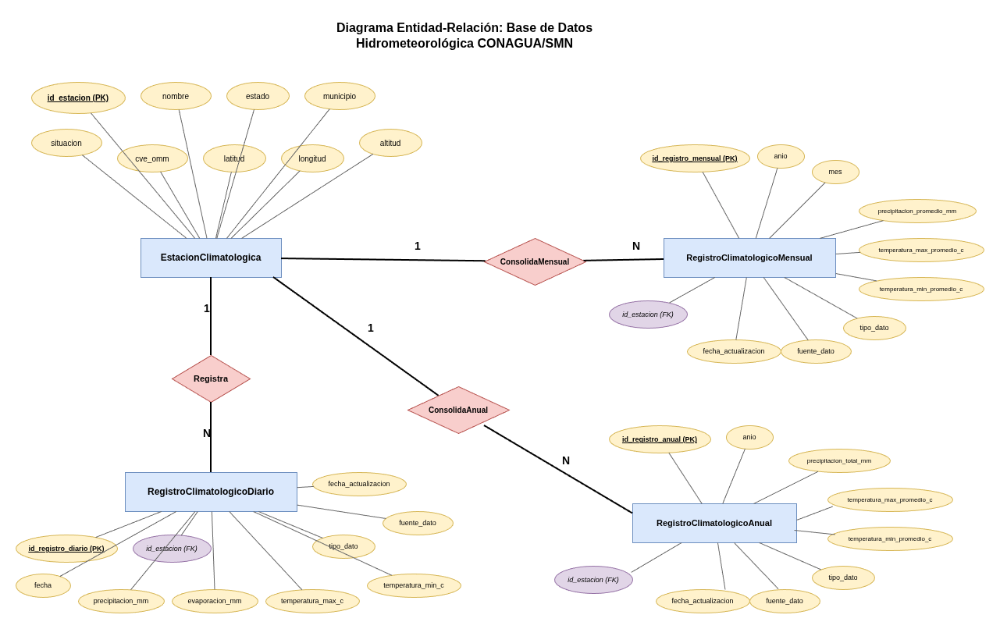

# Reconstrucción de Base de Datos Hidrometeorológica con IA

> Documento de Arquitectura de Software (DAS) — Laboratorio de Geomática y Teledetección  
> Versión actual: **4.0** | Última actualización: *23 de febrero de 2026*

---

## Descripción del Proyecto

Este proyecto desarrolla un sistema para **reconstruir bases de datos hidrometeorológicas históricas** a partir de datos oficiales de la [CONAGUA](https://smn.conagua.gob.mx/es/climatologia/informacion-climatologica/informacion-estadistica-climatologica), mediante técnicas de Inteligencia Artificial.

Las bases de datos meteorológicas presentan frecuentemente valores faltantes, inconsistencias y discontinuidades temporales derivadas de fallas instrumentales, mantenimiento de estaciones o errores de transmisión. Este sistema imputa esos valores preservando las propiedades estadísticas y temporales de los datos.

---

## Objetivos

**General:** Reconstruir una base de datos hidrometeorológica imputando valores faltantes de forma consistente, preservando estructura estadística y temporal.

**Específicos:**
- Analizar la calidad y estructura estadística del conjunto de datos
- Identificar distribución y patrones de valores faltantes
- Implementar y comparar modelos clásicos y de aprendizaje profundo
- Evaluar desempeño con métricas cuantitativas (RMSE, MAE, R²) e hidrológicas (NSE)
- Desarrollar un pipeline reproducible bajo metodología CRISP-ML(Q)
- Generar una base de datos reconstruida con metadatos de trazabilidad

---

## Metodología: CRISP-ML(Q)

El proyecto sigue **CRISP-ML(Q)** *(Cross Industry Standard Process for Machine Learning with Quality Assurance)*, que extiende CRISP-DM con Quality Gates formales, gestión de riesgos y monitoreo continuo del modelo.

| Fase | Descripción |
|------|-------------|
| 1. Comprensión del problema | Definición de métricas base y criterios de éxito |
| 2. Comprensión de los datos | EDA, estacionariedad, patrones de faltantes |
| 3. Preparación de los datos | Limpieza, normalización, feature engineering |
| 4. Modelado | Entrenamiento y comparación de modelos |
| 5. Evaluación / Quality Gate | Validación estadística e hidrológica |
| 6. Despliegue | Generación de base reconstruida + metadatos |
| 7. Monitoreo y mantenimiento | Detección de data drift, reentrenamiento |

---

## Arquitectura del Sistema

### Vista Conceptual

El sistema organiza el flujo de datos en cuatro módulos principales: ingesta, procesamiento, reconstrucción con IA y salida.

### Pipeline CRISP-ML(Q) — Vista de Componentes

Vista completa del pipeline con todas las etapas, herramientas y flujos de retroalimentación.

_Pipeline.jpg)

### Arquitectura de Componentes detallada

_Diagrama_arq_componentes.jpg)

### Diagrama UML de Componentes

Los módulos se comunican mediante interfaces de datos estandarizadas (DataFrames), garantizando acoplamiento bajo y trazabilidad completa del dato.

---

## Modelos Implementados

### Baselines Estadísticos
| Modelo | Uso |
|--------|-----|
| SARIMA | Series con estacionalidad anual |
| TBATS  | Patrones estacionales complejos |
| Prophet | Tendencia + estacionalidad flexible |

### Machine Learning
| Modelo | Uso |
|--------|-----|
| XGBoost | Baseline no lineal con feature engineering |
| KNN | Imputación por vecinos cercanos |

### Deep Learning — Imputación Especializada
| Modelo | Descripción |
|--------|-------------|
| LSTM | Dependencias temporales de largo plazo |
| BRITS | Imputación recurrente bidireccional sin supuestos rígidos |
| GAN | Preservación de distribución conjunta multivariante |
| SAITS | Auto-atención para patrones temporales complejos |
| CSDI | Difusión condicional probabilística para alta tasa de faltantes |

---

## Métricas de Evaluación

$$RMSE = \sqrt{\frac{1}{n}\sum(y_i - \hat{y}_i)^2} \qquad MAE = \frac{1}{n}\sum|y_i - \hat{y}_i|$$

$$NSE = 1 - \frac{\sum(y_i - \hat{y}_i)^2}{\sum(y_i - \bar{y})^2}$$

| Métrica | Propósito |
|---------|-----------|
| RMSE / MAE / MAPE | Error de imputación general |
| R² | Ajuste global del modelo |
| NSE (Nash–Sutcliffe) | Eficiencia predictiva hidrológica |
| Prueba KPSS | Verificación de estacionariedad |
| ACF / PACF | Preservación de autocorrelación pre/post imputación |

---

## Modelo de Datos

La base de datos relacional organiza la jerarquía climática con trazabilidad completa por registro.

Cada registro incluye los campos de auditoría: `fuente_dato`, `fecha_actualizacion` y `tipo_dato` (original / imputado).

---

## Stack Tecnológico

| Categoría | Herramientas |
|-----------|-------------|
| Lenguaje | Python 3.x |
| Manipulación de datos | pandas, NumPy |
| ML clásico | scikit-learn, XGBoost |
| Deep Learning | TensorFlow / PyTorch |
| Series de tiempo | statsmodels, Prophet |
| Almacenamiento | PostgreSQL / CSV / Parquet |
| Tracking de experimentos | MLflow |
| Entorno de ejecución | Local — Laboratorio de Geomática y Teledetección |

---

## Requerimientos Funcionales Clave

| ID | Requerimiento |
|----|--------------|
| RF-01 | Carga de datos CONAGUA (CSV/Excel) con validación de esquema |
| RF-02 | Organización por estación, variable y periodo temporal |
| RF-03 | Identificación y bandereo de valores faltantes |
| RF-04 | Preprocesamiento: limpieza, normalización, lags, features estacionales |
| RF-05 | Imputación con modelos IA comparables |
| RF-06 | Validación estadística con métricas e hidrológicas |
| RF-07 | Exportación con metadatos de qué valores fueron imputados y con qué modelo |
| RF-08 | Reproducibilidad completa del pipeline |

---

## Datasets

- **Sinaloa (Mendeley Data):** https://data.mendeley.com/datasets/gb8jp62vm5/4
- **CONAGUA / SMN:** https://smn.conagua.gob.mx/es/climatologia/informacion-climatologica/informacion-estadistica-climatologica

---

## Referencias y Proyectos Relacionados

- [Notebook_Prediclima](https://github.com/Zastha/Notebook_Prediclima?tab=readme-ov-file)
- [Datos Meteorológicos — ZurielMF](https://github.com/ZurielMF/86-Y-Metereological_data)

---

## Autores

| Nombre | Rol |
|--------|-----|
| Sebastián Verdugo Bermúdez | Autor principal, arquitectura |
| José Ángel García Pérez | Co-autor, revisión |

**Laboratorio de Geomática y Teledetección**

---

## Criterios de Éxito

- Las imputaciones preservan la distribución estadística original
- Mejora cuantificable frente a métodos tradicionales (RMSE, NSE)
- Pipeline totalmente reproducible
- Carga, imputación y exportación sin errores
- Validación estadística formal documentada

---

*Versión del DAS: 4.0 — Sprint 3*
