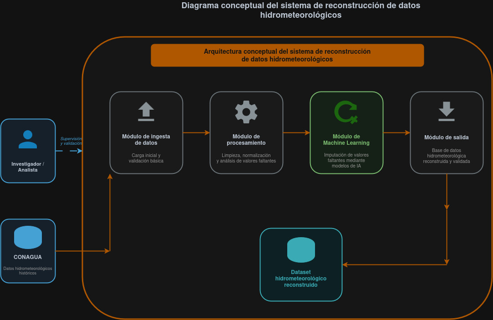
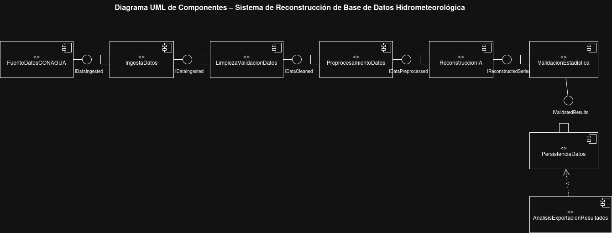

# Reconstrucción de Base de Datos Hidrometeorológica con IA

Sistema para imputar valores faltantes en registros históricos de estaciones climatológicas de Sinaloa, a partir de datos oficiales del **SMN/CONAGUA**, mediante técnicas de Inteligencia Artificial. El proyecto construye un pipeline reproducible y trazable desde la descarga de datos crudos hasta la generación de una base reconstruida y validada estadísticamente.

> Proyecto de Residencias Profesionales — Laboratorio de Geomática y Teledetección  
> Estado: **En desarrollo** | Sprint actual: 3

---

## ¿Qué problema resuelve?

Las bases de datos hidrometeorológicas históricas presentan valores faltantes, discontinuidades e inconsistencias causadas por fallas instrumentales, mantenimiento de estaciones o errores de transmisión. Esto compromete análisis hidrológicos, modelos climáticos y la detección de eventos extremos.

Este proyecto reconstruye esas series comparando modelos estadísticos clásicos contra técnicas de aprendizaje profundo especializadas en imputación de series temporales, garantizando trazabilidad completa de cada valor reconstruido.

---

## Estado del proyecto

| Módulo | Estado |
|--------|--------|
| Descarga de datos crudos (SMN/CONAGUA) | Listo |
| Estructuración del dataset (raw → interim) | Listo |
| Análisis exploratorio (EDA) | En desarrollo |
| Preprocesamiento y feature engineering | Pendiente |
| Modelado e imputación | Pendiente |
| Validación estadística / Quality Gate | Pendiente |
| Exportación de base reconstruida | Pendiente |

---

## Estructura del repositorio

```
.
├── Obtencion de Datos Crudos/
│   ├── download_sinaloa_raw_pro.py
│   └── README.md
│
├── Estructuracion del Dataset/
│   ├── organize_raw_by_station_year_variable_parquet.py
│   └── README.md
│
├── data/                                        # No versionado
│   ├── raw/
│   │   └── conagua_smn/
│   │       └── estado=sin/
│   │           ├── fuente=normales_climatologicas/
│   │           │   └── producto=diarios_txt/    # dia25001.txt ... dia25192.txt
│   │           ├── _logs/
│   │           │   ├── download_manifest.csv
│   │           │   └── download_run.log
│   │           └── _meta/
│   │               └── stations_sin.csv         # 192 estaciones con municipio y situación
│   │
│   └── interim/
│       └── organized/
│           └── estado=sin/
│               ├── estacion=25001/
│               │   ├── year=1961/
│               │   │   ├── precip.csv / precip.parquet   # columnas: date, value
│               │   │   ├── evap.csv   / evap.parquet
│               │   │   ├── tmax.csv   / tmax.parquet
│               │   │   └── tmin.csv   / tmin.parquet
│               │   └── year=.../
│               ├── estacion=.../
│               └── _index.csv                   # índice global con % de faltantes
│
├── docs/
│   └── img/
│
└── README.md
```

---

## Pipeline de datos

El procesamiento sigue la metodología **CRISP-ML(Q)** organizado en capas diferenciadas:


### Capa `raw` — Descarga de datos crudos

**Script:** `download_sinaloa_raw_pro.py`

Descarga los archivos `.txt` diarios de **192 estaciones climatológicas de Sinaloa** desde el portal del SMN/CONAGUA. Por cada estación verifica si el archivo ya existe localmente y tiene contenido antes de volver a descargarlo. Genera trazabilidad completa del proceso en dos archivos:

- `download_manifest.csv` — resultado por estación (`OK`, `SKIP_EXISTS`, `HTTP_404`, `URL_ERROR`, `ERROR`)
- `download_run.log` — log con marca de tiempo de cada evento

Fuente:
```
https://smn.conagua.gob.mx/tools/RESOURCES/Normales_Climatologicas/Diarios/sin/dia{clave}.txt
```

Consulta el [README de Obtencion de Datos Crudos](Obtencion%20de%20Datos%20Crudos/README.md) para más detalles.

### Capa `interim` — Estructuración del dataset

**Script:** `organize_raw_by_station_year_variable_parquet.py`

Transforma los archivos `.txt` crudos en un dataset estructurado jerárquicamente por estación, año y variable climática. El script detecta automáticamente el inicio de la tabla de datos dentro de cada archivo, convierte los valores nulos (`NULO`, `Nulo`, `nulo`, cadena vacía) a `NaN`, y genera una partición independiente por cada combinación estación–año–variable.

Variables procesadas:

| Variable | Descripción |
|----------|-------------|
| `PRECIP` | Precipitación diaria (mm) |
| `EVAP` | Evaporación diaria (mm) |
| `TMAX` | Temperatura máxima diaria (°C) |
| `TMIN` | Temperatura mínima diaria (°C) |

Cada archivo de salida contiene únicamente dos columnas: `date` y `value`. Se genera además un `_index.csv` global con el porcentaje de valores faltantes por partición, útil para priorizar estaciones en el modelado.

Consulta el [README de Estructuracion del Dataset](Estructuracion%20del%20Dataset/README.md) para más detalles.

---

## Arquitectura del sistema

### Vista conceptual



### Ciclo de vida metodológico — CRISP-ML(Q)


### Arquitectura de componentes


### Diagrama UML de módulos



### Modelo de datos


---

## Modelos a implementar

Se compararán tres familias de modelos para determinar cuál preserva mejor la estructura estadística y los patrones estacionales de las series:

| Familia | Modelos |
|---------|---------|
| Estadísticos (baseline) | SARIMA, TBATS, Prophet |
| Machine Learning | XGBoost |
| Deep Learning | LSTM, Autoencoders, BRITS, GAN, SAITS, CSDI |

La selección del modelo final se determina mediante un **Quality Gate** que evalúa no solo el error numérico, sino la preservación de estacionalidad, autocorrelación y eventos extremos hidrológicos.

---

## Métricas de evaluación

| Métrica | Propósito |
|---------|-----------|
| RMSE / MAE / MAPE | Error de imputación general |
| R² | Ajuste global |
| NSE (Nash-Sutcliffe) | Eficiencia predictiva hidrológica |
| KPSS | Verificación de estacionariedad |
| ACF / PACF | Preservación de autocorrelación pre/post imputación |

> Los resultados comparativos entre modelos se publicarán aquí al completar la fase de evaluación.

---

## Instalación

**Requisitos:** Python 3.9 o superior

```bash
git clone https://github.com/Josegas/Residencias_Imputacion_Generativa_Hidrometeorologica.git
cd Residencias_Imputacion_Generativa_Hidrometeorologica

python -m venv venv
source venv/bin/activate       # Windows: venv\Scripts\activate

pip install pandas pyarrow
```

El script de descarga no requiere dependencias externas, solo la biblioteca estándar de Python.

---

## Uso

### 1. Configurar la ruta del proyecto

Antes de ejecutar cualquier script, actualiza la variable `PROJECT_ROOT` en el archivo correspondiente con la ruta local de tu proyecto:

```python
# En download_sinaloa_raw_pro.py
PROJECT_ROOT = r"ruta/a/tu/proyecto"

# En organize_raw_by_station_year_variable_parquet.py
PROJECT_ROOT = r"ruta/a/tu/proyecto"
```

### 2. Descargar los datos crudos

```bash
cd "Obtencion de Datos Crudos"
python download_sinaloa_raw_pro.py
```

Descarga los archivos `.txt` de las 192 estaciones de Sinaloa en `data/raw/`. Los archivos ya descargados se omiten automáticamente.

Salida esperada:
```
[2026-01-01 10:00:00] INICIO | Estado=sin | Total estaciones=192
[2026-01-01 10:00:00] OK   25001 | Acatitan -> ...dia25001.txt
[2026-01-01 10:00:01] SKIP 25002 | Agua Caliente (ya existe)
...
[2026-01-01 10:01:30] RESUMEN | OK=150 | SKIP=30 | FAIL=12
```

### 3. Estructurar el dataset

```bash
cd "Estructuracion del Dataset"
python organize_raw_by_station_year_variable_parquet.py
```

Transforma los archivos crudos en particiones organizadas por estación, año y variable en `data/interim/`.

Salida esperada:
```
Encontrados 192 archivos crudos en: .../producto=diarios_txt

[OK] Estación 25001: 23011 filas, años=63
[OK] Estación 25014: 19850 filas, años=55
[FAIL] dia25099.txt: No encontré encabezado de tabla 'FECHA'
...
Listo
Índice generado en: .../estado=sin/_index.csv
```

---

## Fuentes de datos

- [Sinaloa — Mendeley Data](https://data.mendeley.com/datasets/gb8jp62vm5/4)
- [CONAGUA / SMN — Información estadística climatológica](https://smn.conagua.gob.mx/es/climatologia/informacion-climatologica/informacion-estadistica-climatologica)

---

## Documentación técnica

El diseño completo del sistema está documentado en el Documento de Arquitectura de Software (DAS) v4.0, que incluye requerimientos funcionales y no funcionales, decisiones arquitectónicas, modelo de datos relacional y metodología detallada bajo CRISP-ML(Q).

---

## Autores

| Nombre | GitHub |
|--------|--------|
| José Ángel García Pérez | [@Josegas](https://github.com/Josegas) |
| Sebastián Verdugo Bermúdez | [@Sebastian1247](https://github.com/Sebastian1247) |

**Laboratorio de Geomática y Teledetección**
