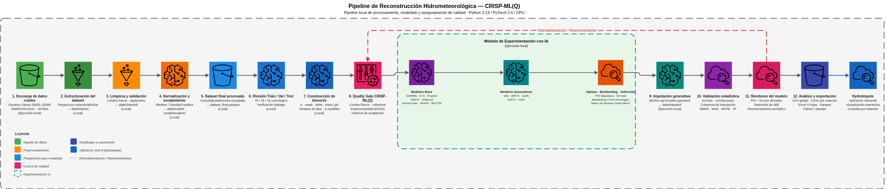
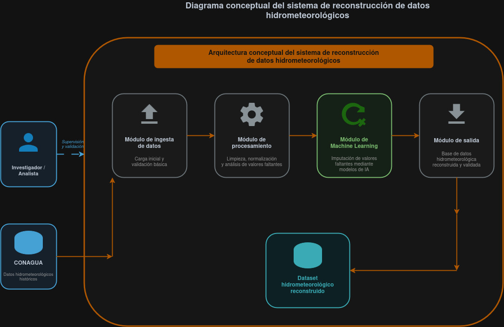

# Reconstrucción de Base de Datos Hidrometeorológica con IA

Sistema para imputar valores faltantes en registros históricos de estaciones climatológicas de Sinaloa, a partir de datos oficiales del **SMN/CONAGUA**, mediante técnicas de Inteligencia Artificial. El proyecto construye un pipeline reproducible y trazable desde la descarga de datos crudos hasta la selección del modelo generativo final, siguiendo la metodología **CRISP-ML(Q)**.

> Proyecto de Residencias Profesionales — Laboratorio de Geomática y Teledetección  
> Autores: José Ángel García Pérez · Sebastián Verdugo Bermúdez  
> Estado: **Completo**

---

## ¿Qué problema resuelve?

Las bases de datos hidrometeorológicas históricas presentan valores faltantes, discontinuidades e inconsistencias causadas por fallas instrumentales, mantenimiento de estaciones o errores de transmisión. Esto compromete análisis hidrológicos, modelos climáticos y la detección de eventos extremos.

Este proyecto reconstruye esas series comparando modelos estadísticos clásicos contra técnicas de aprendizaje profundo especializadas en imputación de series temporales, con trazabilidad completa de cada valor reconstruido.

---

## Inicio rápido

### Requisitos previos

- Python 3.9 o superior
- GPU opcional (CUDA) — recomendada para la etapa 9 (imputación)
- Jupyter instalado para las etapas de modelado (notebooks)

### Instalación

```bash
git clone https://github.com/Josegas/Residencias_Imputacion_Generativa_Hidrometeorologica.git
cd Residencias_Imputacion_Generativa_Hidrometeorologica

python -m venv venv
source venv/bin/activate        # Windows: venv\Scripts\activate

pip install -r requirements.txt
```

<details>
<summary>Instalación manual de dependencias (sin requirements.txt)</summary>

```bash
# Datos y preprocesamiento
pip install pandas pyarrow numpy scikit-learn pyyaml

# Análisis y visualización
pip install matplotlib seaborn scipy jupyter

# Modelos estadísticos (notebooks de modelado)
pip install statsmodels prophet tbats

# Machine learning (notebooks de modelado)
pip install xgboost

# Deep learning — etapa 9 (imputación) y notebooks de modelado
pip install torch torchvision

# Modelos generativos (notebooks de modelado)
pip install pypots          # BRITS, SAITS, CSDI

# Optimización de hiperparámetros (notebooks de optimización)
pip install optuna
```
</details>

### Ejecutar el pipeline completo

```bash
python "Pipeline Reproducible/run_pipeline.py"
```

Ejecuta las **12 etapas** en orden: descarga → estructuración → limpieza → normalización → dataset final → división → tensores → **quality gate** → **imputación generativa** → **validación estadística** → **monitoreo del modelo** → **análisis y exportación**. La salida final es `data/export/` con el dataset reconstruido en CSV (combinado + por estación) y el resumen estadístico en Excel.

Si ya tienes los datos descargados, empieza desde la limpieza:

```bash
python "Pipeline Reproducible/run_pipeline.py" --from-stage 3
```

Para ejecutar solo la imputación (cuando el resto ya está listo):

```bash
python "Pipeline Reproducible/run_pipeline.py" --only-stage 9
# o directamente:
python "Imputación Generativa/impute.py"
```

Para correr el quality gate y la validación sin re-imputar:

```bash
python "Pipeline Reproducible/run_pipeline.py" --only-stage 8   # Quality Gate
python "Pipeline Reproducible/run_pipeline.py" --only-stage 10  # Validación estadística
```

---

## Opciones del pipeline

```
python "Pipeline Reproducible/run_pipeline.py" [opciones]

Opciones:
  --from-stage N      Empieza desde la etapa N (omite las anteriores)
  --only-stage N      Ejecuta únicamente la etapa N
  --force             Re-ejecuta aunque la salida ya exista
  --list-stages       Muestra el estado de cada etapa y termina
  -h, --help          Muestra esta ayuda
```

Ejemplos:

```bash
# Ver estado actual de cada etapa
python "Pipeline Reproducible/run_pipeline.py" --list-stages

# Re-ejecutar normalización forzando reconstrucción
python "Pipeline Reproducible/run_pipeline.py" --only-stage 4 --force

# Ejecutar desde la limpieza en adelante
python "Pipeline Reproducible/run_pipeline.py" --from-stage 3
```

---

## Estado del proyecto

**Pipeline automatizado (scripts)**

| Etapa | Módulo | Estado |
|-------|--------|--------|
| 1 | Descarga de datos crudos (SMN/CONAGUA) | Completo |
| 2 | Estructuración del dataset (raw → interim) | Completo |
| 3 | Limpieza y validación (límites físicos) | Completo |
| 4 | Normalización y escalamiento (scalers globales) | Completo |
| 5 | Dataset final procesado (1.6M registros) | Completo |
| 6 | División train/val/test (70/15/15, sin leakage) | Completo |
| 7 | Construcción de tensores PyTorch | Completo |
| 8 | Quality Gate CRISP-ML(Q) | Completo |
| 9 | Imputación generativa (BiGRU-opt) | Completo |
| 10 | Validación estadística post-imputación | Completo |
| 11 | Monitoreo del modelo (drift PSI + alertas) | Completo |
| 12 | Análisis y exportación (CSV + Excel) | Completo |

**Etapas de modelado (notebooks - experimentales)**

| # | Notebook | Estado |
|---|----------|--------|
| A | EDA general, análisis de faltantes, análisis temporal | Completo |
| B | Modelos base (SARIMA, XGBoost, Autoencoder, BiGRU) | Completo |
| C | Modelos generativos (VAE, BRITS, GAIN, SAITS, CSDI) | Completo |
| D | Optimización Optuna + backtesting + selección final | Completo |

> **Nota:** `Modelos Base/modelos_base_estadisticos.ipynb` no está incluido en este repositorio porque supera el límite de 100 MB de GitHub (pesa ~143 MB por los outputs guardados). El código está intacto; para regenerarlo ejecuta el notebook con los datos en `data/`. Los resultados relevantes están disponibles en `reports/modelos_base/`.

**Validación estadística extendida — US 6.1**

| Subtarea | Artefacto | Estado |
|----------|-----------|--------|
| 6.1.1 Correlaciones | `correlaciones_comparativas.csv` + `val_correlaciones.png` | Completo (Etapa 10) |
| 6.1.2 KS-test & pruebas | `ks_test_report.csv` + `val_ks_test.png` | Completo (Etapa 10) |
| 6.1.3 Validación estacional | `estacional_mensual.csv` + `val_estacional.png` | Completo (notebook) |
| 6.1.4 Validación multianual | `multianual_anual.csv` + `val_multianual.png` | Completo (notebook) |

**Pruebas beta — US 5.3**

| Entregable | Descripción | Estado |
|------------|-------------|--------|
| `reports/beta/beta_test_results.md` | Resultados funcionales de las 3 etapas evaluadas | Completo |
| `reports/beta/validacion_criterios_aceptacion.md` | Validación formal de 38 criterios de aceptación | Completo |
| `reports/beta/paquete_entrega_beta.md` | Manifiesto de entrega del paquete beta | Completo |

---

## Etapas del pipeline

### Etapa 1 — Descarga de datos crudos

**Script:** `Obtencion de Datos Crudos/download_sinaloa_raw_pro.py`

Escanea el rango de claves `25001–25300` y descarga en paralelo (10 hilos) los archivos `.txt` disponibles en el portal del SMN/CONAGUA. Los archivos ya descargados se omiten automáticamente.

```
Salida: data/raw/conagua_smn/estado=sin/
        └── fuente=normales_climatologicas/producto=diarios_txt/  ← dia25001.txt …
        └── _logs/download_summary.csv
```

Tiempo estimado: 3–5 min en la primera ejecución.

---

### Etapa 2 — Estructuración del dataset

**Script:** `Estructuracion del Dataset/organize_raw_by_station_year_variable_parquet.py`

Transforma los `.txt` crudos en particiones Parquet jerárquicas por estación / año / variable. Genera un índice global `_index.csv` con el porcentaje de faltantes por partición.

```
Salida: data/interim/organized/estado=sin/
        ├── estacion=25001/year=1961/precip.parquet  …
        └── _index.csv
```

---

### Etapa 3 — Limpieza y validación

**Script:** `Validacion y limpieza/cleaning.py`

Aplica límites físicos por variable (errores extremos → NaN), elimina filas con fecha duplicada y preserva outliers documentados como posibles registros reales. Genera `_index_cleaned.csv` y `cleaning_report.csv`.

```
Salida: data/cleaned/organized/estado=sin/
```

---

### Etapa 4 — Normalización y escalamiento

**Script:** `Preprocesamiento/normalize.py`

Ajusta scalers globales (un scaler por variable, todos los datos de todas las estaciones) y los serializa en `models/scalers/` para reproducibilidad. Preserva los `NaN` durante la transformación.

| Variable | Scaler | Rango |
|----------|--------|-------|
| `precip` | MinMaxScaler | [0, 1] |
| `evap` | MinMaxScaler | [0, 1] |
| `tmax` | StandardScaler | μ=32.67 °C, σ=4.90 °C |
| `tmin` | StandardScaler | μ=16.71 °C, σ=6.21 °C |

```
Salida: data/scaled/organized/estado=sin/
        models/scalers/scaler_*.pkl
```

---

### Etapa 5 — Dataset final procesado

**Script:** `Dataset Final Procesado/pipeline.py`

Fusiona todas las particiones escaladas por estación en un DataFrame wide (filas = fechas, columnas = variables) y lo exporta como `dataset_final.parquet`. 

```
Salida: data/processed/dataset_final.parquet   (1,611,118 filas · 173 estaciones · 1908–2026)
```

---

### Etapa 6 — División train / val / test

**Scripts:** `División Train-Val-Test/split.py` → `verify_leakage.py`

Divide cada estación de forma independiente y cronológica (sin fuga de información entre conjuntos).

| Conjunto | Proporción | Registros |
|----------|-----------|-----------|
| train | 70 % | 1,127,704 |
| val | 15 % | 241,673 |
| test | 15 % | 241,741 |

`verify_leakage.py` ejecuta 4 pruebas de anti-leakage y retorna exit code 0 solo si todas pasan.

```
Salida: data/splits/{train,val,test}/*.parquet
        data/splits/split_index.csv
```

---

### Etapa 7 — Construcción de tensores PyTorch

**Scripts:** `Construcción de Tensores/tensor_builder.py` → `validate_tensors.py`

Genera ventanas deslizantes de 30 días (stride 7 días) sobre cada split y produce cuatro tipos de tensor:

| Tensor | Shape | Descripción |
|--------|-------|-------------|
| `X_*.pt` | (N, 30, 4) | Valores escalados (NaN → 0) |
| `mask_*.pt` | (N, 30, 4) | 1 = observado, 0 = faltante |
| `delta_*.pt` | (N, 30, 4) | Días desde última observación (BRITS) |
| `meta_*.pt` | (N, 2) | [station_idx, start_date_ordinal] |

| Split | Secuencias |
|-------|-----------|
| train | 160,041 |
| val | 33,831 |
| test | 33,678 |

```
Salida: data/tensors/X_*.pt  mask_*.pt  delta_*.pt  meta_*.pt
        data/tensors/tensors_metadata.json
```

---

### Etapa 8 — Quality Gate CRISP-ML(Q)

**Script:** `Quality Gate/quality_gate.py`

Puerta de calidad que verifica el dataset antes de ejecutar el módulo de IA. Si algún criterio crítico falla el pipeline se detiene con exit code 1.

| Criterio | Tipo | Verificación |
|----------|------|--------------|
| Límites físicos en observados | Crítico | Ningún valor fuera de rango tras limpieza |
| Mínimo de observaciones por estación | Crítico | ≥ 365 registros válidos por estación |
| tmax ≥ tmin en observados | Crítico | Sin pares invertidos en datos originales |
| Tasa de faltantes por variable | Warning | precip ≤ 60%, evap ≤ 85%, tmax/tmin ≤ 60% |
| Estacionariedad KPSS | Warning | ≥ 70% de estaciones conservan estacionariedad |

```
Salida: reports/quality_gate/quality_gate_report.csv
```

---

### Etapa 9 — Imputación generativa (BiGRU-opt)

**Script:** `Imputación Generativa/impute.py`

Carga el modelo ganador (leído de `reports/optimizacion/seleccion_ejecutiva.csv`), aplica ventanas deslizantes de 30 días sobre cada estación y reconstruye las series completas. Solo rellena posiciones NaN — los valores observados se preservan exactamente.

```
Salida: data/imputed/dataset_imputado.parquet   ← artefacto interno del pipeline
        reports/imputacion/imputacion_report.csv
```

> El CSV para usuarios finales lo genera la **Etapa 12 — Análisis y Exportación**.

---

### Etapa 10 — Validación estadística post-imputación

**Script:** `Validación Estadística/validate_imputation.py`

Evalúa la calidad estadística del dataset imputado comparando distribuciones, correlaciones y estacionariedad antes y después de la imputación.

| Análisis | Descripción | Ticket |
|----------|-------------|--------|
| KS-test | Distribución imputados vs. observados (Kolmogorov-Smirnov) | RES-135 |
| Correlaciones | Pearson inter-variable antes/después | RES-138 |
| Límites físicos post-imputación | Ningún valor fuera de rango (crítico) | — |
| tmax ≥ tmin post-imputación | Sin inversiones tras imputación (crítico) | — |
| KPSS post-imputación | Estacionariedad preservada (warning) | — |
| Estadísticos descriptivos | Media, std, min, max antes/después | — |

```
Salida: reports/validacion_estadistica/metricas_imputacion.csv
        reports/validacion_estadistica/ks_test_report.csv
        reports/validacion_estadistica/correlaciones_comparativas.csv
        reports/validacion_estadistica/figuras/val_cobertura.png
        reports/validacion_estadistica/figuras/val_distribucion.png
        reports/validacion_estadistica/figuras/val_correlaciones.png
        reports/validacion_estadistica/figuras/val_ks_test.png
```

---

### US 6.1 — Validación estadística extendida

**Notebook:** `Validación Estadística/validacion_estacional_multianual.ipynb`

Extiende la validación post-imputación con análisis temporal que no forma parte del pipeline automatizado pero es requerida como evidencia estadística de la US 6.1.

| Subtarea | Análisis | Salida |
|----------|----------|--------|
| **6.1.3 Validación estacional** | Media mensual (Ene–Dic) observado vs imputado por variable | `estacional_mensual.csv` + `val_estacional.png` |
| **6.1.4 Validación multianual** | Media anual ±1 std a lo largo del período histórico completo | `multianual_anual.csv` + `val_multianual.png` |

```
Salida: reports/validacion_estadistica/estacional_mensual.csv
        reports/validacion_estadistica/multianual_anual.csv
        reports/validacion_estadistica/figuras/val_estacional.png
        reports/validacion_estadistica/figuras/val_multianual.png
        reports/validacion_estadistica/reporte_validacion_estacionalmultianual.md
```

**Ejecución:** abrir el notebook en Jupyter y ejecutar todas las celdas.

---

### Etapa 11 — Monitoreo del modelo

**Script:** `Monitoreo/monitor.py`

Detecta drift distribucional en el dataset imputado comparando cada ventana decadal contra la ventana de referencia (1970–2000) usando PSI y KS-test. Genera alertas de reentrenamiento cuando el drift supera el umbral. Es una etapa informacional — no bloquea el pipeline.

```
Salida: reports/monitoreo/drift_report.csv
        reports/monitoreo/cobertura_temporal.csv
        reports/monitoreo/figuras/drift_decadal.png
        reports/monitoreo/figuras/cobertura_temporal.png
```

---

### Etapa 12 — Análisis y exportación

**Script:** `Análisis y Exportación/export.py`

Genera la entrega oficial del dataset reconstruido en formatos accesibles. Exporta el dataset completo a CSV, un CSV por estación (misma convención que `data/processed/csv/`), y un resumen estadístico en Excel con 4 hojas.

```
Salida: data/export/dataset_imputado.csv              ← dataset completo (1.6M filas)
        data/export/por_estacion/estacion=*.csv        ← 173 archivos individuales
        data/export/resumen_estadistico.xlsx           ← estadísticas (4 hojas)
        reports/exportacion/export_report.csv
```

---

## Etapas de modelado (notebooks — experimentales)

Estas etapas son experimentales y se ejecutan manualmente en Jupyter. Sus salidas (modelos entrenados, reportes de métricas) son consumidas por el pipeline automatizado.

### Modelos base

**Notebooks:** `Modelos Base/`

| Notebook | Modelos |
|----------|---------|
| `modelos_base_estadisticos.ipynb` | SARIMA, ETS/Holt-Winters, Prophet, TBATS |
| `modelos_base_xgboost.ipynb` | XGBoost con lags y rolling features |
| `modelos_base_autoencoder.ipynb` | Autoencoder Conv1D (encoder-decoder) |
| `modelos_base_rnn_bidireccional.ipynb` | BiGRU / BiLSTM con máscara concatenada |
| `comparacion_modelos_base.ipynb` | Heatmap · radar chart · boxplot por familia |

```
Salida: reports/modelos_base/metrics_*.csv  ·  models/modelos_base/*.pt
```

### Modelos generativos

**Notebooks:** `Modelos Generativos/`

| Notebook | Modelo | Mecanismo clave |
|----------|--------|-----------------|
| `modelo_generativo_vae.ipynb` | VAE Conv1D | β-VAE ELBO |
| `modelo_generativo_brits.ipynb` | BRITS bidireccional | Decaimiento temporal con δ tensors |
| `modelo_generativo_gain.ipynb` | GAIN | Generator + Discriminator + hint matrix |
| `modelo_generativo_saits.ipynb` | SAITS | DMSA, pérdida ORT+MIT conjunta |
| `modelo_generativo_csdi.ipynb` | CSDI | Difusión condicional, cosine schedule T=50 |

```
Salida: reports/modelos_generativos/metrics_*.csv  ·  models/modelos_generativos/*.pt
```

### Optimización y selección del modelo ganador

**Notebooks:** `Optimización/`

| Notebook | Contenido |
|----------|-----------|
| `optimizacion_hiperparametros.ipynb` | Optuna TPE, 50 trials por modelo |
| `backtesting_evaluacion_retrospectiva.ipynb` | Validación cruzada temporal 4-fold |
| `seleccion_modelo_ganador.ipynb` | Matriz multi-criterio MCDM → `seleccion_ejecutiva.csv` |

```
Salida: models/optimizacion/{bigru_opt.pt, brits_opt.pt, saits_opt.pt, xgboost_opt.pkl}
        reports/optimizacion/seleccion_ejecutiva.csv
```

---

## Aplicación HydroImpute

Interfaz web interactiva para ejecutar el pipeline, imputar datos propios y visualizar resultados. Desarrollada con Streamlit como entregable de la US 6.2.

### Ejecutar la app

```bash
cd HydroImpute
streamlit run Inicio.py
```

### Páginas

| Página | Descripción |
|--------|-------------|
| **Inicio** | Descripción del proyecto y estado del modelo |
| **Pipeline** | Ejecutar etapas del pipeline con logs en tiempo real y descarga de resultados |
| **Datos Propios** | Cargar un CSV/Excel/Parquet propio, imputar con BiGRU-opt y descargar el resultado |
| **Resultados** | Figuras y reportes generados por las etapas 8–12 del pipeline |
| **Configuración** | Modificar parámetros de las etapas configurables (descarga, limpieza, quality gate, imputación, validación, monitoreo, exportación) |

---

## Resultados

### Modelo ganador: BiGRU-opt

GRU bidireccional con 2 capas, hidden=128, optimizado con Optuna-TPE (50 trials).

| Variable | NSE (backtesting 4-fold) |
|----------|--------------------------|
| tmax | 0.847 |
| tmin | 0.931 |
| evap | 0.648 |
| precip | 0.056 (distribución zero-inflated) |
| **Global** | **0.621** |

CV-NSE = 0.007 (alta estabilidad temporal entre décadas).

### MAE en unidades reales — BiGRU-opt

| Variable | MAE real | Unidad | NSE |
|----------|----------|--------|-----|
| tmin | 1.17 | °C | 0.931 |
| tmax | 1.39 | °C | 0.847 |
| evap | 1.10 | mm/día | 0.648 |
| precip | 3.44 | mm/día | 0.056 |

> El NSE bajo de precipitación no refleja un error absoluto elevado — el MAE de 3.44 mm/día sobre un rango de 390.5 mm corresponde a < 1 % del rango observable. La distribución zero-inflated (84.7 % de días sin lluvia) colapsa el denominador del NSE, haciendo que esta métrica no sea representativa para precipitación.

### Comparación de modelos candidatos

| Modelo | NSE Global | RMSE | Fortaleza |
|--------|-----------|------|-----------|
| **BiGRU-opt** | **0.621** | 0.186 | Balance rendimiento/estabilidad |
| XGBoost-opt | 0.613 | 0.199 | Mejor en evap (NSE=0.676), sin GPU |
| BRITS-opt | 0.606 | 0.195 | Mayor estabilidad temporal (CV=0.005) |
| SAITS-opt | 0.602 | 0.187 | Mejor arquitectura/rendimiento en tmax |

> Los modelos estadísticos (SARIMA, ETS, etc.) obtienen NSE < 0 porque están diseñados para forecasting, no para interpolación con contexto bidireccional.

---

## Estructura del repositorio

```
.
├── .project-root                            ← Marcador de raíz del proyecto
│
├── Pipeline Reproducible/                   ← Orquestador end-to-end
│   ├── run_pipeline.py                      # Script principal del pipeline
│   ├── config.yaml                          # Etapas, rutas y artefactos (sin hardcoding)
│   └── README.md
│
├── Obtencion de Datos Crudos/               # Etapa 1
│   ├── download_sinaloa_raw_pro.py
│   ├── config.yaml
│   └── README.md
│
├── Estructuracion del Dataset/              # Etapa 2
│   ├── organize_raw_by_station_year_variable_parquet.py
│   ├── config.yaml
│   └── README.md
│
├── Validacion y limpieza/                   # Etapa 3
│   ├── cleaning.py
│   ├── config.yaml
│   └── README.md
│
├── Preprocesamiento/                        # Etapa 4
│   ├── normalize.py
│   ├── config.yaml
│   └── README.md
│
├── Dataset Final Procesado/                 # Etapa 5
│   ├── pipeline.py
│   ├── config.yaml
│   └── README.md
│
├── División Train-Val-Test/                 # Etapa 6
│   ├── split.py
│   ├── verify_leakage.py
│   ├── config.yaml
│   └── README.md
│
├── Construcción de Tensores/                # Etapa 7
│   ├── tensor_builder.py
│   ├── validate_tensors.py
│   ├── config.yaml
│   └── README.md
│
├── EDA/                                     # Análisis exploratorio (notebooks)
│   ├── eda_general_sinaloa.ipynb
│   ├── analisis_valores_faltantes.ipynb
│   └── analisis_temporal_estacional.ipynb
│
├── Modelos Base/                            # Modelado baseline (notebooks)
│   ├── modelos_base_estadisticos.ipynb
│   ├── modelos_base_xgboost.ipynb
│   ├── modelos_base_autoencoder.ipynb
│   ├── modelos_base_rnn_bidireccional.ipynb
│   └── comparacion_modelos_base.ipynb
│
├── Modelos Generativos/                     # Modelado generativo (notebooks)
│   ├── modelo_generativo_vae.ipynb
│   ├── modelo_generativo_brits.ipynb
│   ├── modelo_generativo_gain.ipynb
│   ├── modelo_generativo_saits.ipynb
│   ├── modelo_generativo_csdi.ipynb
│   └── comparacion_modelos_generativos.ipynb
│
├── Optimización/                            # Optimización y selección (notebooks)
│   ├── optimizacion_hiperparametros.ipynb
│   ├── backtesting_evaluacion_retrospectiva.ipynb
│   └── seleccion_modelo_ganador.ipynb
│
├── Quality Gate/                            # Etapa 8 — verificación pre-imputación
│   ├── quality_gate.py                      # Quality Gate CRISP-ML(Q) + 3 figuras
│   ├── config.yaml
│   └── README.md
│
├── Imputación Generativa/                   # Etapa 9 — función de imputación final
│   ├── impute.py                            # Función generativa de imputación
│   ├── config.yaml                          # Rutas, hiperparámetros e inferencia
│   └── README.md
│
├── Validación Estadística/                  # Etapa 10 + US 6.1
│   ├── validate_imputation.py               # Etapa 10: KS-test, correlaciones, KPSS, 4 figuras
│   ├── validacion_estacional_multianual.ipynb  # US 6.1.3/6.1.4: notebook estacional y multianual
│   ├── config.yaml
│   └── README.md
│
├── Monitoreo/                               # Etapa 11 — detección de drift
│   ├── monitor.py                           # PSI + KS-test por décadas, alertas de reentrenamiento
│   └── config.yaml
│
├── Análisis y Exportación/                  # Etapa 12 — entrega final del dataset
│   ├── export.py                            # CSV combinado + por_estacion/ + Excel
│   └── config.yaml
│
├── HydroImpute/                             # Aplicación web Streamlit (US 6.2)
│   ├── Inicio.py                            # Página de inicio
│   ├── utils.py                             # Utilidades compartidas + carga del modelo
│   ├── pages/
│   │   ├── 2_Pipeline.py                    # Ejecución del pipeline con logs
│   │   ├── 3_Datos_Propios.py               # Carga, imputación y descarga interactiva
│   │   ├── 4_Resultados.py                  # Visualización de reportes y figuras
│   │   └── 5_Configuracion.py               # Edición de configuraciones por etapa
│   └── img/                                 # Logotipo institucional
│
├── tesis_secciones/                         # Secciones del documento de tesis
│
├── data/                                    # No versionado (.gitignore)
│   ├── raw/              → descarga CONAGUA
│   ├── interim/          → particiones parquet estructuradas
│   ├── cleaned/          → datos con límites físicos aplicados
│   ├── scaled/           → datos normalizados
│   ├── processed/        → dataset_final.parquet
│   ├── splits/           → train / val / test
│   ├── tensors/          → X, mask, delta, meta (.pt)
│   ├── imputed/          → dataset_imputado.parquet  ← artefacto interno (etapa 9)
│   ├── export/           → dataset_imputado.csv + por_estacion/ + resumen_estadistico.xlsx  ← entrega final (etapa 12)
│   └── pipeline_logs/    → logs de cada ejecución del pipeline
│
├── models/
│   ├── scalers/          → scaler_*.pkl (reproducibilidad)
│   ├── modelos_base/     → pesos de modelos base
│   ├── modelos_generativos/ → pesos de modelos generativos
│   └── optimizacion/     → modelos optimizados (bigru_opt.pt, …)
│
├── reports/
│   ├── figures/               → visualizaciones del EDA y análisis
│   ├── modelos_base/          → metrics_*.csv
│   ├── modelos_generativos/   → metrics_*.csv
│   ├── optimizacion/          → seleccion_ejecutiva.csv, backtesting_resumen.csv, mae_unidades_reales.csv
│   ├── quality_gate/          → quality_gate_report.csv + figuras/   ← etapa 8
│   ├── imputacion/            → imputacion_report.csv                ← etapa 9
│   ├── validacion_estadistica/ → CSVs + figuras/                     ← etapa 10
│   ├── monitoreo/             → drift_report.csv + figuras/          ← etapa 11
│   ├── exportacion/           → export_report.csv                    ← etapa 12
│   ├── archive/               → copias de runs anteriores (no versionado)
│   ├── beta/                  → beta_test_results.md, validacion_criterios_aceptacion.md
│   └── documentacion/         → DATA_DICTIONARY, reportes técnicos, tesis
│
└── docs/
    └── img/              → diagramas de arquitectura del sistema
```

---

## Pipeline de datos - CRISP-ML(Q)

El procesamiento sigue la metodología **CRISP-ML(Q)** organizado en capas diferenciadas. Cada etapa produce una salida validable que sirve como entrada a la siguiente.



### Arquitectura del sistema

**Vista conceptual** - cuatro módulos principales: ingesta → procesamiento → reconstrucción con IA → salida.



**Ciclo CRISP-ML(Q)** - siete fases con retroalimentación hacia fases anteriores cuando una evaluación no supera el Quality Gate.

.jpg)

---

## Datos

- **173 estaciones** climatológicas de Sinaloa, México (red SMN/CONAGUA)
- **Período:** 1908–2026, granularidad diaria
- **Variables:** `precip` (mm) · `evap` (mm) · `tmax` (°C) · `tmin` (°C)
- **~6.4M registros** totales · **~1.6M** en el dataset final procesado
- **Faltantes reales:** precip 0.8% · tmax/tmin 9% · evap 38–48% (estructural, MNAR)

### Protocolo de evaluación (MCAR 20 %)

Se enmascaran artificialmente el 20 % de los valores observados en el split de test y se mide el error solo en esas posiciones. Umbral de calidad: NSE > 0.65 (Legates & McCabe, 1999).

**Métricas:** NSE (Nash-Sutcliffe) · RMSE · MAE · KPSS (estacionariedad) · ACF/PACF.

---

## Hallazgos clave

- **Precipitación** es el mayor reto: distribución zero-inflated (84.7 % de días = 0 mm), NSE < 0.14 para todos los modelos.
- **EVAP** tiene faltantes estructurales (MNAR, rachas medianas de 3.6 años). El mecanismo de decaimiento temporal de BRITS es clave para capturar este patrón.
- **BRITS/GAIN/CSDI** preservan ACF perfectamente (Δρ₁ = 0) por re-inyección de valores observados.
- Todos los modelos preservan estacionariedad KPSS (28/28 tests en base, 20/20 en generativos).
- Tendencia ascendente significativa en TMAX: +0.76 °C acumulados en 73 años (r=0.303, p=0.009).

---

## Fuentes de datos

- [Sinaloa — Mendeley Data](https://data.mendeley.com/datasets/gb8jp62vm5/4)
- [CONAGUA / SMN — Información estadística climatológica](https://smn.conagua.gob.mx/es/climatologia/informacion-climatologica/informacion-estadistica-climatologica)

---


## Licencia

Este proyecto se distribuye bajo la licencia **MIT**. Puedes usar, modificar y distribuir el código libremente con atribución a los autores originales. Los datos provienen de CONAGUA/SMN y están sujetos a sus propios términos de uso.

---

## Autores

| Nombre | GitHub |
|--------|--------|
| José Ángel García Pérez | [@Josegas](https://github.com/Josegas) |
| Sebastián Verdugo Bermúdez | [@Sebastian1247](https://github.com/Sebastian1247) |

**Laboratorio de Geomática y Teledetección**
