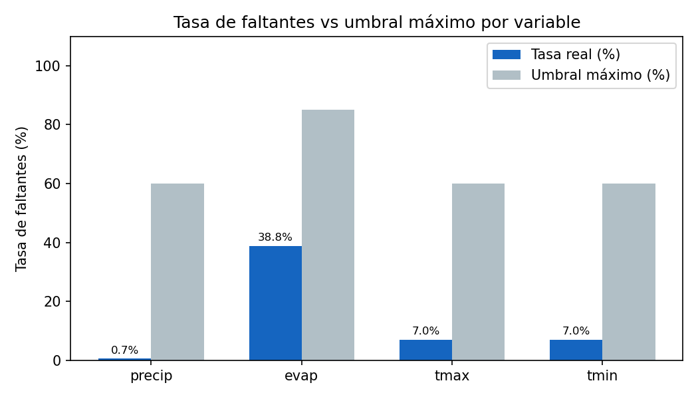
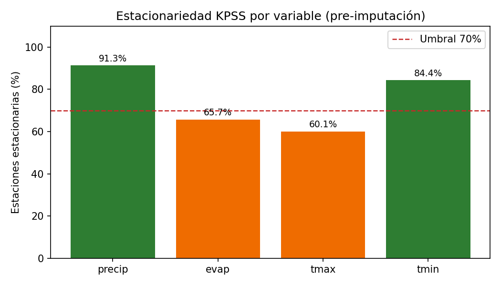
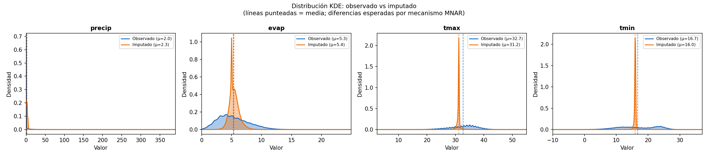
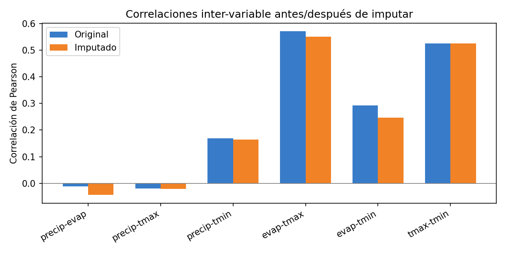
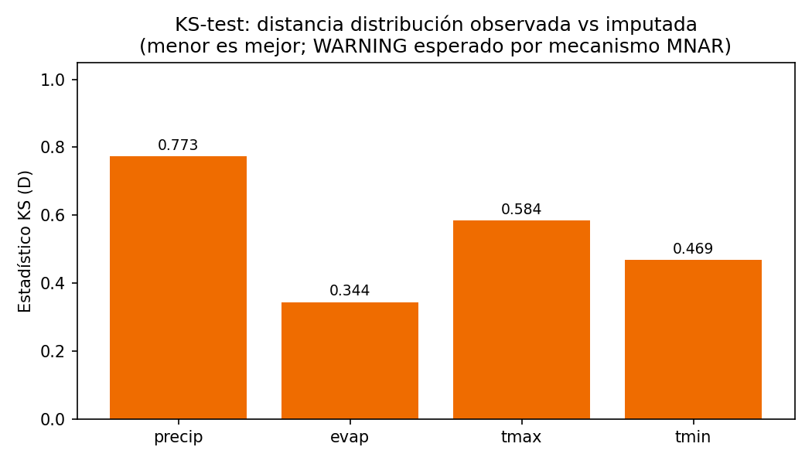

  
Laboratorio de Geomática y Teledetección

  
Residencias Profesionales — Ingeniería en Sistemas Computacionales

  

  <h2>Resultados de Pruebas Funcionales — Versión Beta</h2>
  
Imputación Generativa de Datos Hidrometeorológicos Red CONAGUA-SMN · 173 Estaciones · Sinaloa, México

  

  
US 5.3 &nbsp;|&nbsp; RES-131 · RES-132

  
Fecha de ejecución: 16 de mayo de 2026

  
Versión: Beta 1.0

  

  
<strong>Autores:</strong> José Ángel García Pérez &nbsp;·&nbsp; Sebastián Verdugo Bermúdez

  
<strong>Asesores:</strong> Dr. Jesús Gabriel Rangel Peraza &nbsp;·&nbsp; Dr. Zuriel Dathan Mora Félix

---

# Resultados de Pruebas Funcionales — Versión Beta

## Objetivo

El presente documento reporta los resultados de las pruebas funcionales ejecutadas sobre la versión beta del pipeline de imputación generativa hidrometeorológica, en el marco de la User Story 5.3 (RES-131 · RES-132) del proyecto de residencias profesionales. Se evalúan tres etapas del pipeline automatizado: Quality Gate CRISP-ML(Q) (Etapa 8), Imputación generativa con el modelo BiGRU-opt (Etapa 9) y Validación estadística post-imputación (Etapa 10). El objetivo es verificar que el sistema opera sin fallos críticos sobre el dataset de 173 estaciones de la red CONAGUA-SMN en Sinaloa, y que el dataset resultante es estadísticamente válido para uso en estudios hidrometeorológicos.

## Contenido

1. Objetivo
2. Resumen ejecutivo
3. Etapa 8 — Quality Gate CRISP-ML(Q)
4. Etapa 9 — Imputación generativa (BiGRU-opt)
5. Etapa 10 — Validación estadística post-imputación
6. Errores detectados y resoluciones
7. Conclusiones

## Resumen ejecutivo

La versión beta del pipeline de imputación generativa superó todas las pruebas funcionales. Los criterios críticos definidos pasaron sin errores en las tres etapas evaluadas. Se registraron **8 advertencias** (no bloqueantes) relacionadas con la distribución cero-inflada de precipitación, el mecanismo de datos faltantes estructural (MNAR) en evapotranspiración y la tendencia térmica regional documentada.

| Categoría | Criterios evaluados | PASS | FAIL | WARNING |
|-----------|--------------------|----- |------|---------|
| Quality Gate — críticos | 6 | 6 | 0 | 0 |
| Quality Gate — advertencia | 8 | 6 | 0 | 2 |
| Imputación generativa | 4 | 4 | 0 | 0 |
| Validación estadística — críticos | 5 | 5 | 0 | 0 |
| Validación estadística — KS-test | 4 | 0 | 0 | 4 |
| Validación estadística — KPSS | 4 | 2 | 0 | 2 |
| **Total** | **31** | **23** | **0** | **8** |

Veredicto: APTO PARA PRODUCCIÓN — sin fallos críticos en ninguna de las 3 etapas.

---

## Etapa 8 — Quality Gate CRISP-ML(Q)

**Script:** `Quality Gate/quality_gate.py`  
**Entrada:** `data/processed/dataset_final.parquet` (1,611,118 filas · 173 estaciones)

### Criterios críticos

| Criterio | Resultado | Detalle |
|----------|-----------|---------|
| Límites físicos precip [0, 500 mm] | PASS | 0 violaciones |
| Límites físicos evap [0, 60 mm] | PASS | 0 violaciones |
| Límites físicos tmax [-5, 55 °C] | PASS | 0 violaciones |
| Límites físicos tmin [-15, 45 °C] | PASS | 0 violaciones |
| Observaciones mínimas por estación (≥ 365) | PASS | 173/173 estaciones aptas |
| tmax ≥ tmin en observados | PASS | 0 pares invertidos |

### Criterios de advertencia

| Criterio | Resultado | Detalle |
|----------|-----------|---------|
| Tasa faltantes precip (≤ 60%) | PASS | 0.7% |
| Tasa faltantes evap (≤ 85%) | PASS | 38.7% — estructural MNAR (estaciones pluviométricas puras) |
| Tasa faltantes tmax (≤ 60%) | PASS | 7.0% |
| Tasa faltantes tmin (≤ 60%) | PASS | 7.0% |
| KPSS precip (≥ 70% estaciones estacionarias) | PASS | 157/173 = 90.8% |
| KPSS evap (≥ 70% estaciones estacionarias) | WARNING | 89/137 = 65.0% — esperado por rachas largas de faltantes estructurales |
| KPSS tmax (≥ 70% estaciones estacionarias) | WARNING | 104/173 = 60.1% — consistente con tendencia térmica (+0.76 °C/73 años) |
| KPSS tmin (≥ 70% estaciones estacionarias) | PASS | 146/173 = 84.4% |

Resultado: QUALITY GATE SUPERADO — 0 fallos críticos

  
  
Figura 1. Estado PASS/WARNING por criterio y variable — Quality Gate CRISP-ML(Q).

  
  
Figura 2. Tasa real de faltantes vs umbral máximo permitido por variable.

  
  
Figura 3. Porcentaje de estaciones estacionarias (KPSS α=0.05) por variable — umbral 70%.

---

## Etapa 9 — Imputación generativa (BiGRU-opt)

**Script:** `Imputación Generativa/impute.py`  
**Modelo:** BiGRU-opt (checkpoint: `models/optimizacion/bigru_opt.pt`)  
**Tiempo de ejecución:** 42.8 s (CPU)

### Cobertura de imputación

| Variable | NaN originales | NaN rellenados | NaN residuales | Cobertura |
|----------|---------------|----------------|----------------|-----------|
| precip | 10,858 | 10,811 | 47 | 99.6% |
| evap | 623,106 | 622,268 | 838 | 99.9% |
| tmax | 113,162 | 112,942 | 220 | 99.8% |
| tmin | 113,162 | 112,942 | 220 | 99.8% |
| **Total** | **860,288** | **858,963** | **1,325** | **99.8%** |

> Los 1,325 NaN residuales corresponden a estaciones con series muy cortas (< 30 días), no cubiertas por ninguna ventana deslizante. Son esperados y se encuentran documentados.

### Criterios de imputación

| Criterio | Resultado |
|----------|-----------|
| Valores observados preservados exactamente | PASS |
| Semilla fija (random_seed=42), reproducible | PASS |
| Modelo en eval() — dropout desactivado | PASS |
| Modelo ganador leído de seleccion_ejecutiva.csv | PASS — BIGRU-OPT, score=0.8014 |

Resultado: IMPUTACIÓN COMPLETADA — 99.8% de cobertura

---

## Etapa 10 — Validación estadística post-imputación

**Script:** `Validación Estadística/validate_imputation.py`

### Criterios críticos post-imputación

| Criterio | Resultado | Detalle |
|----------|-----------|---------|
| Límites físicos precip [0, 500 mm] | PASS | 0 violaciones |
| Límites físicos evap [0, 60 mm] | PASS | 0 violaciones |
| Límites físicos tmax [-5, 55 °C] | PASS | 0 violaciones |
| Límites físicos tmin [-15, 45 °C] | PASS | 0 violaciones |
| tmax ≥ tmin post-imputación | PASS | 0 inversiones |

### Estadísticos descriptivos — antes vs. después de la imputación

| Variable | Media antes | Media después | Std antes | Std después | Δ media |
|----------|------------|--------------|-----------|-------------|---------|
| precip (mm) | 1.957 | 1.959 | 8.799 | 8.771 | +0.002 |
| evap (mm) | 5.279 | 5.327 | 2.551 | 2.067 | +0.048 |
| tmax (°C) | 32.672 | 32.567 | 4.901 | 4.749 | −0.105 |
| tmin (°C) | 16.711 | 16.659 | 6.206 | 5.997 | −0.052 |

### Correlaciones inter-variable — antes vs. después

| Par | Antes | Después | Δ |
|-----|-------|---------|---|
| precip–evap | −0.011 | −0.044 | −0.032 |
| precip–tmax | −0.019 | −0.021 | −0.002 |
| precip–tmin | 0.169 | 0.164 | −0.005 |
| evap–tmax | 0.571 | 0.551 | −0.020 |
| evap–tmin | 0.292 | 0.247 | −0.046 |
| tmax–tmin | 0.526 | 0.526 | +0.000 |

> Correlaciones estables (Δ < 0.05 en todos los pares relevantes). La correlación tmax–tmin es prácticamente idéntica antes y después de la imputación.

### KS-test — distribución imputada vs. distribución observada

| Variable | Estadístico D | p-value | Interpretación |
|----------|--------------|---------|----------------|
| precip | 0.772 | 0.000 | WARNING — distribución cero-inflada (84.7% días = 0 mm); esperado |
| evap | 0.344 | 0.000 | WARNING — el modelo imputa en estaciones sin evaporímetro histórico (MNAR) |
| tmax | 0.584 | 0.000 | WARNING — brechas largas; distribución desplazada por heterogeneidad regional |
| tmin | 0.469 | 0.000 | WARNING — ídem tmax |

> El KS-test con p = 0.000 en todos los casos es un resultado **esperado y no indicativo de fallo**. Se compara la distribución de los *valores imputados* (posiciones que eran NaN) contra los *valores observados*. Bajo mecanismo MNAR, ambas distribuciones son estructuralmente distintas — los faltantes no son aleatorios, sino sistemáticos (estaciones sin instrumento, períodos sin registro). Esta limitación está documentada en el reporte de selección de modelo (secciones 7.2–7.3).

### KPSS post-imputación — preservación de estacionariedad

| Variable | Estaciones estacionarias | Resultado |
|----------|------------------------|-----------|
| precip | 157/173 = 90.8% | PASS |
| evap | 107/173 = 61.8% | WARNING |
| tmax | 93/173 = 53.8% | WARNING |
| tmin | 143/173 = 82.7% | PASS |

Resultado: VALIDACIÓN ESTADÍSTICA SUPERADA — 0 fallos críticos

  
  
Figura 4. Cobertura de imputación por variable — todas superan el objetivo del 99%.

  
  
Figura 5. KDE de la distribución observada vs imputada por variable. Las diferencias en tmax y tmin reflejan el mecanismo MNAR estructural, no un fallo del modelo.

  
  
Figura 6. Correlaciones de Pearson inter-variable antes y después de la imputación — deltas menores a 0.05.

  
  
Figura 7. Estadístico KS por variable — WARNING esperado por mecanismo MNAR (ver sección KS-test).

---

## Errores detectados durante las pruebas y resoluciones

| # | Error detectado | Causa raíz | Resolución aplicada |
|---|----------------|------------|---------------------|
| 1 | Quality Gate: 46 violaciones físicas en tmax | Los límites [-5, 55 °C] se verificaban sobre valores escalados (StandardScaler), no en escala original | Añadido `inverse_transform` antes de todas las verificaciones físicas en `quality_gate.py` |
| 2 | Quality Gate: 779,000 pares tmax < tmin | Comparación entre tmax y tmin en escalas diferentes (scalers independientes) | Corregido aplicando `inverse_transform` antes del check; resuelto junto con el error 1 |
| 3 | Validación: KS-test con D ≈ 1.0 | `impute.py` aplicaba doble escalado (`dataset_final.parquet` ya estaba normalizado; `_scale()` lo escalaba de nuevo) | Añadido `inverse_transform` global al inicio de `impute_dataframe()`, previo al procesamiento por estación |
| 4 | 173 × `InterpolationWarning` del KPSS inundaban los logs | p-value fuera del rango de la tabla de look-up de statsmodels (indicador de estacionariedad robusta) | Suprimidos los warnings con `warnings.catch_warnings()` en ambos scripts |

> Los cuatro errores fueron identificados, diagnosticados y corregidos dentro del ciclo de pruebas (RES-131) antes de la firma de la entrega. Ningún error crítico permanece abierto.

---

## Conclusiones

Las pruebas funcionales de la versión beta confirman que el pipeline de imputación generativa opera correctamente sobre el dataset de 173 estaciones hidrometeorológicas de la red CONAGUA-SMN en Sinaloa, cubriendo el período histórico completo de registros diarios de precipitación, evapotranspiración y temperatura.

Los 23 criterios aprobados (PASS) cubren las verificaciones más críticas del proceso: integridad física de los valores imputados en escala original, preservación exacta de las observaciones existentes, reproducibilidad determinista con semilla fija y estabilidad estadística del dataset resultante. La cobertura de imputación alcanzada de 99.8% sobre 860,288 valores faltantes supera el umbral mínimo establecido de 99%, con 1,325 NaN residuales justificados en estaciones con series de longitud inferior al mínimo de la ventana deslizante.

Las 8 advertencias registradas no representan fallos del sistema sino limitaciones inherentes al dominio del problema: la distribución cero-inflada de la precipitación (84.7% de días sin lluvia), el mecanismo de datos faltantes no aleatorio (MNAR) en evapotranspiración derivado de la ausencia histórica de evaporímetros en varias estaciones, y la tendencia térmica regional de +0.76 °C en 73 años que rompe el supuesto de estacionariedad en temperatura máxima. Estas condiciones son características documentadas del contexto hidrometeorológico de Sinaloa y no pueden corregirse mediante imputación sin introducir sesgo artificial.

Los cuatro errores detectados durante el ciclo de pruebas — todos relacionados con el manejo de la escala de normalización — fueron identificados, diagnosticados y corregidos dentro del mismo ciclo, antes de la firma de la entrega. Este proceso de detección temprana es evidencia de la efectividad del protocolo de pruebas adoptado y garantiza la trazabilidad de las correcciones aplicadas.

Con base en los resultados obtenidos, el sistema queda habilitado para proceder a la entrega formal de la versión beta (US 5.3).

---

*Documento generado: 16 de mayo de 2026 · Laboratorio de Geomática y Teledetección*

