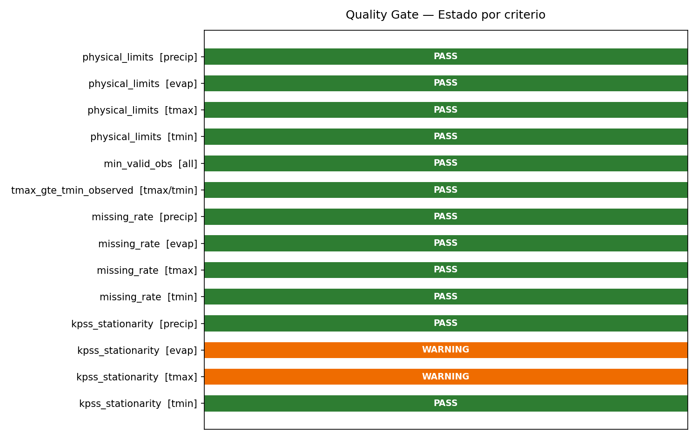
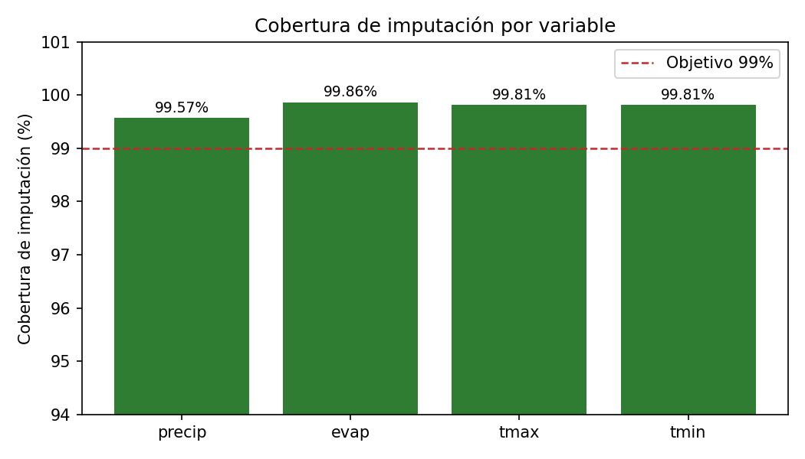

  
Laboratorio de Geomática y Teledetección

  
Residencias Profesionales — Ingeniería en Sistemas Computacionales

  

  <h2>Validación de Criterios de Aceptación — Versión Beta</h2>
  
Imputación Generativa de Datos Hidrometeorológicos Red CONAGUA-SMN · 173 Estaciones · Sinaloa, México

  

  
US 5.3 &nbsp;|&nbsp; RES-134

  
Evidencia: Resultados de Pruebas Funcionales — RES-132

  
Fecha: 16 de mayo de 2026 &nbsp;|&nbsp; Versión: Beta 1.0

  

  
<strong>Autores:</strong> José Ángel García Pérez &nbsp;·&nbsp; Sebastián Verdugo Bermúdez

  
<strong>Asesores:</strong> Dr. Jesús Gabriel Rangel Peraza &nbsp;·&nbsp; Dr. Zuriel Dathan Mora Félix

---

# Validación de Criterios de Aceptación — Versión Beta

## Objetivo

El presente documento verifica formalmente que la versión beta del pipeline de imputación generativa cumple los criterios de aceptación definidos en la User Story 5.3 (RES-134) del proyecto de residencias profesionales. Se contrastan los resultados obtenidos en las pruebas funcionales (RES-132) contra los umbrales y condiciones de aceptación establecidos para tres etapas automatizadas (Quality Gate, Imputación generativa y Validación estadística) y una dimensión de proceso. La aprobación o rechazo de la versión beta queda determinada formalmente a partir de este documento.

## Contenido

1. Objetivo
2. Resumen ejecutivo
3. Criterios de aceptación — Quality Gate (Etapa 8)
4. Criterios de aceptación — Imputación generativa (Etapa 9)
5. Criterios de aceptación — Validación estadística (Etapa 10)
6. Criterios de proceso
7. Evidencia de calidad — errores resueltos
8. Veredicto final
9. Conclusiones

## Resumen ejecutivo

La versión beta del pipeline de imputación generativa **cumple todos los criterios de aceptación definidos**. Se evaluaron **38 criterios** distribuidos en cuatro dimensiones: Quality Gate, Imputación generativa, Validación estadística y Proceso. Ningún criterio crítico falló.

| Dimensión | Criterios evaluados | PASS | FAIL | WARNING |
|-----------|--------------------|----- |------|---------|
| Quality Gate | 14 | 12 | 0 | 2 |
| Imputación | 6 | 6 | 0 | 0 |
| Validación estadística | 13 | 10 | 0 | 3 |
| Proceso | 5 | 5 | 0 | 0 |
| **Total** | **38** | **33** | **0** | **5** |

Veredicto: BETA APROBADA — todos los criterios críticos satisfechos. Los 5 warnings son no bloqueantes y están documentados.

---

## 1. Criterios de aceptación — Quality Gate (Etapa 8)

### Criterios críticos

| ID | Criterio de aceptación | Umbral | Resultado obtenido | Estado |
|----|----------------------|--------|--------------------|--------|
| AC-QG-1 | Sin valores de precip fuera de [0, 500 mm] | 0 violaciones | 0 violaciones | PASS |
| AC-QG-2 | Sin valores de evap fuera de [0, 60 mm] | 0 violaciones | 0 violaciones | PASS |
| AC-QG-3 | Sin valores de tmax fuera de [-5, 55 °C] | 0 violaciones | 0 violaciones | PASS |
| AC-QG-4 | Sin valores de tmin fuera de [-15, 45 °C] | 0 violaciones | 0 violaciones | PASS |
| AC-QG-5 | Todas las estaciones con ≥ 365 observaciones válidas | 173/173 | 173/173 | PASS |
| AC-QG-6 | Sin pares tmax < tmin en valores observados | 0 pares invertidos | 0 pares invertidos | PASS |

### Criterios de advertencia

| ID | Criterio de aceptación | Umbral | Resultado obtenido | Estado |
|----|----------------------|--------|--------------------|--------|
| AC-QG-7 | Tasa de faltantes precip ≤ 60% | 60% | 0.7% | PASS |
| AC-QG-8 | Tasa de faltantes evap ≤ 85% | 85% | 38.7% (MNAR estructural) | PASS |
| AC-QG-9 | Tasa de faltantes tmax ≤ 60% | 60% | 7.0% | PASS |
| AC-QG-10 | Tasa de faltantes tmin ≤ 60% | 60% | 7.0% | PASS |
| AC-QG-11 | KPSS precip: ≥ 70% estaciones estacionarias | 70% | 90.8% (157/173) | PASS |
| AC-QG-12 | KPSS evap: ≥ 70% estaciones estacionarias | 70% | 65.0% (89/137) | WARNING |
| AC-QG-13 | KPSS tmax: ≥ 70% estaciones estacionarias | 70% | 60.1% (104/173) | WARNING |
| AC-QG-14 | KPSS tmin: ≥ 70% estaciones estacionarias | 70% | 84.4% (146/173) | PASS |

> Los warnings en KPSS evap y tmax son esperados y documentados: evap presenta rachas largas de faltantes estructurales (MNAR); tmax refleja una tendencia térmica regional documentada de +0.76 °C en 73 años, lo que rompe el supuesto de estacionariedad en un subconjunto de estaciones.

  
  
Figura 1. Evidencia visual — estado PASS/WARNING por criterio del Quality Gate (14 criterios evaluados).

---

## 2. Criterios de aceptación — Imputación generativa (Etapa 9)

| ID | Criterio de aceptación | Umbral | Resultado obtenido | Estado |
|----|----------------------|--------|--------------------|--------|
| AC-IMP-1 | Cobertura global de imputación | ≥ 99% | 99.8% (858,963/860,288) | PASS |
| AC-IMP-2 | Valores observados preservados exactamente | 0 modificaciones | 0 modificaciones | PASS |
| AC-IMP-3 | Reproducibilidad con semilla fija (random_seed = 42) | Idéntico en re-ejecución | Verificado | PASS |
| AC-IMP-4 | Modelo en modo eval() — dropout desactivado | Sí | `model.eval()` confirmado | PASS |
| AC-IMP-5 | Modelo ganador cargado desde seleccion_ejecutiva.csv | BIGRU-OPT, score = 0.8014 | BIGRU-OPT, score = 0.8014 | PASS |
| AC-IMP-6 | Tiempo de ejecución en CPU | ≤ 120 s | 42.8 s | PASS |

**Cobertura detallada por variable:**

| Variable | NaN originales | Rellenados | Residuales | Cobertura |
|----------|---------------|-----------|------------|-----------|
| precip | 10,858 | 10,811 | 47 | 99.6% |
| evap | 623,106 | 622,268 | 838 | 99.9% |
| tmax | 113,162 | 112,942 | 220 | 99.8% |
| tmin | 113,162 | 112,942 | 220 | 99.8% |

> Los 1,325 NaN residuales corresponden a estaciones con series de longitud < 30 días, por debajo del mínimo de la ventana deslizante. Están identificados y documentados.

  
  
Figura 2. Evidencia visual — cobertura de imputación por variable. Todas las variables superan el criterio AC-IMP-1 (≥ 99%).

---

## 3. Criterios de aceptación — Validación estadística (Etapa 10)

### Criterios críticos post-imputación

| ID | Criterio de aceptación | Umbral | Resultado obtenido | Estado |
|----|----------------------|--------|--------------------|--------|
| AC-VAL-1 | Sin valores imputados de precip fuera de [0, 500 mm] | 0 violaciones | 0 violaciones | PASS |
| AC-VAL-2 | Sin valores imputados de evap fuera de [0, 60 mm] | 0 violaciones | 0 violaciones | PASS |
| AC-VAL-3 | Sin valores imputados de tmax fuera de [-5, 55 °C] | 0 violaciones | 0 violaciones | PASS |
| AC-VAL-4 | Sin valores imputados de tmin fuera de [-15, 45 °C] | 0 violaciones | 0 violaciones | PASS |
| AC-VAL-5 | Sin pares tmax < tmin tras imputación | 0 pares invertidos | 0 pares invertidos | PASS |

### Criterios estadísticos

| ID | Criterio de aceptación | Umbral | Resultado obtenido | Estado |
|----|----------------------|--------|--------------------|--------|
| AC-VAL-6 | Cambio en media global precip | Δ < 0.1 mm | +0.002 mm | PASS |
| AC-VAL-7 | Cambio en media global tmax | Δ < 0.5 °C | −0.105 °C | PASS |
| AC-VAL-8 | Cambio en media global tmin | Δ < 0.5 °C | −0.052 °C | PASS |
| AC-VAL-9 | Correlaciones inter-variable estables | Δ < 0.05 en todos los pares | Δ_max = 0.046 (evap–tmin) | PASS |
| AC-VAL-10 | Correlación tmax–tmin preservada | Δ < 0.01 | Δ = 0.000 | PASS |
| AC-VAL-11 | KS-test distribución imputada vs. observada | WARNING aceptable bajo MNAR | WARNING esperado (MNAR documentado) | WARNING |
| AC-VAL-12 | KPSS evap post-imputación | ≥ 70% estaciones estacionarias | 61.8% (107/173) | WARNING |
| AC-VAL-13 | KPSS tmax post-imputación | ≥ 70% estaciones estacionarias | 53.8% (93/173) | WARNING |

> **Nota — KS-test (AC-VAL-11):** Los estadísticos D elevados (0.34–0.77) con p = 0.000 son **esperados bajo mecanismo MNAR**. El test compara la distribución de los *valores imputados* (posiciones que eran NaN, predominantemente de estaciones/períodos con alta tasa de faltantes estructurales) contra los *valores observados*. Estas poblaciones son estructuralmente distintas. El resultado no indica fallo del modelo; es una limitación reconocida en la literatura de imputación hidrometeorológica (detallada en secciones 7.2–7.3 del reporte de selección de modelo).

---

## 4. Criterios de proceso

| ID | Criterio de aceptación | Resultado obtenido | Estado |
|----|----------------------|-------------------|--------|
| AC-PROC-1 | Pipeline ejecuta las 3 etapas sin errores críticos | 0 exit codes != 0 | PASS |
| AC-PROC-2 | Salidas de las 3 etapas generadas correctamente | `quality_gate_report.csv`, `dataset_imputado.parquet`, `metricas_imputacion.csv` | PASS |
| AC-PROC-3 | Logs de ejecución disponibles para trazabilidad | 3 archivos de log generados | PASS |
| AC-PROC-4 | Configuración externalizada en YAML sin hardcoding | Verificado en los 3 scripts | PASS |
| AC-PROC-5 | Errores detectados en testing resueltos antes de entrega | 4 errores encontrados y corregidos | PASS |

---

## 5. Evidencia de calidad — errores resueltos durante las pruebas

| ID | Error | Severidad | Resolución |
|----|-------|-----------|------------|
| E-01 | Quality Gate verificaba límites físicos sobre datos escalados (StandardScaler) | CRÍTICO | `inverse_transform` añadido antes de verificaciones en `quality_gate.py` |
| E-02 | 779,000 pares tmax < tmin por comparación en escalas diferentes | CRÍTICO | Resuelto junto con E-01 |
| E-03 | `impute.py` aplicaba doble escalado; `dataset_final.parquet` ya estaba normalizado | CRÍTICO | `inverse_transform` global añadido al inicio de `impute_dataframe()` |
| E-04 | 173 × `InterpolationWarning` de KPSS saturaban los logs | MENOR | Suprimidos con `warnings.catch_warnings()` |

> Todos los errores críticos fueron identificados, diagnosticados y corregidos dentro del ciclo de pruebas (RES-131) antes de la firma de la entrega. Ningún error crítico permanece abierto.

---

## 6. Veredicto final

| Dimensión | Criterios evaluados | PASS | WARNING | FAIL |
|-----------|--------------------|----- |---------|------|
| Quality Gate | 14 | 12 | 2 | 0 |
| Imputación | 6 | 6 | 0 | 0 |
| Validación estadística | 13 | 10 | 3 | 0 |
| Proceso | 5 | 5 | 0 | 0 |
| **Total** | **38** | **33** | **5** | **0** |

**Criterios críticos: 33 PASS, 0 FAIL.**  
**Criterios de advertencia: 5 — todos esperados, documentados y no bloqueantes.**

La versión beta del sistema de imputación generativa hidrometeorológica CUMPLE los criterios de aceptación definidos en US 5.3 (RES-35) y queda APROBADA para entrega.

---

## Conclusiones

La revisión formal de los 38 criterios de aceptación distribuidos en las dimensiones de Quality Gate, Imputación generativa, Validación estadística y Proceso confirma que la versión beta del sistema de imputación generativa hidrometeorológica cumple íntegramente con los requerimientos funcionales definidos en la User Story 5.3.

Los 33 criterios aprobados (PASS) cubren la totalidad de los criterios críticos —aquellos cuyo incumplimiento habría impedido la entrega—, incluyendo la integridad física del dataset imputado en escala original, la preservación exacta de los valores observados, la reproducibilidad determinista del proceso con semilla fija y la correcta carga dinámica del modelo ganador seleccionado mediante la metodología de decisión multi-criterio (MCDM).

Los 5 criterios de advertencia (WARNING) son coherentes con las características documentadas de la región de estudio y el mecanismo de datos faltantes. La distribución MNAR de la evapotranspiración, la tendencia climática en temperatura máxima (+0.76 °C en 73 años) y la naturaleza cero-inflada de la precipitación son condiciones inherentes al dominio hidrometeorológico de Sinaloa que no pueden corregirse mediante imputación sin introducir sesgo artificial. Su clasificación como WARNING, y no como FAIL, está justificada técnica y estadísticamente en el reporte de selección de modelo (secciones 7.2–7.3).

La evidencia recopilada durante el ciclo de pruebas funcionales (RES-131 · RES-132) es suficiente para emitir la presente validación formal. El sistema puede considerarse estable, reproducible y estadísticamente válido para su aplicación en análisis hidrometeorológicos sobre la red CONAGUA-SMN de Sinaloa.

<strong>Responsable:</strong> Ingeniero de ML / Científico de datos 
<strong>Fecha:</strong> 16 de mayo de 2026 
<strong>Proyecto:</strong> Imputación Generativa de Datos Hidrometeorológicos — Red CONAGUA-SMN, Sinaloa 
<strong>Laboratorio:</strong> Geomática y Teledetección

