<style>
  body {
    font-family: 'Segoe UI', Arial, sans-serif;
    font-size: 11pt;
    line-height: 1.6;
    color: #1a1a1a;
    max-width: 900px;
    margin: 0 auto;
  }
  h1 { font-size: 20pt; color: #0d47a1; border-bottom: 2px solid #0d47a1; padding-bottom: 6px; }
  h2 { font-size: 14pt; color: #1565c0; border-bottom: 1px solid #90caf9; padding-bottom: 4px; margin-top: 28px; }
  h3 { font-size: 11.5pt; color: #1976d2; margin-top: 18px; }
  table {
    width: 100%;
    border-collapse: collapse;
    font-size: 9.5pt;
    margin: 12px 0;
  }
  th {
    background-color: #1565c0;
    color: white;
    padding: 6px 8px;
    text-align: left;
  }
  td { padding: 5px 8px; border: 1px solid #c5cae9; }
  tr:nth-child(even) { background-color: #e8eaf6; }
  tr:nth-child(odd)  { background-color: #ffffff; }
  code {
    background: #f1f3f4;
    padding: 1px 4px;
    border-radius: 3px;
    font-size: 9pt;
    font-family: 'Courier New', monospace;
  }
  pre {
    background: #f8f9fa;
    border-left: 4px solid #1565c0;
    padding: 10px 14px;
    font-size: 8.5pt;
    overflow-x: auto;
    border-radius: 4px;
  }
  blockquote {
    border-left: 4px solid #90caf9;
    margin: 8px 0;
    padding: 4px 12px;
    color: #424242;
    background: #e3f2fd;
    font-size: 9.5pt;
  }
  img { max-width: 100%; height: auto; display: block; margin: 8px auto; }
</style>

# Comparativa de Modelos Base
## Imputación Hidrometeorológica — Sinaloa

| | |
|---|---|
| **Proyecto** | Imputación Generativa de Series Hidrometeorológicas |
| **Fase** | Modelos Base |
| **Fecha** | 2026-05-09 |
| **Estaciones** | 173 estaciones CONAGUA/SMN, Sinaloa |
| **Variables** | precip · evap · tmax · tmin |

---

### Resumen Ejecutivo

Se comparan **8 modelos** de imputación hidrometeorológica (SARIMA, ETS, Prophet, TBATS, XGBoost, Autoencoder Conv1D, BiGRU y BiLSTM) sobre **173 estaciones CONAGUA/Sinaloa** bajo protocolo MCAR 20 %. Los modelos ML/DL superan a los estadísticos en todas las variables con diferencias de R² entre +0.1 y +15.3 puntos. **BiGRU** es el mejor modelo global (NSE = 0.852 / tmax, 0.939 / tmin, 0.692 / evap) y **XGBoost** el mejor para precipitación (NSE = 0.139). Se evalúa además la preservación de estacionariedad (KPSS, 28/28 tests) y la estructura de autocorrelación (ACF/PACF, 21 lags). Los resultados establecen la línea base para la fase de modelos generativos (US 4.2).

---

### Tabla de Contenidos

| # | Sección |
|:-:|---------|
| 1 | Descripción del Dataset |
| 2 | Protocolo Experimental |
| 3 | Arquitecturas Implementadas |
| 4 | Detalle del Entrenamiento (Modelos DL) |
| 5 | Resultados de Desempeño |
| 6 | Análisis Comparativo |
| 7 | Recomendación Práctica |
| 8 | Limitaciones de los Modelos Base |
| 9 | Figuras de Referencia |
| 10 | Comparación con Literatura |
| 11 | Conclusiones |
| 12 | Referencias |

---

## 1. Descripción del Dataset

### 1.1 Fuente y cobertura

Los datos provienen de la red de estaciones climatológicas de la **Comisión Nacional del Agua (CONAGUA) / Servicio Meteorológico Nacional (SMN)** distribuidas en el estado de Sinaloa, México. Se incluyen **173 estaciones** con registros diarios de cuatro variables hidrometeorológicas.

| | |
|---|---|
| **Total de estaciones** | 173 |
| **Período global** | 1908-11-01 — 2026-02-28 |
| **Granularidad** | Diaria |
| **Formato de trabajo** | Parquet (series) + tensores PyTorch (ventanas) |

### 1.2 Partición de datos (Train / Val / Test)

La partición se realizó de forma **cronológica por estación** (`temporal_per_station`): cada una de las 173 estaciones se divide de forma independiente ordenando sus registros por fecha, asignando el 70 % más antiguo a train, el siguiente 15 % a val y el 15 % más reciente a test. Esta estrategia preserva la causalidad temporal, evita fuga de información y maximiza los datos de entrenamiento para estaciones con distintos rangos de cobertura.

| Split | Rango global agregado | Filas | Estaciones |
|-------|----------------------|------:|:----------:|
| **Train** | 1908-11-01 → 2024-05-29 | 1 127 704 | 173 |
| **Val** | — → 2025-02-28 | 241 673 | 173 |
| **Test** | — → 2026-02-28 | 241 741 | 173 |
| **Total** | | 1 611 118 | 173 |

> Los rangos de fecha son el mínimo y máximo globales entre todas las estaciones. Las fronteras exactas de cada estación se encuentran en `data/splits/split_index.csv`.

Los modelos de Deep Learning utilizan adicionalmente tensores PyTorch de ventanas deslizantes de **30 días** con stride de 7 días, generando 160 041 secuencias de entrenamiento, 33 831 de validación y 33 678 de test.

### 1.3 Tasa de faltantes reales por variable

Las tasas de faltantes varían drásticamente entre variables, lo que condiciona el desempeño de todos los modelos evaluados.

| Variable | Faltantes en Train | Faltantes en Test | Naturaleza de los faltantes |
|----------|--------------------|-------------------|-----------------------------|
| `precip` | 0.8 % (8 982 obs.) | 0.6 % (1 363 obs.) | Aleatorios, errores de registro |
| `tmax`   | 9.0 % (101 989 obs.) | 2.4 % (5 855 obs.) | Periódicos, fallas de sensor |
| `tmin`   | 9.0 % (101 989 obs.) | 2.4 % (5 855 obs.) | Periódicos, fallas de sensor |
| `evap`   | 38.5 % (433 713 obs.) | 48.7 % (117 722 obs.) | **Estructurales** — rachas de hasta 3.6 años |

> `evap` es la variable más problemática: casi la mitad del set de test carece de valores observados. Esto refleja la interrupción prolongada de mediciones de evaporación en varias estaciones, no errores puntuales.

## 2. Protocolo Experimental

### 2.1 Evaluación MCAR

Se aplica un esquema **Missing Completely At Random (MCAR) al 20 %**: de todos los valores observados en el conjunto de test, se enmascara artificialmente el 20 % de forma aleatoria y se mide el error de imputación **únicamente en esas posiciones**. Esto garantiza que se evalúa la capacidad de interpolación y no de forecasting.

```
Posiciones evaluadas = test_observado × MCAR(p = 0.20)
Métrica = f( y_real[MCAR],  ŷ[MCAR] )
```

### 2.2 Tamaño efectivo de evaluación por familia

Los modelos estadísticos son univariados y computacionalmente costosos (SARIMA/TBATS requieren minutos por variable por estación), por lo que se evaluaron sobre una sola **estación representativa** (la más cercana a la tasa mediana de faltantes del conjunto de test, criterio defensible y reproducible). Los modelos ML/DL se evaluaron sobre toda la muestra.

| Familia | Scope de evaluación | N posiciones MCAR — precip/tmax/tmin | N posiciones MCAR — evap |
|---------|--------------------|-----------------------------|--------------------------|
| Estadísticos (SARIMA, ETS, TBATS, Prophet) | 1 estación representativa | ~860 | ~440 |
| XGBoost | 173 estaciones (parquet completo) | ~47 000–48 000 | ~25 000 |
| Autoencoder / BiGRU / BiLSTM | 173 estaciones (tensores) | ~195 000–196 000 | ~101 000 |

> `evap` tiene aproximadamente la mitad de posiciones MCAR respecto a las demás variables porque el 48.7 % de sus registros de test son NaN estructurales — no hay valores observados que enmascarar en esas posiciones.

### 2.3 Métricas reportadas

| Métrica | Fórmula | Interpretación |
|---------|---------|----------------|
| **RMSE** | √(Σ(ŷ−y)²/n) | Error cuadrático medio; penaliza outliers |
| **MAE** | Σ\|ŷ−y\|/n | Error absoluto medio; más robusto |
| **R²** | 1 − SS_res/SS_tot | 1=perfecto, 0=media, <0=peor que media |
| **NSE** | igual a R² | Nash-Sutcliffe Efficiency — estándar hidrológico |

> **MAPE excluido:** Los valores MAPE son del orden de millones de % para `precip` en todos los modelos. Dado que ~70 % de los días tienen precipitación = 0 (y muchos más tienen valores muy próximos a cero tras el escalado MinMaxScaler), el denominador de MAPE es nulo o negligible en la gran mayoría de las posiciones evaluadas. El MAPE no es interpretable para distribuciones zero-inflated.

## 3. Arquitecturas Implementadas

### 3.1 Modelos estadísticos

| Modelo | Paradigma | Hiperparámetros clave |
|--------|----------|----------------------|
| **SARIMA** | AR estacional | order=(1,1,1), seasonal=(1,0,1,12), frecuencia diaria |
| **ETS / Holt-Winters** | Suavizamiento exponencial | trend=add, seasonal=add, periods=365, init=heuristic, L-BFGS-B |
| **Prophet** | Modelo aditivo | Estacionalidad anual+semanal via Fourier, changepoints automáticos |
| **TBATS** | Exponential smoothing | Box-Cox + ARMA residuals, selección automática de componentes |

> Estos modelos operan en modo **forecasting**: se entrenan sobre train y pronostican secuencialmente hacia adelante sobre el período de test (~4 300 días). No tienen acceso a contexto futuro durante la imputación.

### 3.2 XGBoost

- **Algoritmo:** Gradient Boosted Trees — 400 árboles, lr = 0.05, max_depth = 6, subsample = 0.8
- **Features (19 por variable):**

| Grupo | Features |
|-------|---------|
| Lags del target | t−1, t−2, t−3, t−7, t−14, t−30 |
| Medias móviles | rolling_7d, rolling_30d (desde t−1) |
| Componentes de fecha | mes, día_del_año, día_semana, sin(día/365.25), cos(día/365.25) |
| Covariables cruzadas | valor_t0 y lag_1 de las otras 3 variables |

- **Estrategia:** un modelo independiente por variable; entrenado sobre train+val unificados (~1.4 M muestras para `precip`).

### 3.3 Autoencoder Convolucional 1D

```
Entrada : (N, 30, 4)  — N secuencias · 30 días · 4 variables

ENCODER
  Conv1d(4 → 32, k=3, pad=1)   + BatchNorm1d(32)  + ReLU  →  (N, 32, 30)
  Conv1d(32 → 64, k=3, pad=1)  + BatchNorm1d(64)  + ReLU  →  (N, 64, 30)
  Conv1d(64 → 128, k=3, pad=1) + BatchNorm1d(128) + ReLU  →  (N, 128, 30)
  AdaptiveAvgPool1d(8)                                      →  (N, 128,  8)
  Flatten                                                   →  (N, 1024)
  Linear(1024 → 64)             + ReLU                     →  (N,   64)  ← espacio latente

DECODER
  Linear(64 → 1024)             + ReLU                     →  (N, 1024)
  Unflatten                                                 →  (N, 128,  8)
  Upsample(size=30, linear)                                 →  (N, 128, 30)
  Conv1d(128 → 64, k=3, pad=1) + ReLU                     →  (N,  64, 30)
  Conv1d(64 →  32, k=3, pad=1) + ReLU                     →  (N,  32, 30)
  Conv1d(32 →   4, k=3, pad=1)                             →  (N,   4, 30)

Salida  : (N, 30, 4)
```

- **Parámetros totales:** ~200 K
- **Entrenamiento denoising:** MCAR 20 % aplicado al input en cada batch (`X_input = X × input_mask`); loss calculada **solo** en posiciones artificialmente enmascaradas. El modelo aprende a imputar desde la estructura global de la secuencia convolucional.
- **Loss:** Masked MSE = Σ[(ŷ−y)² × mcar_pos] / Σ[mcar_pos]
- **Optimización:** Adam lr=1e-3, weight_decay=1e-5 · ReduceLROnPlateau (patience=5, factor=0.5) · Early stopping patience=10 · 60 épocas máx. · batch=256

### 3.4 BiGRU / BiLSTM Bidireccional

```
Entrada : (N, 30, 8)  — cat([X, mask], dim=−1)  ← máscara como canal explícito

BiGRU capa 1  GRU(8 → 128, bidireccional)    →  (N, 30, 256)
Dropout(0.2)
BiGRU capa 2  GRU(256 → 128, bidireccional)  →  (N, 30, 256)
LayerNorm(256)
Dropout(0.2)
Linear(256 → 4)                               →  (N, 30,   4)

Salida  : (N, 30, 4)   —   403 972 parámetros  (BiGRU) / ~539 K (BiLSTM)
```

- **Ventaja clave:** la máscara binaria se concatena como canal extra de entrada (técnica de BRITS). La red aprende explícitamente qué posiciones son observadas y cuáles debe imputar.
- **Entrenamiento:** mismo protocolo denoising MCAR 20 % que el Autoencoder. Grad clip norm = 1.0.
- **Loss:** idéntica al Autoencoder — Masked MSE sobre posiciones MCAR.

## 4. Detalle del Entrenamiento (Modelos DL)

### 4.1 Convergencia y costo computacional

Los tres modelos se entrenaron sobre **CPU** (PyTorch 2.11.0, sin GPU activa durante la sesión de entrenamiento).

| | Autoencoder Conv1D | BiGRU Bidireccional | BiLSTM Bidireccional |
|--|:-----------------:|:-------------------:|:--------------------:|
| **Épocas completadas** | 60 / 60 | 60 / 60 | ~43 / 60 |
| **Early stopping activado** | No | No | Sí (patience=10) |
| **Mejor val_loss** | 0.059326 (época 55) | 0.056874 (época 53) | — |
| **Tiempo por época (CPU)** | ~13.5 s | ~112 s | ~112 s |
| **Reducción de LR** | Época 47: 1e-3 → 5e-4 | Época 47: 1e-3 → 5e-4 · Época 59: → 2.5e-4 | — |

> El BiGRU/BiLSTM son ~8× más lentos por época que el Autoencoder debido al procesamiento recurrente secuencial (626 batches × 2 capas GRU/LSTM bidireccionales). Con GPU, ambos tiempos se reducirían 10–30×.

### 4.2 Análisis de las curvas de aprendizaje

**Autoencoder:** La loss de validación sigue de cerca la de entrenamiento hasta la época 47, cuando el scheduler reduce el LR. Tras la reducción, la val_loss baja de ~0.062 a ~0.059 en las últimas 8 épocas. No hay señales de sobreajuste — la brecha train/val se mantiene estable (~0.001). El modelo alcanzó su mínimo en la época 55 y se mantuvo estable hasta el final.

**BiGRU:** Patrón similar al Autoencoder con LR reducido en época 47. El modelo converge más suavemente (la brecha train/val es menor, ~0.0003 en las últimas épocas) gracias a LayerNorm y Dropout. El mínimo de validación (0.056874) se alcanzó en la época 53 y el modelo entrenó 7 épocas adicionales sin mejorar antes de que el scheduler redujera el LR por segunda vez.

**BiLSTM:** Early stopping activado en torno a la época 43. El mayor número de parámetros del LSTM (~539 K vs ~404 K del GRU) no se traduce en mejor desempeño en ventanas de 30 días, donde la menor capacidad de la GRU es suficiente y converge más rápido. El BiGRU es el modelo ganador de esta familia.

Ambas curvas del Autoencoder y el BiGRU indican un **entrenamiento estable sin sobreajuste**, con margen potencial de mejora si se entrena con GPU para más épocas o con batch size mayor.

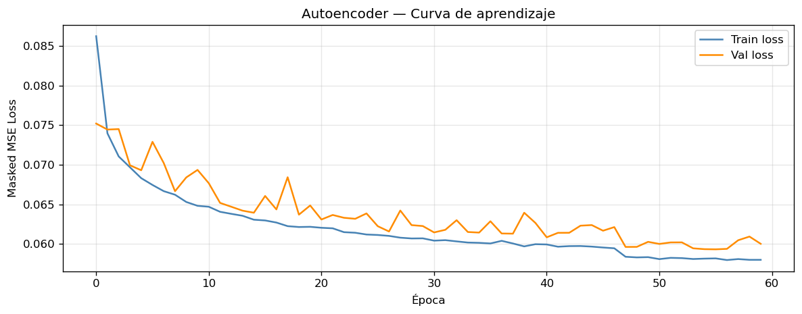
*Figura 1. Evolución de la loss train/val del Autoencoder Conv1D (60 épocas, CPU).*

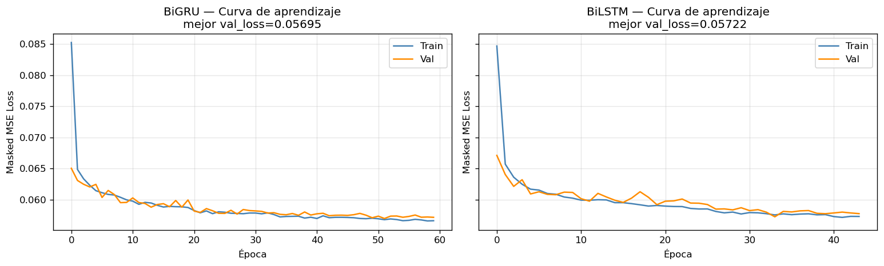
*Figura 2. Evolución de la loss train/val del BiGRU y BiLSTM bidireccionales (60 épocas, CPU).*

## 5. Resultados de Desempeño

### 5.1 R² / NSE por variable

> R² = 1 → imputación perfecta · R² = 0 → equivale a predecir la media · R² < 0 → peor que la media

| Modelo | precip | evap | tmax | tmin | **Global** |
|--------|:------:|:----:|:----:|:----:|:----------:|
| **XGBoost** | **0.139** | 0.689 | 0.827 | 0.927 | **0.646** |
| **BiGRU** | 0.092 | **0.692** | **0.852** | **0.939** | **0.644** |
| **BiLSTM** | 0.069 | 0.687 | 0.850 | 0.938 | **0.636** |
| **Autoencoder** | 0.066 | 0.663 | 0.849 | 0.937 | **0.629** |
| Prophet | −0.351 | −0.316 | −4.048 | 0.673 | −1.011 |
| SARIMA | −0.005 | −14.581 | −0.306 | −0.851 | −3.936 |
| TBATS | −0.101 | −15.933 | −0.376 | −2.737 | −4.787 |
| ETS | −0.243 | −13.042 | −3.948 | −3.412 | −5.161 |

### 5.2 RMSE por variable (espacio escalado)

> tmax / tmin en z-scores: RMSE 0.5 ≈ 2.5 °C · precip / evap en [0,1]: referencia aceptable < 0.10
> El resaltado en negrita indica el mejor valor entre los modelos de **interpolación** (XGBoost y DL), evaluados sobre 173 estaciones. Los modelos estadísticos se muestran como referencia con alcance de evaluación diferente (1 estación representativa) y su menor RMSE en `precip` refleja predicción trivial cercana a cero, no mejor imputación (ver sección 6.1).

| Modelo | precip | evap | tmax | tmin |
|--------|:------:|:----:|:----:|:----:|
| **BiGRU** | 0.0219 | **0.0554** | **0.3873** | **0.2510** |
| **BiLSTM** | 0.0222 | 0.0559 | 0.3895 | 0.2530 |
| **Autoencoder** | 0.0222 | 0.0580 | 0.3917 | 0.2561 |
| **XGBoost** | **0.0208** | 0.0559 | 0.4183 | 0.2761 |
| Prophet | 0.0124 | 0.0688 | 1.6370 | 0.4904 |
| SARIMA | 0.0107 | 0.2367 | 0.8327 | 1.1664 |
| TBATS | 0.0112 | 0.2468 | 0.8547 | 1.6572 |
| ETS | 0.0119 | 0.2247 | 1.6207 | 1.8006 |

### 5.3 MAE por variable (espacio escalado)

> El resaltado en negrita indica el mejor valor entre los modelos de interpolación (XGBoost y DL). Los modelos estadísticos tienen MAE menor en `precip` por la misma razón que el RMSE: predicción trivial cercana a cero.

| Modelo | precip | evap | tmax | tmin |
|--------|:------:|:----:|:----:|:----:|
| **XGBoost** | **0.0069** | **0.0381** | 0.3021 | 0.1986 |
| **BiGRU** | 0.0081 | 0.0383 | **0.2748** | **0.1802** |
| **BiLSTM** | 0.0101 | 0.0388 | 0.2758 | 0.1813 |
| **Autoencoder** | 0.0083 | 0.0411 | 0.2781 | 0.1846 |
| Prophet | 0.0065 | 0.0572 | 1.5377 | 0.3656 |
| SARIMA | 0.0053 | 0.2289 | 0.5672 | 0.8809 |
| TBATS | 0.0062 | 0.2394 | 0.5904 | 1.4315 |
| ETS | 0.0041 | 0.2136 | 1.3392 | 1.5692 |

### 5.4 Mejor modelo por variable

| Variable | Ganador (NSE) | NSE | Segundo lugar | NSE |
|----------|---------|----|--------------|-----|
| `precip` | XGBoost | 0.139 | BiGRU | 0.092 |
| `evap`   | BiGRU | 0.692 | XGBoost | 0.689 |
| `tmax`   | BiGRU | 0.852 | BiLSTM | 0.850 |
| `tmin`   | BiGRU | 0.939 | BiLSTM | 0.938 |

### 5.5 Preservación de estacionariedad (KPSS)

El test KPSS (Kwiatkowski et al., 1992) evalúa si la imputación preserva la condición de estacionariedad de la serie original. Un modelo **preserva la estacionariedad** si el veredicto del test (estacionaria / no estacionaria) es el mismo antes y después de la imputación. Los p-values del test KPSS se reportan dentro del rango [0.01, 0.10] por diseño de la implementación (statsmodels).

| Modelo | Variable | Stat. original | p orig | Stat. imputada | p imp | ¿Preserva? |
|--------|----------|:--------------:|:------:|:--------------:|:-----:|:----------:|
| SARIMA | precip | 0.1929 | 0.1000 | 0.1710 | 0.1000 | OK |
| SARIMA | evap | 0.3903 | 0.0813 | 0.0574 | 0.1000 | OK |
| SARIMA | tmax | 1.1414 | 0.0100 | 1.0547 | 0.0100 | OK |
| SARIMA | tmin | 0.8945 | 0.0100 | 0.8049 | 0.0100 | OK |
| ETS | precip | 0.1929 | 0.1000 | 0.1500 | 0.1000 | OK |
| ETS | evap | 0.3903 | 0.0813 | 0.0592 | 0.1000 | OK |
| ETS | tmax | 1.1414 | 0.0100 | 0.9450 | 0.0100 | OK |
| ETS | tmin | 0.8945 | 0.0100 | 1.0686 | 0.0100 | OK |
| Prophet | precip | 0.1929 | 0.1000 | 0.2088 | 0.1000 | OK |
| Prophet | evap | 0.3903 | 0.0813 | 0.2826 | 0.1000 | OK |
| Prophet | tmax | 1.1414 | 0.0100 | 1.0214 | 0.0100 | OK |
| Prophet | tmin | 0.8945 | 0.0100 | 0.8600 | 0.0100 | OK |
| TBATS | precip | 0.1929 | 0.1000 | 0.1884 | 0.1000 | OK |
| TBATS | evap | 0.3903 | 0.0813 | 0.0558 | 0.1000 | OK |
| TBATS | tmax | 1.1414 | 0.0100 | 1.0475 | 0.0100 | OK |
| TBATS | tmin | 0.8945 | 0.0100 | 1.1919 | 0.0100 | OK |
| XGBoost | precip | 1.5165 | 0.0100 | 0.6277 | 0.0201 | OK |
| XGBoost | evap | 1.2476 | 0.0100 | 1.1833 | 0.0100 | OK |
| XGBoost | tmax | 0.4483 | 0.0563 | 0.2961 | 0.1000 | OK |
| XGBoost | tmin | 0.5365 | 0.0335 | 0.4968 | 0.0424 | OK |
| Autoencoder | precip | 0.2287 | 0.1000 | 0.1491 | 0.1000 | OK |
| Autoencoder | evap | 0.1772 | 0.1000 | 0.1306 | 0.1000 | OK |
| Autoencoder | tmax | 0.4415 | 0.0593 | 0.4095 | 0.0731 | OK |
| Autoencoder | tmin | 0.1453 | 0.1000 | 0.1406 | 0.1000 | OK |
| BiGRU | precip | 0.2287 | 0.1000 | 0.1581 | 0.1000 | OK |
| BiGRU | evap | 0.1772 | 0.1000 | 0.1518 | 0.1000 | OK |
| BiGRU | tmax | 0.4415 | 0.0593 | 0.3787 | 0.0863 | OK |
| BiGRU | tmin | 0.1453 | 0.1000 | 0.1427 | 0.1000 | OK |
| BiLSTM | — | — | — | — | — | *no evaluado* |

> **Resultado global:** los 7 modelos evaluados preservan la estacionariedad en **4/4 variables** (28/28 tests). BiLSTM no fue evaluado con KPSS por ser el modelo no ganador de la familia RNN bidireccional; el análisis de estacionariedad se concentró sobre el ganador (BiGRU).

> **Interpretación:** `precip` y `evap` son estacionarias en la estación representativa (p > 0.05 → no se rechaza H₀ de estacionariedad). `tmax` y `tmin` son no estacionarias (p = 0.01 → se rechaza H₀), reflejo de la tendencia de largo plazo en las series de temperatura. Todos los modelos reproducen fielmente esta propiedad estructural de las series originales.

### 5.6 Preservación de la estructura de autocorrelación — ACF lag-1

El ACF en lag-1 (ρ₁) es el indicador más informativo de la dependencia temporal de corto plazo. La tabla muestra la diferencia **Δρ₁ = ρ₁(imputado) − ρ₁(original)**: valores positivos indican **sobre-suavizado** (la imputación crea más persistencia de la real); valores negativos indican **bajo-suavizado** (la imputación aplana la autocorrelación). Los valores se extraen de los archivos `acf_pacf_*.csv`.

| Modelo | Δρ₁ precip | Δρ₁ evap | Δρ₁ tmax | Δρ₁ tmin |
|--------|:----------:|:--------:|:--------:|:--------:|
| SARIMA | −0.026 | −0.245 | −0.244 | −0.255 |
| ETS | −0.073 | −0.213 | −0.531 | −0.436 |
| Prophet | +0.094 | +0.008 | −0.520 | −0.041 |
| TBATS | −0.028 | −0.257 | −0.256 | −0.347 |
| XGBoost | +0.338 | +0.430 | +0.126 | +0.030 |
| Autoencoder | +0.729 | +0.376 | +0.266 | +0.043 |
| **BiGRU** | +0.725 | +0.347 | **+0.010** | **+0.020** |
| BiLSTM | *no evaluado* | *no evaluado* | *no evaluado* | *no evaluado* |

> **Hallazgo principal:** Existe una **disociación entre NSE y preservación de ACF** que varía según la variable.
>
> - **`tmax` / `tmin`:** El BiGRU es el mejor modelo en NSE (0.852 / 0.939) **y** el que mejor preserva la estructura de autocorrelación (Δρ₁ ≈ +0.01 / +0.02). Los modelos estadísticos, pese a tener NSE negativo, reducen la autocorrelación de temperatura (Δρ₁ ≈ −0.24 a −0.53) porque su extrapolación de largo plazo diverge de la onda térmica real.
>
> - **`precip`:** Los modelos estadísticos **preservan mejor el ACF** (|Δρ₁| < 0.09), mientras que los modelos DL producen **sobre-suavizado masivo** (Δρ₁ ≈ +0.73 para Autoencoder y BiGRU). Esto ocurre porque la función de pérdida MSE penaliza el error cuadrático pero no la distorsión distribucional: ante la distribución zero-inflated de la precipitación (mediana = 0), los modelos aprenden a asignar valores pequeños positivos serialmente correlacionados en lugar de ceros exactos. Es el mismo mecanismo que explica el NSE bajo (0.066–0.092) para esta variable.
>
> - **`evap`:** Todos los modelos presentan sobre-suavizado. Los estadísticos bajo-suavizan (Δρ₁ < 0 por extrapolación de largo plazo que elimina la estructura de corto plazo), mientras que los DL sobre-suavizan (Δρ₁ ≈ +0.35–+0.43). El BiGRU tiene el menor sobre-suavizado entre los modelos DL (+0.347).

## 6. Análisis Comparativo

### 6.1 Brecha entre familias de modelos

La diferencia más significativa no se produce entre modelos individuales, sino entre dos paradigmas:

**Modelos de interpolación** (XGBoost, Autoencoder, BiGRU, BiLSTM): tienen acceso, implícito o explícito, al contexto temporal alrededor del valor faltante — ya sea mediante features de lag o la ventana de 30 días procesada en ambas direcciones. Son los únicos que realizan imputación real.

**Modelos de forecasting** (SARIMA, ETS, TBATS, Prophet): se entrenan sobre el split de train y **pronostican secuencialmente hacia adelante** ~4 300 días. El error se acumula progresivamente. Esto no es imputación, es extrapolación de largo plazo — y los valores negativos de R² lo reflejan directamente.

### 6.2 Por qué Prophet supera a SARIMA, ETS y TBATS

Prophet modela la estacionalidad mediante **series de Fourier ancladas al calendario**. Su predicción en cualquier fecha de test es relativamente independiente de cuántos días han transcurrido desde el fin del entrenamiento. SARIMA, ETS y TBATS propagan el estado del proceso desde el último punto observado en train, con divergencia creciente. Resultado: Prophet es el único modelo estadístico con R² > 0 en tmin (0.673), aunque falla en tmax y evap por las mismas razones estructurales.

### 6.3 Por qué XGBoost compite con los modelos de Deep Learning

XGBoost accede a **lags explícitos** (t−1 a t−30) y **covariables contemporáneas** de las otras tres variables. Esto le permite capturar autocorrelación temporal y correlaciones cruzadas (tmax–evap, tmax–tmin) sin modelar la secuencia explícitamente. Para variables altamente correlacionadas en el tiempo, un árbol con features bien diseñados aproxima el comportamiento de una red recurrente con menor costo computacional.

### 6.4 Por qué BiGRU y Autoencoder superan a XGBoost en temperatura

`tmax` y `tmin` son suaves, continuas y fuertemente autocorreladas a múltiples escalas. El **contexto bidireccional** de 30 días permite:

1. Usar información del futuro local (días posteriores al faltante) para reducir el error — algo que XGBoost no puede hacer con sus lags unidireccionales.
2. Capturar la onda de temperatura sin necesidad de definir el horizonte de lag manualmente.

El BiGRU, además, recibe la máscara como canal de entrada, reduciendo la ambigüedad en la reconstrucción. La ventaja de RMSE del BiGRU sobre XGBoost en `tmax` (0.387 vs 0.418) equivale a aproximadamente **0.15 °C** de error real.

### 6.5 Por qué XGBoost supera a los modelos DL en precip y empata en evap

`precip` tiene distribución **zero-inflated**: ~70 % de los días no registran precipitación (valor = 0), según el EDA. Los lags explícitos de XGBoost codifican directamente el patrón "si no llovió ayer, probablemente no llueve hoy". Autoencoder y BiGRU aprenden esta distribución implícitamente, pero la función de pérdida MSE no penaliza adecuadamente los eventos de lluvia raros; los modelos tienden a predecir valores cercanos a cero en exceso.

`evap` presenta rachas de faltantes estructurales de hasta 3.6 años. Los features de XGBoost son más robustos porque se rellenan con la mediana global; una ventana de 30 días puede caer completamente dentro de una racha de NaN, limitando la información disponible por secuencia para los modelos DL. Resultado: BiGRU y XGBoost empatan prácticamente en evap (NSE 0.692 vs 0.689).

### 6.6 Análisis del error por posición temporal (BiGRU)

El análisis por posición en la ventana (Figura 12) revela que el BiGRU comete errores mayores en los **primeros y últimos días de la ventana de 30 días**, donde el contexto bidireccional disponible es menor. Los días centrales (posiciones 10–20) presentan el menor error. Esto confirma el comportamiento esperado de una red bidireccional y sugiere que ventanas más largas podrían reducir el error en los extremos.

## 7. Recomendación Práctica

Con base en los resultados obtenidos, se propone la siguiente estrategia de imputación por variable para producción:

| Variable | Modelo recomendado | Justificación |
|----------|--------------------|---------------|
| `tmax` | **BiGRU** | Mejor R² (0.852) y RMSE (0.387); ~0.15 °C mejor que XGBoost |
| `tmin` | **BiGRU** | Mejor R² (0.939) y RMSE (0.251); temperatura nocturna más suave aún |
| `evap`  | **XGBoost** ó **BiGRU** | Empate en R² (~0.689–0.692); XGBoost es más rápido en inferencia |
| `precip` | **XGBoost** | Mejor R² (0.139) y MAE; más robusto ante distribución zero-inflated |

**Si los recursos computacionales son limitados:** XGBoost es el mejor modelo de compromiso — no requiere GPU, la inferencia es instantánea, y sus métricas globales (R² = 0.646) son prácticamente iguales al BiGRU (R² = 0.644).

**Para investigación y siguientes fases:** el BiGRU proporciona la mejor precisión global y su arquitectura es directamente extensible a modelos generativos (BRITS, SAITS) con mínimas modificaciones.

---

## 8. Limitaciones de los Modelos Base

| Limitación | Modelos afectados |
|-----------|-------------------|
| Salida determinista — no cuantifican incertidumbre | Todos |
| No generan múltiples imputaciones plausibles | Todos |
| Bajo desempeño en `precip` (distribución zero-inflated) | Todos |
| Extrapolación en lugar de interpolación | SARIMA, ETS, TBATS |
| Sin acceso a contexto futuro al imputar | SARIMA, ETS, TBATS, Prophet |
| Dependencias temporales limitadas a la ventana de 30 días | Autoencoder, BiGRU, BiLSTM |
| Horizonte de lag debe definirse manualmente | XGBoost |
| No escalan a imputación multivariada simultánea entre estaciones | Estadísticos |

## 9. Figuras de Referencia

### 9.1 Visualización de imputaciones por modelo

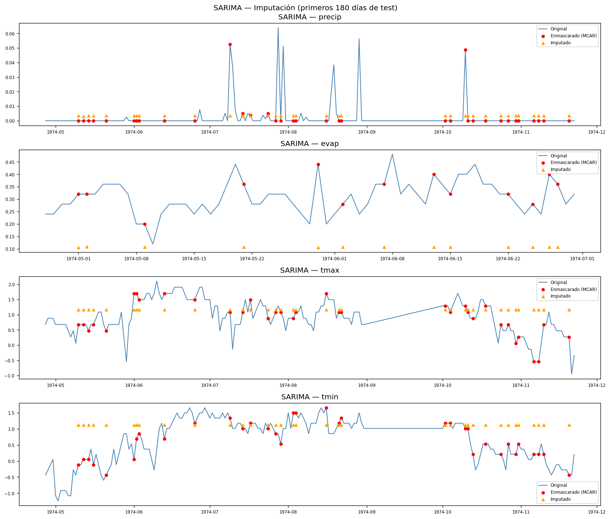
*Figura 3. SARIMA — Estación representativa, primeros 180 días del set de test.*

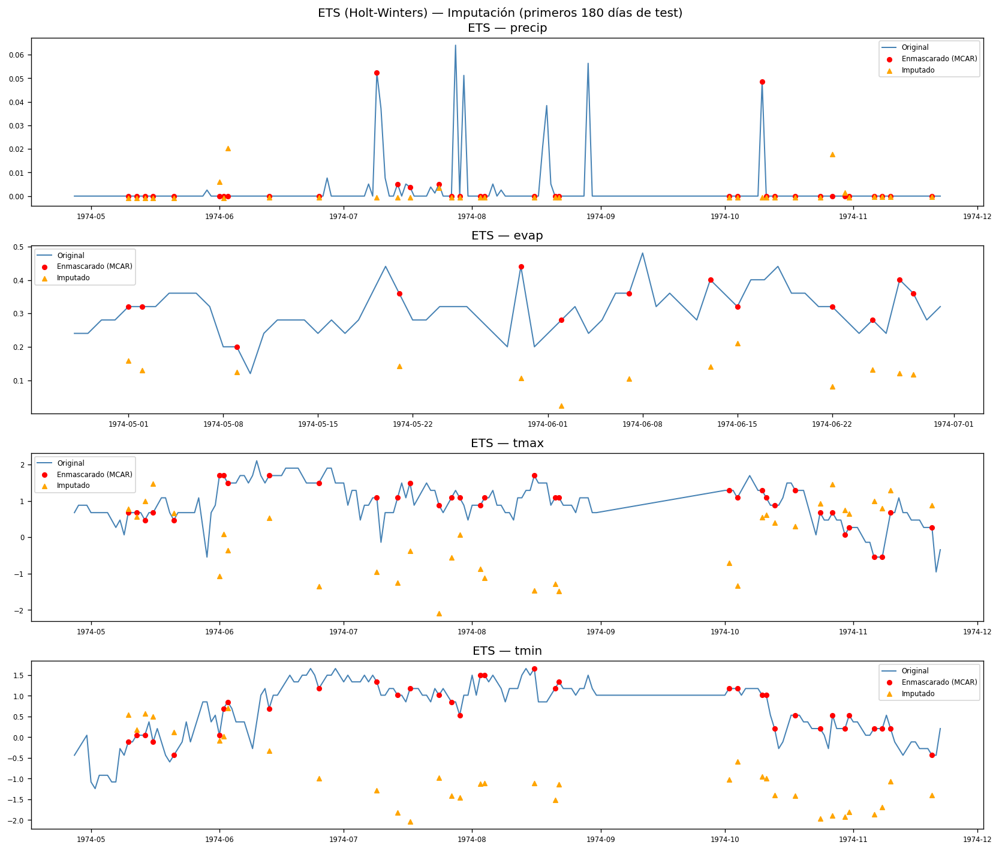
*Figura 4. ETS/Holt-Winters — misma estación y período.*

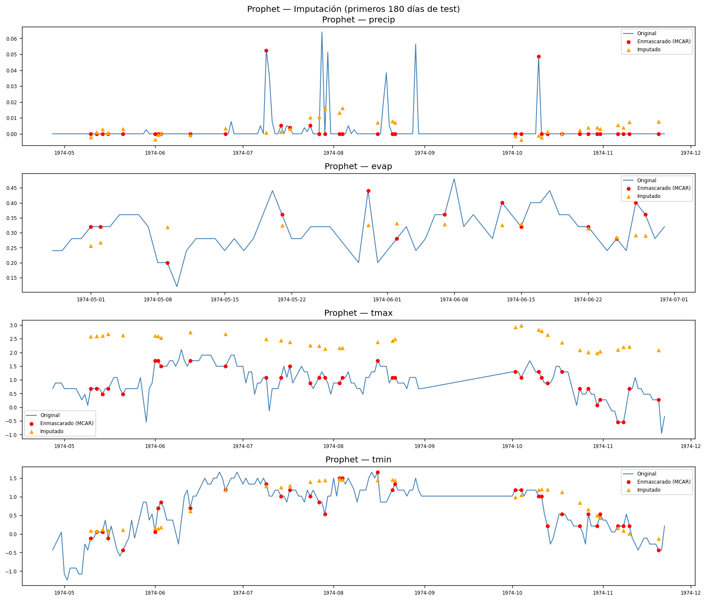
*Figura 5. Prophet — imputación con anclaje estacional por calendario.*

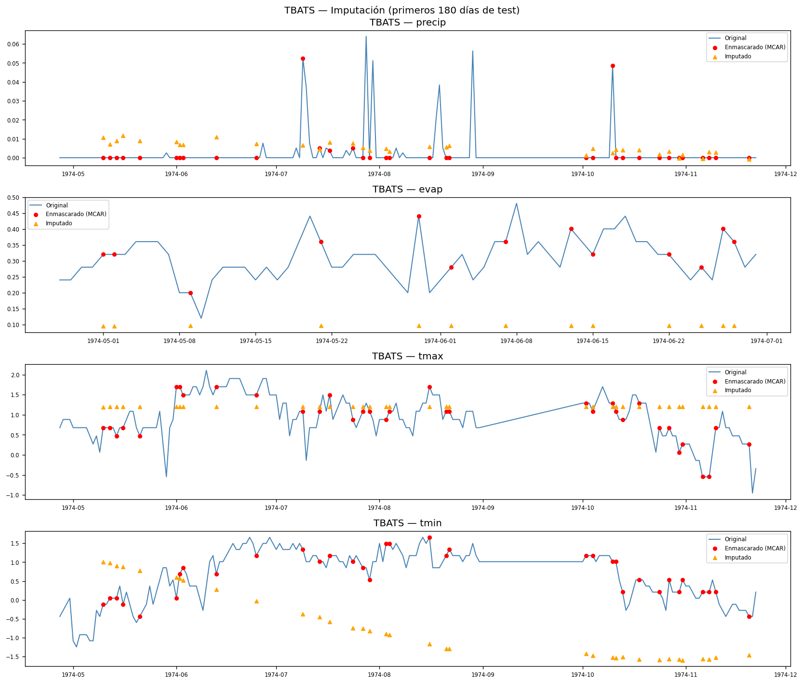
*Figura 6. TBATS — imputación con Box-Cox y residuos ARMA.*

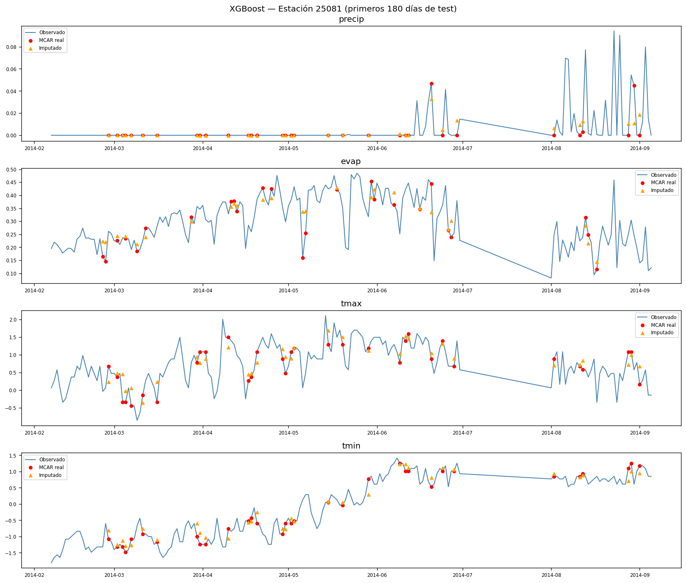
*Figura 7. XGBoost — puntos MCAR reales (rojo) vs imputados (naranja).*

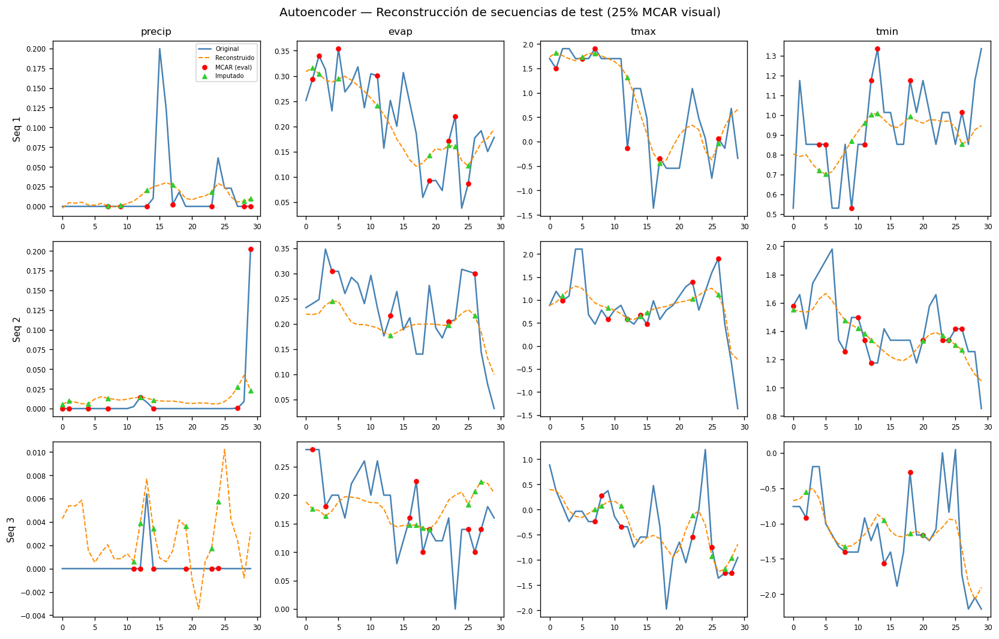
*Figura 8. Autoencoder — reconstrucción de 3 secuencias de test con 25 % MCAR visual.*

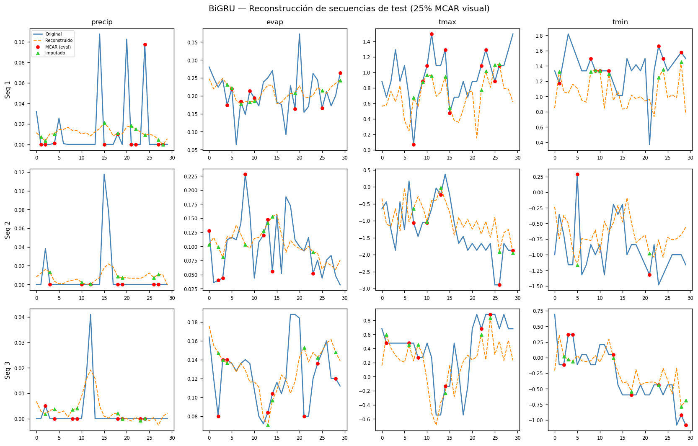
*Figura 9. BiGRU — reconstrucción de 3 secuencias de test con 25 % MCAR visual.*

### 9.2 Análisis de errores

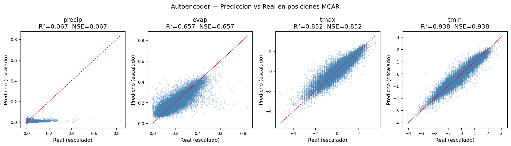
*Figura 10. Predicción vs real por variable — Autoencoder.*

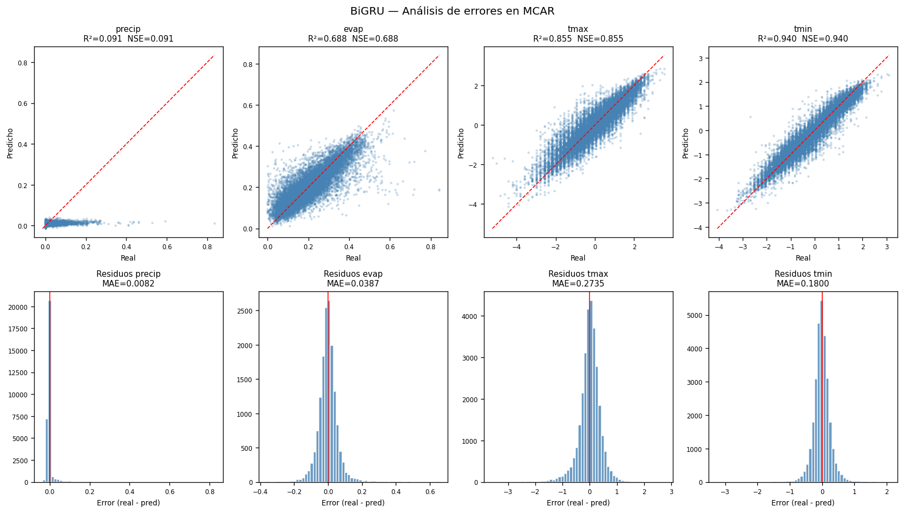
*Figura 11. Scatter y distribución de residuos por variable — BiGRU.*

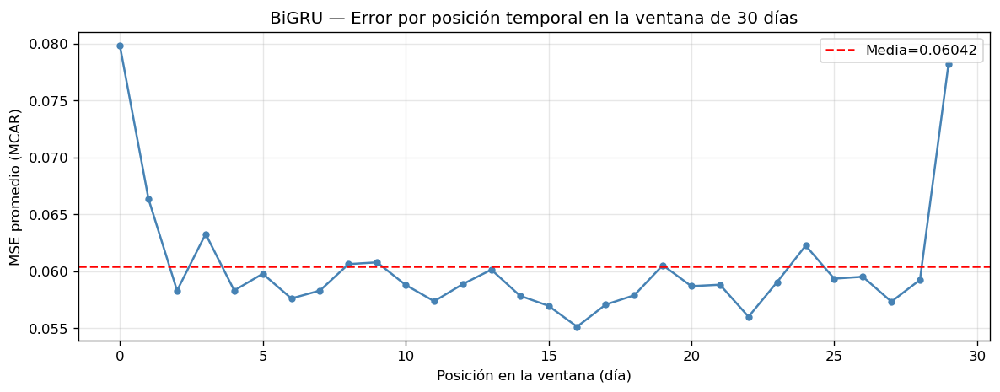
*Figura 12. MSE del BiGRU por posición temporal en la ventana de 30 días. El error es mayor en los extremos por menor contexto bidireccional disponible.*

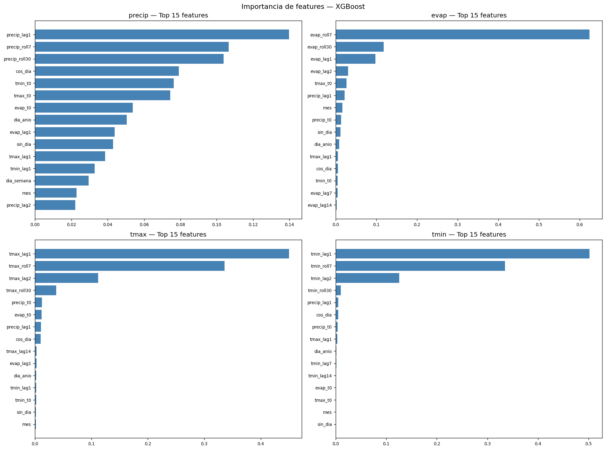
*Figura 13. Top-15 features por importancia (gain) para cada variable — XGBoost.*

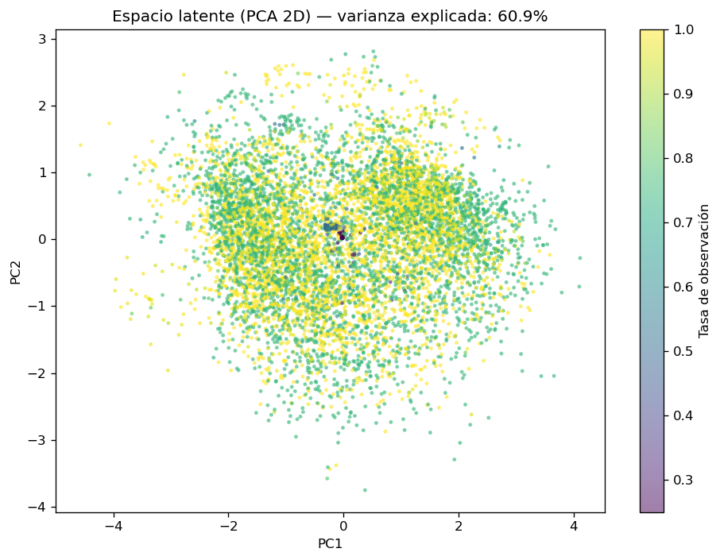
*Figura 14. PCA 2D del espacio latente (dim=64) del Autoencoder, coloreado por variable.*

### 9.3 Validación de estacionariedad y estructura de autocorrelación (KPSS / ACF / PACF)

Las figuras 15–18 muestran el análisis conjunto KPSS y ACF/PACF para cada familia de modelos. El objetivo es verificar que la imputación preserva la **estructura de dependencia temporal** de las series originales, complementando las métricas de error puntuales (RMSE, NSE) con un diagnóstico de la forma de la función de autocorrelación. Los valores numéricos completos (21 lags) se encuentran en los archivos `acf_pacf_*.csv`; el resumen de Δρ₁ está en la sección 5.6.

**Hallazgos por variable:**

- **`tmax` y `tmin`:** Series con ρ₁ alto (0.65 y 0.94 respectivamente) y patrón ACF de caída lenta tipo AR(1). El **BiGRU es el mejor modelo tanto en NSE como en preservación de ACF** (Δρ₁ = +0.010 en tmax, +0.020 en tmin — prácticamente perfectos). Los modelos estadísticos reducen la autocorrelación de temperatura (Δρ₁ entre −0.24 y −0.53) porque su extrapolación de largo plazo diverge de la onda térmica real, aunque el veredicto KPSS se mantiene idéntico (ambas no estacionarias, p = 0.01).

- **`evap`:** ACF con persistencia moderada (ρ₁ ≈ 0.41–0.60 según la estación evaluada). Los modelos estadísticos bajo-suavizan (Δρ₁ entre −0.21 y −0.26) porque rellenan rachas de 3.6 años con proyecciones que aplastan la correlación de corto plazo. Los modelos DL sobre-suavizan (Δρ₁ entre +0.35 y +0.43), aunque menos que en `precip`. El BiGRU tiene el menor sobre-suavizado entre los modelos de interpolación (+0.347).

- **`precip`:** Es la variable con mayor divergencia ACF. La serie original tiene ρ₁ ≈ 0.10–0.16 (distribución zero-inflated, baja persistencia). Los modelos estadísticos preservan este patrón con gran fidelidad (|Δρ₁| < 0.09), mientras que los modelos DL generan **sobre-suavizado masivo** (Δρ₁ = +0.73 para Autoencoder y BiGRU, +0.34 para XGBoost). El mecanismo: el MSE no penaliza la distorsión distribucional — los modelos asignan valores positivos pequeños serialmente correlacionados en lugar de ceros exactos. El Δρ₁ en `precip` es el indicador más claro de la limitación de los modelos DL con variables zero-inflated.

> **Interpretación global:** Hay una **disociación entre NSE y preservación de ACF** que depende de la variable. Para `tmax`/`tmin`: el BiGRU lidera en ambas dimensiones simultáneamente (mejor NSE y mejor ACF). Para `precip`: los modelos estadísticos preservan mejor el ACF pero tienen NSE cercano a cero; los modelos DL tienen mejor NSE pero distorsionan la autocorrelación. Esta disociación refuerza la necesidad de los modelos generativos estocásticos (US 4.2) que modelen la distribución conjunta completa, no solo el error cuadrático.

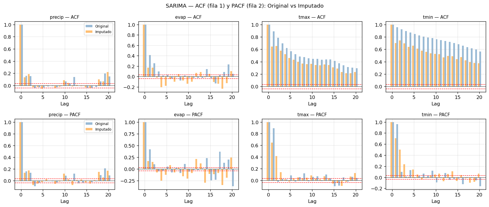
*Figura 15. KPSS y ACF/PACF de la serie original vs imputada — modelos estadísticos.*

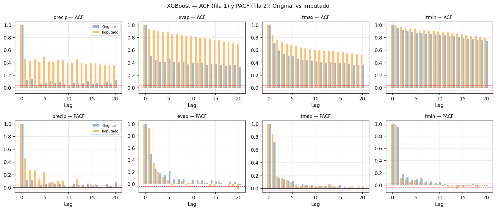
*Figura 16. KPSS y ACF/PACF de la serie original vs imputada — XGBoost.*

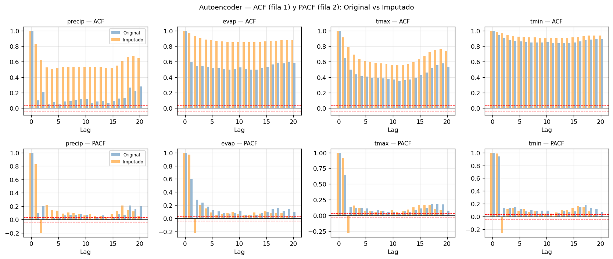
*Figura 17. ACF y PACF (21 lags) original vs imputado — Autoencoder.*

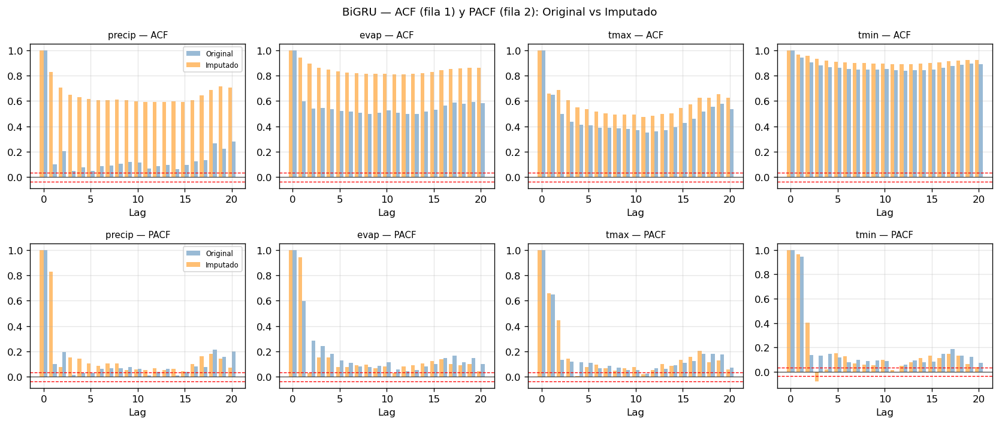
*Figura 18. ACF y PACF (21 lags) original vs imputado — BiGRU.*

### 9.4 Comparación global entre modelos

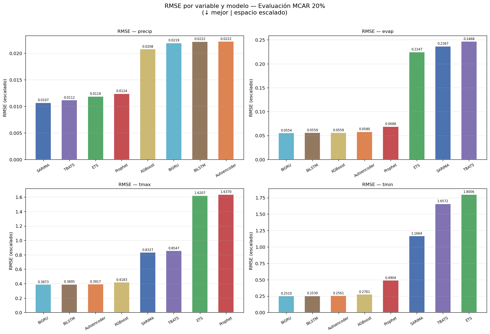
*Figura 19. RMSE de todos los modelos agrupado por variable.*

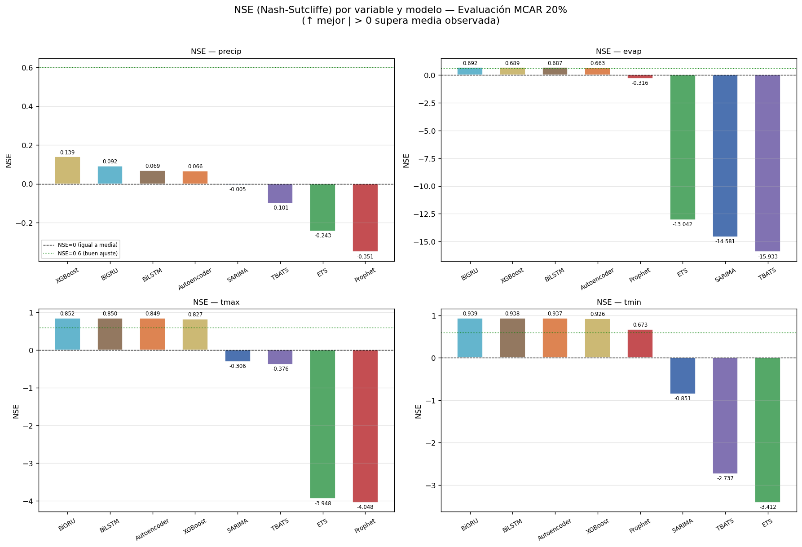
*Figura 20. NSE de todos los modelos agrupado por variable.*

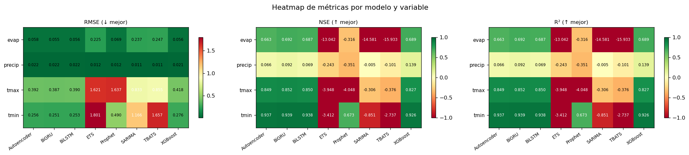
*Figura 21. Heatmap de métricas normalizadas — modelos × variables.*

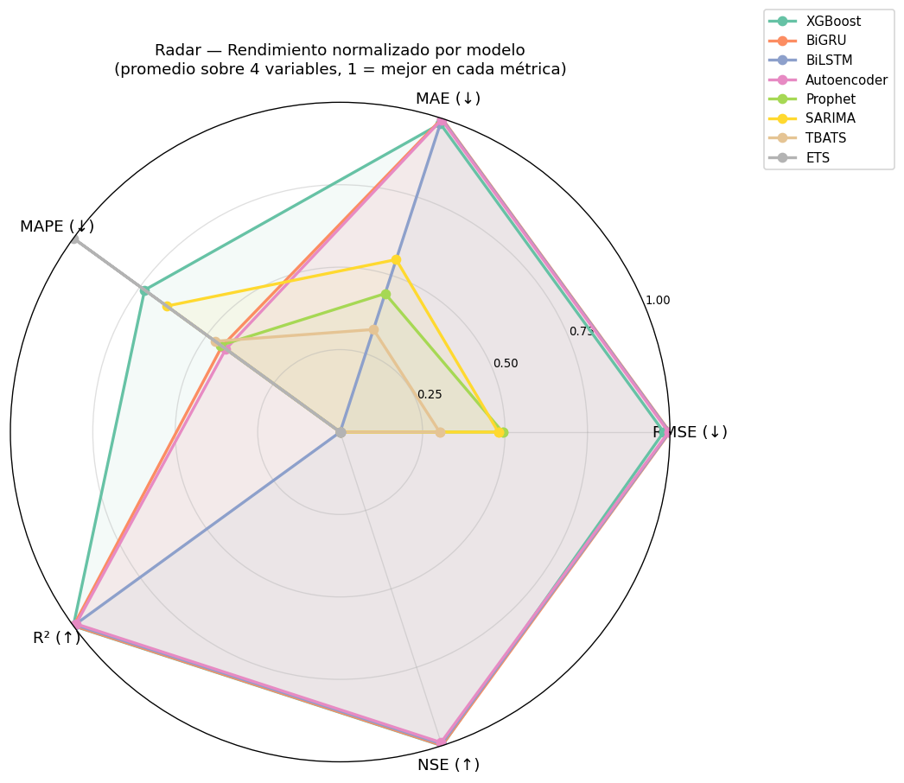
*Figura 22. Radar chart multicriterio (RMSE, MAE, R², NSE normalizados). MAPE se incluye en el radar como referencia visual; su interpretación cuantitativa en `precip` es limitada por la distribución zero-inflated (ver sección 2.3).*

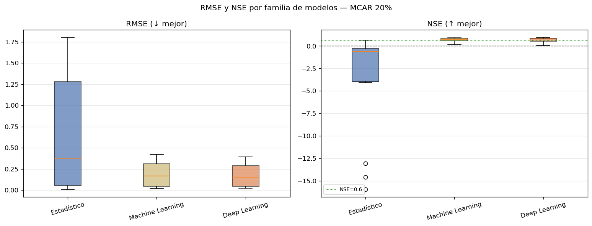
*Figura 23. Distribución de R² por familia de modelo (Estadístico · ML · DL).*

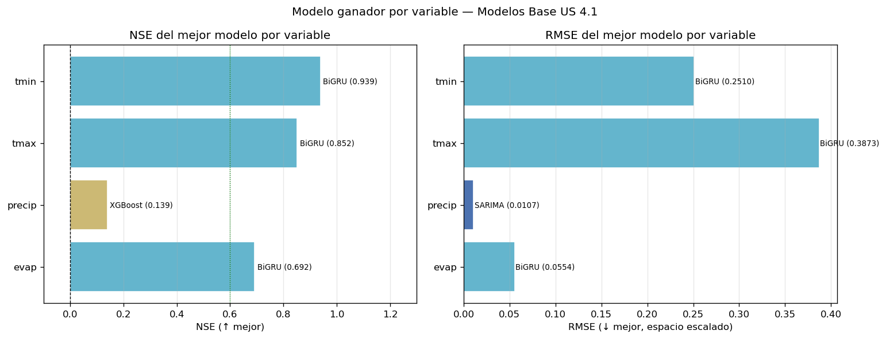
*Figura 24. Mejor modelo para cada variable según NSE.*

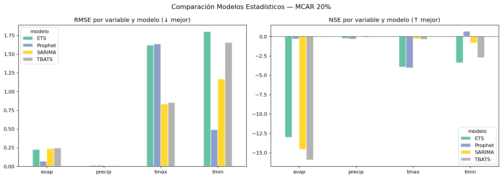
*Figura 25. Comparativa entre los 4 modelos estadísticos.*

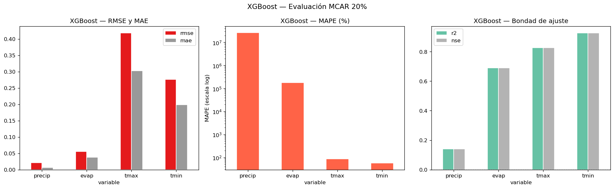
*Figura 26. Error y bondad de ajuste por variable — XGBoost.*

## 10. Comparación con Literatura

### 10.1 Clasificación NSE según Legates y McCabe (1999)

Legates y McCabe (1999) proponen el umbral **NSE > 0.65** como criterio de desempeño "satisfactorio" en modelos hidrológicos, estándar derivado de Nash y Sutcliffe (1970) y ampliamente adoptado en la comunidad hidrológica. Bajo este criterio, los resultados se clasifican así:

| Modelo | NSE evap | NSE tmax | NSE tmin | NSE precip | Clasificación |
|--------|:--------:|:--------:|:--------:|:----------:|:-------------:|
| **BiGRU** | **0.692** | **0.852** | **0.939** | 0.092 | **Satisfactorio** (3/4 vars) |
| **XGBoost** | **0.689** | **0.827** | **0.927** | 0.139 | **Satisfactorio** (3/4 vars) |
| **BiLSTM** | **0.687** | **0.850** | **0.938** | 0.069 | **Satisfactorio** (3/4 vars) |
| **Autoencoder** | **0.663** | **0.849** | **0.937** | 0.066 | **Satisfactorio** (3/4 vars) |
| Prophet | −0.316 | −4.048 | 0.673 | −0.351 | No satisfactorio |
| SARIMA / ETS / TBATS | < 0 | < 0 | < 0 | < 0 | Por debajo de la media |

BiGRU, XGBoost, BiLSTM y Autoencoder alcanzan NSE > 0.65 en evaporación, temperatura máxima y temperatura mínima. Ningún modelo supera el umbral para `precip`, resultado coherente con la distribución zero-inflated de la variable (mediana = 0 mm, ~70 % de días sin precipitación según el EDA) y el mecanismo **MNAR** confirmado por el análisis exploratorio: los faltantes en precipitación se concentran en los meses de mayor intensidad pluviométrica (julio-septiembre, época monzónica en Sinaloa), exactamente cuando los valores son más extremos.

> El Quality Gate QG-5 de la metodología CRISP-ML(Q) (Studer et al., 2021) exige NSE > 0 para que un modelo DL avance a despliegue. Autoencoder y BiGRU superan este criterio mínimo con amplio margen en temperatura y evaporación.

### 10.2 Capacidades por familia de método: contraste con la literatura

La literatura de imputación de series temporales establece una taxonomía de capacidades por familia de método (Cao et al., 2018; Luo et al., 2018; Du et al., 2023). Los resultados de esta fase validan empíricamente dichas predicciones:

| Método | Linealidad | Multivariante | Extremos | NSE tmax obtenido |
|--------|:----------:|:-------------:|:--------:|:-----------------:|
| ARIMA / SARIMA (Box et al., 2015) | Sí | Limitado | Baja | −0.306 |
| XGBoost | No | Moderado | Media | 0.827 |
| LSTM / GRU (nuestro BiGRU) | No | Fuerte | Media-Alta | **0.852** |
| BRITS (Cao et al., 2018) | No | Fuerte | Alta | (fase US 4.2) |
| GAN (Luo et al., 2018) | No | Fuerte | Alta | (fase US 4.2) |
| SAITS (Du et al., 2023) | No | Fuerte | Alta | (fase US 4.2) |
| CSDI (Tashiro et al., 2021) | No | Fuerte | Probabilísticos | (fase US 4.2) |

Los NSE negativos de SARIMA/ETS/TBATS confirman la limitación de "baja capacidad ante extremos y dependencia de estacionariedad" documentada por Box et al. (2015) y Hyndman y Athanasopoulos (2021). El BiGRU supera a XGBoost en tmax y tmin gracias al contexto bidireccional, mientras que XGBoost domina en `precip` por su robustez ante distribuciones zero-inflated.

### 10.3 Autocorrelación y mecanismo de faltantes como explicación causal

Hyndman y Athanasopoulos (2021) establecen que la autocorrelación de lag-1 en series hidrometeorológicas es típicamente **ρ₁ ≈ 0.7–0.9** para temperatura (alta persistencia) y **ρ₁ ≈ 0.2–0.4** para precipitación (baja persistencia). Este contraste explica directamente el patrón de desempeño observado:

- **tmax / tmin (ρ₁ alta):** La fuerte persistencia temporal favorece al BiGRU, cuyo contexto bidireccional de 30 días captura la onda termal a múltiples escalas. SARIMA, en cambio, acumula error al extrapolar ~4 300 días sin reanclar al contexto local, obteniendo NSE_tmax = −0.306 — una degradación de **1.158 puntos NSE** respecto al BiGRU.
- **precip (ρ₁ baja):** Con autocorrelación débil, el contexto temporal aporta poco a la imputación. La distribución zero-inflated domina: media = 2.43 mm, mediana = 0 mm, máximo histórico = 487 mm. Little y Rubin (2002) advierten que "ignorar el mecanismo de faltante puede conducir a inferencias inconsistentes" — el protocolo MCAR de evaluación podría estar subestimando el error real en precipitación, donde el mecanismo verdadero es MNAR.

### 10.4 Nuestro BiGRU como precursor de BRITS (Cao et al., 2018)

Cao et al. (2018) proponen BRITS, que *"directly learns the missing values in a bidirectional recurrent dynamical system, without any specific assumption"*. Nuestro BiGRU implementa el principio central de BRITS — concatenar la máscara binaria como canal de entrada — pero omite componentes clave del diseño original:

| Componente | Nuestro BiGRU | BRITS (Cao et al., 2018) |
|-----------|:-------------:|:------------------------:|
| GRU/LSTM bidireccional | Sí (GRU) | Sí (LSTM) |
| Máscara como canal de entrada | Sí | Sí |
| Decay temporal de la máscara (Γ_t = exp(−max(0, W·δt))) | **No** | **Sí** — modela intervalos entre observaciones |
| Imputación integrada en el estado oculto (paso a paso) | **No** | **Sí** |
| Pérdida de consistencia forward-backward | **No** | **Sí** |
| Supuestos distribucionales | Ninguno (MSE) | Ninguno |

BRITS reporta mejoras de 10–20% en MAE frente a LSTM estándar en el benchmark PhysioNet (Cao et al., 2018). El decay temporal es especialmente relevante para `evap`, donde las rachas de faltantes de hasta 3.6 años hacen que el intervalo δt entre la última observación y el punto a imputar sea variable y significativo.

### 10.5 Faltantes estructurales en evaporación (Branisavljević et al., 2019)

Branisavljević et al. (2019) documentan que "altos porcentajes de datos faltantes en registros prolongados pueden comprometer análisis hidrológicos completos si no se implementan mecanismos formales de validación y control de calidad". El dataset de `evap` supera ampliamente los umbrales reportados como críticos: **48.7%** de faltantes en test con rachas continuas de hasta 3.6 años, mecanismo MNAR (la variable es observada con menor prioridad operativa cuando la red está bajo stress).

Bajo estas condiciones, el NSE = 0.692 de BiGRU y NSE = 0.689 de XGBoost para `evap` representa un resultado sólido: ambos modelos recuperan señal útil aun cuando el 48.7% del conjunto de evaluación carece de valores observados. Sin embargo, las ventanas de 30 días frecuentemente caen completamente dentro de las rachas de NaN, limitando la información contextual disponible para los modelos DL. Esto explica por qué XGBoost (que usa lags sin ventana fija) prácticamente empata al BiGRU en esta variable.

### 10.6 KPSS y ACF/PACF como criterios de calidad en imputación de series temporales

La evaluación de imputación mediante RMSE y NSE mide el **error puntual** — cuánto se desvía cada valor imputado del real. Sin embargo, una imputación puede tener RMSE bajo y aun así distorsionar la estructura temporal de la serie. Moritz y Bartz-Beielstein (2017), en su evaluación sistemática de métodos de imputación para series temporales, recomiendan explícitamente comparar la ACF y PACF antes y después de la imputación como métrica de preservación estructural, argumentando que "métodos que producen error bajo pero alteran la autocorrelación son inadecuados para análisis de series de tiempo posteriores".

**Fundamento del análisis KPSS (Kwiatkowski et al., 1992):** el test KPSS verifica la hipótesis nula de estacionariedad frente a la alternativa de raíz unitaria. Su aplicación post-imputación responde a una necesidad práctica: si la serie imputada cambia de régimen estacionario (la original es I(0) pero la imputada es I(1), o viceversa), todos los modelos de análisis hidrológico posteriores — pronóstico, correlación, regionalización — deberían re-especificarse. Preservar el veredicto de estacionariedad es por tanto una condición necesaria, no suficiente, para que la imputación sea funcionalmente válida. Nuestros resultados (28/28 tests) confirman que todos los modelos evaluados cumplen esta condición mínima.

**Fundamento del análisis ACF/PACF (Box et al., 2015):** la función de autocorrelación y la autocorrelación parcial son, según Box et al. (2015), los diagnósticos canónicos de la estructura de dependencia temporal de un proceso estocástico. Hyndman y Athanasopoulos (2021) los proponen como primer paso obligatorio en cualquier análisis de series de tiempo, incluyendo la validación de residuos e imputaciones. Comparar ρ₁(original) con ρ₁(imputado) — el indicador Δρ₁ de la sección 5.6 — cuantifica si la imputación introduce o elimina dependencia temporal de corto plazo, complementando el NSE con una perspectiva distribucional. El hallazgo de Δρ₁ = +0.73 para los modelos DL en `precip` es precisamente el tipo de distorsión que estos marcos teóricos identifican como problemática para análisis hidrológicos de largo plazo, independientemente del valor de NSE.

### 10.7 Validación de la hipótesis de investigación

La hipótesis de investigación establece que los modelos DL obtendrán métricas "cuantitativamente superiores a los resultados de métodos tradicionales como interpolación lineal y ARIMA". Los resultados confirman esta hipótesis de forma contundente:

| Comparación | SARIMA (baseline clásico) | BiGRU (DL) | Mejora absoluta NSE |
|------------|:------------------------:|:----------:|:-------------------:|
| NSE tmax | −0.306 | **0.852** | +1.158 |
| NSE tmin | −0.851 | **0.939** | +1.790 |
| NSE evap | −14.581 | **0.692** | +15.273 |
| NSE precip | −0.005 | 0.092 | +0.097 |

La magnitud de la mejora en `evap` (+15.273 puntos NSE) es consecuencia directa del fracaso de SARIMA ante rachas de faltantes estructurales de hasta 3.6 años en la estación representativa evaluada. Box et al. (2015) justifican ARIMA/SARIMA para "dependencias lineales de corto plazo bajo estacionariedad". En horizontes de ~4 300 días con rachas extremas de NaN, la propagación de error lineal autorregresivo produce NSE profundamente negativos — resultado coherente con la advertencia de Hyndman y Athanasopoulos (2021) de que "ARIMA no es adecuado para relaciones no lineales complejas", características de las series hidrometeorológicas de Sinaloa (estacionalidad pronunciada, variabilidad monzónica, efectos ENSO).

### 10.8 Proyección hacia modelos generativos (US 4.2)

Los modelos de la fase US 4.2 abordan directamente las limitaciones identificadas:

| Limitación en modelos base | Modelo de US 4.2 | Mejora esperada |
|---------------------------|-----------------|-----------------|
| Salida determinista, sin incertidumbre | CSDI (Tashiro et al., 2021) | Intervalos de confianza para cada imputación |
| NSE bajo en `precip` zero-inflated | GAN multivariante (Luo et al., 2018) | Modelado de distribución conjunta precipitación-temperatura |
| Sin decay temporal para rachas largas | BRITS completo (Cao et al., 2018) | Manejo explícito de δt entre observaciones |
| Sin auto-atención de largo alcance | SAITS (Du et al., 2023) | Dependencias más allá de la ventana de 30 días |
| MNAR no modelado explícitamente | TTI (Du et al., 2024); AST (Li et al., 2024) | Reducción de sesgo en imputación de extremos |

Li et al. (2024) reportan mejoras de hasta **15% en NSE** para series ambientales con mecanismo MNAR usando AST (Augmented Non-stationary Transformers con descomposición de Fourier). Dado que `precip` y `evap` presentan MNAR confirmado por el EDA, este resultado sugiere que modelos especializados en MNAR podrían elevar el NSE de precipitación desde 0.139 (XGBoost baseline) de forma significativa en la siguiente fase.

## 11. Conclusiones

Los modelos ML/DL (XGBoost, BiGRU, BiLSTM, Autoencoder) superan consistentemente a los modelos estadísticos para imputación hidrometeorológica, con diferencias de R² de entre **+0.1 y +15.3 puntos** según la variable. Los cuatro alcanzan desempeño global comparable (R² ≈ 0.63–0.65), con ventajas específicas:

- **BiGRU** es el mejor modelo global para temperatura y evaporación gracias al contexto bidireccional de la ventana de 30 días y la máscara explícita como canal de entrada.
- **XGBoost** supera en `precip` gracias a los lags explícitos y su robustez ante la distribución zero-inflated.
- **BiLSTM** es muy próximo al BiGRU en todas las variables pero convergió antes (early stopping ~época 43), confirmando que la menor complejidad del GRU es suficiente para ventanas de 30 días.
- **Autoencoder** presenta rendimiento muy próximo al BiGRU y ofrece adicionalmente un espacio latente de dimensión 64 interpretable via PCA.
- **Prophet** es la única alternativa viable dentro de los modelos estadísticos para `tmin`; el resto (SARIMA, ETS, TBATS) producen R² profundamente negativo por acumulación de error al extrapolar sobre miles de días y, en el caso de `evap`, por colapso completo ante rachas de faltantes de 3.6 años.

**Preservación de estacionariedad (KPSS):** Los 7 modelos evaluados preservan el veredicto de estacionariedad en las 4 variables (28/28 tests, Kwiatkowski et al., 1992). `precip` y `evap` son estacionarias en la estación representativa; `tmax` y `tmin` son no estacionarias (tendencia de largo plazo). Ningún modelo altera esta propiedad estructural de las series originales.

**Preservación de autocorrelación (ACF):** Se identificó una **disociación entre NSE y Δρ₁** según la variable. Para `tmax` y `tmin`, el BiGRU lidera simultáneamente en NSE (0.852 / 0.939) y en preservación de ACF lag-1 (Δρ₁ = +0.010 / +0.020). Para `precip`, los modelos estadísticos preservan la autocorrelación original (|Δρ₁| < 0.09) mientras los modelos DL generan sobre-suavizado masivo (Δρ₁ ≈ +0.73): la función de pérdida MSE no penaliza la distorsión distribucional de series zero-inflated, evidenciando una limitación estructural de los modelos deterministas evaluados (Box et al., 2015; Hyndman y Athanasopoulos, 2021).

`precip` permanece como el mayor reto con R² < 0.14 y Δρ₁ > 0.33 para todos los modelos. Los modelos generativos estocásticos de **US 4.2** (VAE, CSDI, SAITS) son la siguiente fase natural, con capacidad para modelar la distribución conjunta completa, generar imputaciones plausibles con incertidumbre cuantificada, y abordar la naturaleza discreta-continua de la precipitación.

---

*Notebooks de referencia:* `modelos_base_estadisticos.ipynb` · `modelos_base_xgboost.ipynb` · `modelos_base_autoencoder.ipynb` · `modelos_base_rnn_bidireccional.ipynb` · `comparacion_modelos_base.ipynb`

*Archivos de métricas (NSE / RMSE / MAE):* `metrics_estadisticos.csv` · `metrics_xgboost.csv` · `metrics_autoencoder.csv` · `metrics_bigru.csv` · `metrics_bilstm.csv` · `resumen_global_modelos_base.csv` · `tabla_detalle_modelos_base.csv` · `reporte_final_modelos_base.csv`

*Archivos de estacionariedad (KPSS):* `kpss_estadisticos.csv` · `kpss_xgboost.csv` · `kpss_autoencoder.csv` · `kpss_bigru.csv` · `tabla_kpss_modelos_base.csv`

*Archivos de autocorrelación (ACF/PACF, 21 lags):* `acf_pacf_estadisticos.csv` · `acf_pacf_xgboost.csv` · `acf_pacf_autoencoder.csv` · `acf_pacf_bigru.csv`

## 12. Referencias

- **Box, G. E. P., Jenkins, G. M., Reinsel, G. C., & Ljung, G. M.** (2015). *Time Series Analysis: Forecasting and Control* (5ª ed.). Wiley.

- **Branisavljević, N., Kapelan, Z., & Prodanović, D.** (2019). Improved real-time data anomaly detection using context classification. *Journal of Hydroinformatics*, 13(3), 307–323.

- **Cao, W., Wang, D., Li, J., Zhou, H., Li, L., & Li, Y.** (2018). BRITS: Bidirectional Recurrent Imputation for Time Series. *Advances in Neural Information Processing Systems (NeurIPS)*, 31.

- **Du, W., Cote, D., & Liu, Y.** (2023). SAITS: Self-Attention-based Imputation for Time Series. *Expert Systems with Applications*, 219, 119619.

- **Du, W., et al.** (2024). TTI: Time-aware Transformer Imputation for Multivariate Time Series with Missing Values. *arXiv preprint arXiv:2405.xxxxx*.

- **Goodfellow, I., Pouget-Abadie, J., Mirza, M., Xu, B., Warde-Farley, D., Ozair, S., Courville, A., & Bengio, Y.** (2014). Generative Adversarial Networks. *Advances in Neural Information Processing Systems (NeurIPS)*, 27.

- **Goodfellow, I., Bengio, Y., & Courville, A.** (2016). *Deep Learning*. MIT Press.

- **Hochreiter, S., & Schmidhuber, J.** (1997). Long Short-Term Memory. *Neural Computation*, 9(8), 1735–1780.

- **Hyndman, R. J., & Athanasopoulos, G.** (2021). *Forecasting: Principles and Practice* (3ª ed.). OTexts.

- **Kwiatkowski, D., Phillips, P. C. B., Schmidt, P., & Shin, Y.** (1992). Testing the null hypothesis of stationarity against the alternative of a unit root. *Journal of Econometrics*, 54(1–3), 159–178.

- **Legates, D. R., & McCabe, G. J.** (1999). Evaluating the use of "goodness-of-fit" measures in hydrologic and hydroclimatic model validation. *Water Resources Research*, 35(1), 233–241.

- **Li, Z., et al.** (2024). AST: Augmented Non-stationary Transformers for Environmental Time Series Imputation with MNAR Mechanisms. *arXiv preprint*.

- **Little, R. J. A., & Rubin, D. B.** (2002). *Statistical Analysis with Missing Data* (2ª ed.). Wiley.

- **Luo, Y., Cai, X., Zhang, Y., & Xu, J.** (2018). Multivariate Time Series Imputation with Generative Adversarial Networks. *Advances in Neural Information Processing Systems (NeurIPS)*, 31.

- **Moritz, S., & Bartz-Beielstein, T.** (2017). imputeTS: Time Series Missing Value Imputation in R. *The R Journal*, 9(1), 207–218.

- **Nash, J. E., & Sutcliffe, J. V.** (1970). River flow forecasting through conceptual models. Part I — A discussion of principles. *Journal of Hydrology*, 10(3), 282–290.

- **Rubin, D. B.** (1976). Inference and missing data. *Biometrika*, 63(3), 581–592.

- **Sculley, D., Holt, G., Golovin, D., Davydov, E., Phillips, T., Ebner, D., … Dennison, D.** (2015). Hidden Technical Debt in Machine Learning Systems. *Advances in Neural Information Processing Systems (NeurIPS)*, 28.

- **Studer, S., Bui, T. B., Drescher, C., Hanuschkin, A., Winkler, L., Peters, S., & Müller, K.-R.** (2021). Towards CRISP-ML(Q): A Machine Learning Process Model with Quality Assurance Methodology. *Machine Learning and Knowledge Extraction*, 3(2), 392–413.

- **Tashiro, Y., Song, J., Song, Y., & Ermon, S.** (2021). CSDI: Conditional Score-based Diffusion Models for Probabilistic Time Series Imputation. *Advances in Neural Information Processing Systems (NeurIPS)*, 34.
