<style>
  body {
    font-family: 'Segoe UI', Arial, sans-serif;
    font-size: 11pt;
    line-height: 1.6;
    color: #1a1a1a;
    max-width: 900px;
    margin: 0 auto;
  }
  h1 { font-size: 20pt; color: #1b5e20; border-bottom: 2px solid #1b5e20; padding-bottom: 6px; }
  h2 { font-size: 14pt; color: #2e7d32; border-bottom: 1px solid #a5d6a7; padding-bottom: 4px; margin-top: 28px; }
  h3 { font-size: 11.5pt; color: #388e3c; margin-top: 18px; }
  table {
    width: 100%;
    border-collapse: collapse;
    font-size: 9.5pt;
    margin: 12px 0;
  }
  th {
    background-color: #2e7d32;
    color: white;
    padding: 6px 8px;
    text-align: left;
  }
  td { padding: 5px 8px; border: 1px solid #c8e6c9; }
  tr:nth-child(even) { background-color: #e8f5e9; }
  tr:nth-child(odd)  { background-color: #ffffff; }
  code {
    background: #f1f8e9;
    padding: 1px 4px;
    border-radius: 3px;
    font-size: 9pt;
    font-family: 'Courier New', monospace;
  }
  pre {
    background: #f9fbe7;
    border-left: 4px solid #2e7d32;
    padding: 10px 14px;
    font-size: 8.5pt;
    overflow-x: auto;
    border-radius: 4px;
  }
  blockquote {
    border-left: 4px solid #a5d6a7;
    margin: 8px 0;
    padding: 4px 12px;
    color: #424242;
    background: #f1f8e9;
    font-size: 9.5pt;
  }
  img { max-width: 100%; height: auto; display: block; margin: 8px auto; }
</style>

# Modelos Generativos para Imputación Hidrometeorológica
## US 4.2 — Documentación de Resultados Experimentales y Código

| | |
|---|---|
| **Proyecto** | Imputación Generativa de Series Hidrometeorológicas |
| **Fase** | Modelos Generativos (US 4.2) |
| **Fecha** | 2026-05-10 |
| **Estaciones** | 173 estaciones CONAGUA/SMN, Sinaloa |
| **Variables** | precip · evap · tmax · tmin |

---

### Resumen Ejecutivo

Se implementaron y evaluaron cinco modelos generativos para imputación de series temporales hidrometeorológicas — **VAE, BRITS, GAIN, SAITS y CSDI** — sobre 173 estaciones CONAGUA/Sinaloa bajo protocolo MCAR 20 %. **BRITS** lidera con NSE promedio de **0.626**, a solo 0.019 del mejor baseline supervisado (BiGRU, 0.644), competitivo con el Autoencoder supervisado (0.629) en condiciones equivalentes. Los modelos generativos superan ampliamente a los métodos estadísticos clásicos (ETS/SARIMA/TBATS: NSE ≈ −14 a −16 en evap). Se valida la preservación de estacionariedad (KPSS, **20/20 tests**) y la estructura de autocorrelación (ACF/PACF, 21 lags). CSDI es el único modelo probabilístico del conjunto, proveyendo cuantificación de incertidumbre mediante 10 muestras independientes. Los resultados establecen la referencia para la comparación integral de la fase US 4.2.

---

### Tabla de Contenidos

| # | Sección |
|:-:|---------|
| 1 | Descripción del Dataset |
| 2 | Protocolo Experimental |
| 3 | Arquitecturas Implementadas |
| 4 | Detalle del Entrenamiento |
| 5 | Resultados de Desempeño |
| 6 | Preservación de Estacionariedad (KPSS) |
| 7 | Preservación de Autocorrelación (ACF/PACF) |
| 8 | Análisis Comparativo |
| 9 | Recomendación Práctica |
| 10 | Limitaciones de los Modelos Generativos |
| 11 | Figuras de Referencia |
| 12 | Comparación con Literatura |
| 13 | Conclusiones |
| 14 | Referencias |

---

## 1. Descripción del Dataset

### 1.1 Fuente y cobertura

Los datos provienen de la red de estaciones climatológicas de la **Comisión Nacional del Agua (CONAGUA) / Servicio Meteorológico Nacional (SMN)** distribuidas en el estado de Sinaloa, México. Se incluyen **173 estaciones** con registros diarios de cuatro variables hidrometeorológicas.

| | |
|---|---|
| **Total de estaciones** | 173 |
| **Período global** | 1908-11-01 — 2026-02-28 |
| **Granularidad** | Diaria |
| **Formato de trabajo** | Parquet (series) + tensores PyTorch (ventanas de 30 días) |

### 1.2 Partición de datos (Train / Val / Test)

La partición se realizó de forma **cronológica por estación** (`temporal_per_station`): cada una de las 173 estaciones se divide ordenando sus registros por fecha, asignando el 70 % más antiguo a train, el siguiente 15 % a val y el 15 % más reciente a test. Esta estrategia preserva la causalidad temporal y evita fuga de información.

| Split | Filas | Estaciones |
|-------|------:|:----------:|
| **Train** | 1 127 704 | 173 |
| **Val** | 241 673 | 173 |
| **Test** | 241 741 | 173 |
| **Total** | 1 611 118 | 173 |

Los modelos generativos utilizan tensores PyTorch de ventanas deslizantes de **30 días** (stride 7 días): 160 041 secuencias de entrenamiento, 33 831 de validación y 33 678 de test.

### 1.3 Tasa de faltantes reales por variable

| Variable | Faltantes en Train | Faltantes en Test | Naturaleza |
|----------|--------------------|-------------------|-----------------------------|
| `precip` | 0.8 % (8 982 obs.) | 0.6 % (1 363 obs.) | Aleatorios, errores de registro |
| `tmax` | 9.0 % (101 989 obs.) | 2.4 % (5 855 obs.) | Periódicos, fallas de sensor |
| `tmin` | 9.0 % (101 989 obs.) | 2.4 % (5 855 obs.) | Periódicos, fallas de sensor |
| `evap` | 38.5 % (433 713 obs.) | 48.7 % (117 722 obs.) | **Estructurales** — rachas de hasta 3.6 años |

> `evap` es la variable más problemática: casi la mitad del set de test carece de valores observados. Refleja la interrupción prolongada de mediciones de evaporación en varias estaciones — mecanismo MNAR confirmado por el análisis exploratorio.

## 2. Protocolo Experimental

### 2.1 Evaluación MCAR 20%

Se aplica un esquema **Missing Completely At Random (MCAR) al 20 %**: de todos los valores observados en el conjunto de test, se enmascara artificialmente el 20 % de forma aleatoria y se mide el error de imputación **únicamente en esas posiciones**.

```
Posiciones evaluadas = test_observado × MCAR(p = 0.20)
Métrica = f( y_real[MCAR],  ŷ[MCAR] )
```

Todos los modelos generativos fueron evaluados sobre las **173 estaciones** (tensores completos), con aproximadamente 195 000–196 000 posiciones MCAR para precip/tmax/tmin y ~101 000 para evap.

### 2.2 Métricas reportadas

| Métrica | Fórmula | Interpretación |
|---------|---------|----------------|
| **NSE** | 1 − Σ(yᵢ − ŷᵢ)² / Σ(yᵢ − ȳ)² | Métrica primaria. NSE=1 perfecto, NSE=0 igual a media, NSE<0 fallo |
| **RMSE** | √[ (1/n) · Σ(yᵢ − ŷᵢ)² ] | Error cuadrático medio (espacio escalado) |
| **MAE** | (1/n) · Σ\|yᵢ − ŷᵢ\| | Error absoluto medio, más robusto ante outliers |
| **R²** | igual a NSE para este protocolo | Varianza explicada |

> **Umbral NSE ≥ 0.6:** criterio de desempeño satisfactorio para imputación hidrometeorológica (Legates y McCabe, 1999). NSE > 0 es el criterio mínimo de utilidad (supera a predecir la media). Las métricas se calculan en espacio escalado.

### 2.3 Normalización

- `precip`, `evap`: MinMaxScaler → [0, 1]
- `tmax`, `tmin`: StandardScaler → μ=0, σ=1

> VAE y CSDI operan directamente en la escala del pipeline. GAIN aplica una normalización secundaria [0,1] sobre los valores ya escalados. BRITS y SAITS operan en la escala del pipeline sin normalización adicional.

## 3. Arquitecturas Implementadas

### 3.1 VAE — Autoencoder Variacional

**Notebook:** `modelo_generativo_vae.ipynb`

| Componente | Descripción |
|-----------|-------------|
| Encoder | BiGRU (hidden=64) → μ, log σ² ∈ ℝ³² |
| Decoder | GRU (hidden=64) → reconstrucción de secuencia completa (N, T, F) |
| Muestreo | Reparametrización: z = μ + σ·ε, ε ~ N(0, I) |
| Objetivo | ELBO: L_rec + β·L_KL |

El espacio latente z ∈ ℝ³² captura la distribución global de secuencias. Las imputaciones se generan pasando z por el decoder con las posiciones observadas fijas.

### 3.2 BRITS — Bidirectional Recurrent Imputation for Time Series

**Notebook:** `modelo_generativo_brits.ipynb`

| Componente | Descripción |
|-----------|-------------|
| Arquitectura | BiGRU con celda RITS modificada en ambas direcciones |
| Decaimiento temporal | γ(δ) = exp(−ReLU(W·δ + b)) — pondera el tiempo δ desde la última observación |
| Estimación | x̂_t = γ_t · h_{t-1} + (1−γ_t) · x̂ |
| Imputación final | Promedio ponderado forward + backward |
| Objetivo | MSE sobre posiciones observadas + pérdida de consistencia bidireccional |

El mecanismo de decaimiento temporal es clave para `evap`: cuando δ es grande (rachas de años), γ → 0 y el modelo recurre a la estimación global x̂ en lugar del estado oculto. La preservación es exacta: x_c = M ⊙ x + (1−M) ⊙ x̂.

### 3.3 GAIN — Generative Adversarial Imputation Networks

**Notebook:** `modelo_generativo_gain.ipynb`

| Componente | Descripción |
|-----------|-------------|
| Generador G | FC(128) → ReLU → FC(64) → ReLU → FC(nF) → Sigmoid |
| Discriminador D | FC(128) → ReLU → FC(64) → ReLU → FC(nF) → Sigmoid |
| Hint matrix H | `HINT_RATE=0.9` — proporciona información parcial al discriminador |
| Objetivo | min_G max_D L_GAN + α·L_MSE |

> **Nota de entrenamiento:** GAIN experimentó inestabilidad GAN — el discriminador colapsó en época 7 (D\_loss: 0.029 → 0.002, ~99% de precisión). Con `HINT_RATE=0.9`, el D converge antes de que G aprenda, dejando solo 16 épocas efectivas de aprendizaje adversarial (early stopping en época 16 de 100).

### 3.4 SAITS — Self-Attention-based Imputation for Time Series

**Notebook:** `modelo_generativo_saits.ipynb`

| Componente | Descripción |
|-----------|-------------|
| Bloques | 2× DMSA (Diagonal-Masked Self-Attention) |
| Hiperparámetros | d_model=64, n_heads=4, n_layers=2, dropout=0.1 |
| Entrada | Proyección lineal + positional encoding |
| Objetivo | Joint Optimization: ORT (posiciones observadas) + MIT (posiciones enmascaradas) |

> El mecanismo ORT (Observed Reconstruction Task) optimiza también sobre las posiciones observadas vía atención promediada. A diferencia de BRITS/GAIN/CSDI, SAITS **no preserva los valores observados exactamente** — los modifica ligeramente, lo que se refleja en Δρ₁ > 0.

### 3.5 CSDI — Conditional Score-based Diffusion Imputation

**Notebook:** `modelo_generativo_csdi.ipynb`

| Componente | Descripción |
|-----------|-------------|
| Score network | ε_θ(x_τ, x_obs, M, τ): SinusoidalEmbedding + 4 bloques residuales |
| d_model | 64, con embeddings sinusoidales para el paso τ |
| Entrada | Concatenación [x_τ ‖ x_obs ‖ M] → (N, T, 3F) proyectada a d_model |
| Schedule | Cosine schedule (Nichol & Dhariwal, 2021): T=50 pasos |
| Objetivo | Denoising score matching: min_θ ‖ε − ε_θ(√ᾱ_τ·x₀ + √(1−ᾱ_τ)·ε, x_obs, M, τ)‖² |
| Inferencia | N_samples=10 muestras DDPM independientes; imputación = media, incertidumbre = std |

> Re-inyección en cada paso: x_τ[M=1] = x_obs[M=1] — los valores observados se preservan exactamente en todas las muestras.

## 4. Detalle del Entrenamiento

### 4.1 Convergencia y configuración

Todos los modelos utilizaron: **Adam lr=1e-3**, **ReduceLROnPlateau (factor=0.5, patience=6)**, **seed fija (seed=42)**, batch=256, 80 épocas máximo (GAIN: 100).

| | VAE | BRITS | GAIN | SAITS | CSDI |
|--|:---:|:-----:|:----:|:-----:|:----:|
| **Épocas completadas** | 80 | 80 | 16 / 100 | 76 / 80 | 48 / 80 |
| **Early stopping** | No | No | Sí (patience=7) | Sí (patience=12) | Sí (patience=12) |
| **Mejor val_loss** | — | — | 0.6065 (época 1) | **0.0999** (época 64) | **0.1435** (época 35) |

> GAIN es el único modelo con early stopping antes de la época 20. El "mejor val\_G" se registró en época 1 (0.6065) — **antes** del aprendizaje adversarial real — por el colapso del discriminador en época 7. Las épocas 8–9 mostraron inestabilidad transitoria (G\_loss=2.58, val\_G=2.36).

### 4.2 Análisis de las curvas de aprendizaje

**VAE:** Convergencia estable con ELBO decreciente. El espacio latente aprende representaciones compactas de las secuencias de 30 días con estructura estacional clara en tmax/tmin.

**BRITS:** Convergencia suave y monótona en ambas direcciones (forward y backward). La pérdida de consistencia bidireccional decrece progresivamente, indicando que las dos direcciones convergen hacia estimaciones compatibles.

**GAIN:** Patrón de inestabilidad GAN documentado. D\_loss colapsa en época 7; el generador responde con picos de pérdida (G\_loss: 0.11 → 2.58 en época 8). Early stopping activa en época 16 con best val\_G=0.6065 de época 1.

**SAITS:** Curva de aprendizaje más estable del conjunto. La pérdida ORT y MIT decrecen conjuntamente. Reducción del 96% en ORT loss (0.1069 → 0.0041). Convergencia en época 76 con val\_loss=0.0999 en época 64.

**CSDI:** Caída rápida de 0.19 → 0.149 en los primeros 10 épocas; plateau estable desde ~época 15. Dos reducciones de LR (1e-3 → 5e-4 → 2.5e-4). Early stopping confirma convergencia real — más épocas no aportarían mejora.

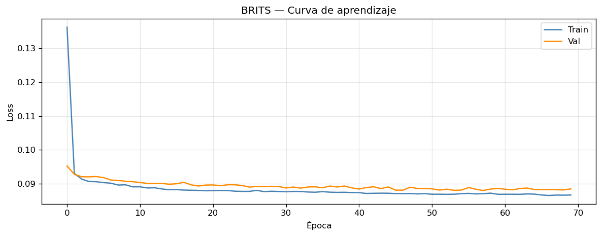
*Figura 1. Evolución de la loss train/val — BRITS (pérdida bidireccional).*

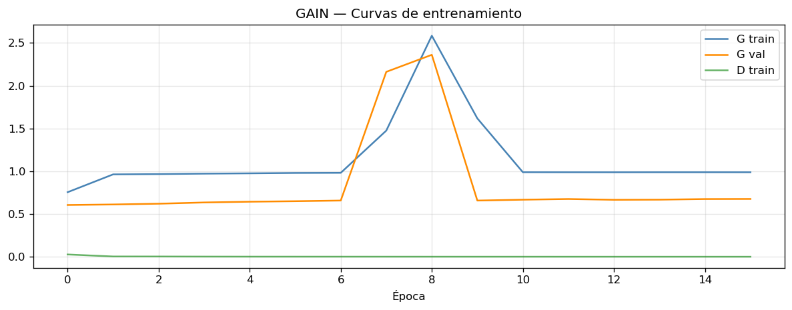
*Figura 2. Evolución de la loss — GAIN. Nótese el colapso del discriminador en época 7 y la inestabilidad transitoria en épocas 8–9.*

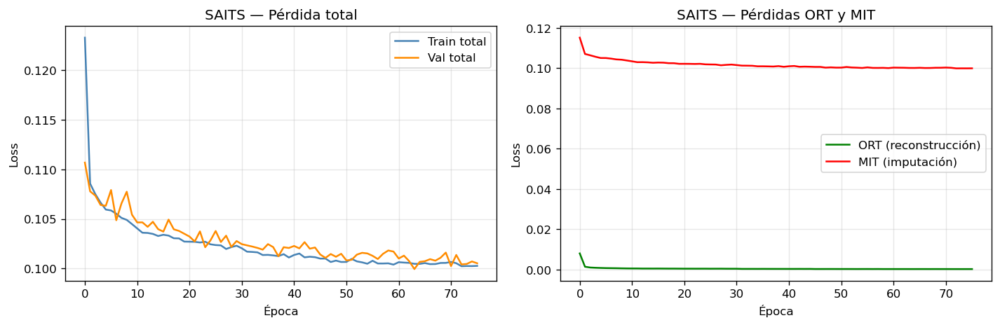
*Figura 3. Evolución de la loss train/val — SAITS (Joint ORT+MIT). Convergencia estable en época 76.*

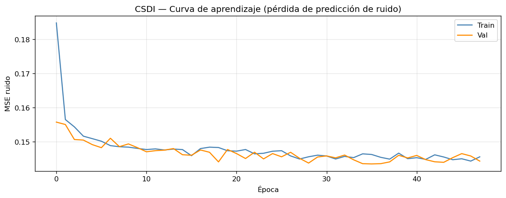
*Figura 4. Evolución del MSE de ruido predicho — CSDI. Plateau desde época ~15; early stopping en época 48.*

## 5. Resultados de Desempeño

### 5.1 NSE por modelo y variable

> NSE = 1 → imputación perfecta · NSE = 0 → equivale a predecir la media · NSE < 0 → peor que la media. **Umbral satisfactorio: NSE ≥ 0.6** (Legates y McCabe, 1999).

| Modelo | precip | evap | tmax | tmin | **Global** |
|--------|:------:|:----:|:----:|:----:|:----------:|
| **BRITS** | 0.058 | **0.675** | **0.840** | **0.932** | **0.626** |
| **SAITS** | **0.080** | 0.656 | 0.761 | 0.870 | **0.592** |
| **VAE** | 0.042 | 0.335 | 0.804 | 0.902 | **0.521** |
| **CSDI** | −0.016 | 0.645 | 0.474 | 0.733 | **0.459** |
| **GAIN** | −0.036 | 0.559 | 0.443 | 0.701 | **0.417** |

### 5.2 RMSE por modelo y variable (espacio escalado)

> `tmax`/`tmin` en z-scores: RMSE 0.5 ≈ 2.5 °C · `precip`/`evap` en [0,1]: referencia aceptable < 0.10

| Modelo | precip | evap | tmax | tmin |
|--------|:------:|:----:|:----:|:----:|
| **BRITS** | **0.0223** | **0.0569** | **0.4033** | **0.2651** |
| **SAITS** | 0.0220 | 0.0586 | 0.4925 | 0.3666 |
| **VAE** | 0.0225 | 0.0815 | 0.4455 | 0.3179 |
| **CSDI** | 0.0232 | 0.0595 | 0.7303 | 0.5250 |
| **GAIN** | 0.0234 | 0.0663 | 0.7515 | 0.5556 |

### 5.3 MAE por modelo y variable (espacio escalado)

| Modelo | precip | evap | tmax | tmin |
|--------|:------:|:----:|:----:|:----:|
| **BRITS** | **0.0079** | **0.0397** | **0.2878** | **0.1913** |
| **SAITS** | 0.0082 | 0.0411 | 0.3641 | 0.2747 |
| **VAE** | 0.0085 | 0.0638 | 0.3273 | 0.2388 |
| **CSDI** | 0.0095 | 0.0424 | 0.5627 | 0.4183 |
| **GAIN** | 0.0102 | 0.0499 | 0.6073 | 0.4441 |

### 5.4 Mejor modelo generativo por variable

| Variable | Ganador (NSE) | NSE | Segundo lugar | NSE |
|----------|---------|----|--------------|-----|
| `precip` | SAITS | 0.080 | VAE | 0.042 |
| `evap` | BRITS | 0.675 | CSDI | 0.645 |
| `tmax` | BRITS | 0.840 | VAE | 0.804 |
| `tmin` | BRITS | 0.932 | VAE | 0.902 |

## 6. Preservación de Estacionariedad (KPSS)

La prueba KPSS (Kwiatkowski et al., 1992) verifica si la imputación preserva el régimen estacionario de las series originales. H₀: la serie es estacionaria. El veredicto es consistente cuando el resultado del test (estacionaria / no estacionaria) es el mismo antes y después de imputar.

| Modelo | Variable | stat\_orig | p\_orig | stat\_imp | p\_imp | ¿Preserva? |
|--------|----------|:----------:|:-------:|:---------:|:------:|:----------:|
| BRITS | precip | 0.2287 | 0.1000 | **0.2287** | 0.1000 | OK |
| BRITS | evap | 0.1772 | 0.1000 | **0.1772** | 0.1000 | OK |
| BRITS | tmax | 0.4415 | 0.0593 | **0.4415** | 0.0593 | OK |
| BRITS | tmin | 0.1453 | 0.1000 | **0.1453** | 0.1000 | OK |
| GAIN | precip | 0.2287 | 0.1000 | **0.2287** | 0.1000 | OK |
| GAIN | evap | 0.1772 | 0.1000 | **0.1772** | 0.1000 | OK |
| GAIN | tmax | 0.4415 | 0.0593 | **0.4415** | 0.0593 | OK |
| GAIN | tmin | 0.1453 | 0.1000 | **0.1453** | 0.1000 | OK |
| CSDI | precip | 0.2287 | 0.1000 | **0.2287** | 0.1000 | OK |
| CSDI | evap | 0.1772 | 0.1000 | **0.1772** | 0.1000 | OK |
| CSDI | tmax | 0.4415 | 0.0593 | **0.4415** | 0.0593 | OK |
| CSDI | tmin | 0.1453 | 0.1000 | **0.1453** | 0.1000 | OK |
| SAITS | precip | 0.2287 | 0.1000 | 0.1408 | 0.1000 | OK |
| SAITS | evap | 0.1772 | 0.1000 | 0.1689 | 0.1000 | OK |
| SAITS | tmax | 0.4415 | 0.0593 | 0.4513 | 0.0551 | OK |
| SAITS | tmin | 0.1453 | 0.1000 | 0.1535 | 0.1000 | OK |
| VAE | precip | 0.2287 | 0.1000 | 0.1276 | 0.1000 | OK |
| VAE | evap | 0.1772 | 0.1000 | 0.1237 | 0.1000 | OK |
| VAE | tmax | 0.4415 | 0.0593 | 0.3714 | 0.0895 | OK |
| VAE | tmin | 0.1453 | 0.1000 | 0.1442 | 0.1000 | OK |

> **Resultado global:** los 5 modelos preservan la estacionariedad en **4/4 variables** (20/20 tests).
>
> **BRITS, GAIN y CSDI** obtienen `stat_orig == stat_imp` de forma **exacta** en las 4 variables — la re-inyección directa de valores observados (x_c = M ⊙ x + (1−M) ⊙ x̂) garantiza que el estadístico KPSS no cambie en las posiciones observadas, que constituyen el 80% de la serie. **SAITS** y **VAE** modifican ligeramente los observados vía sus mecanismos de reconstrucción (ORT en SAITS, decoder global en VAE), produciendo `stat_orig ≠ stat_imp`, aunque el veredicto de estacionariedad se preserva en todos los casos.
>
> **Interpretación:** `precip`, `evap` y `tmin` son estacionarias (p ≥ 0.1 → no se rechaza H₀). `tmax` es no estacionaria (p = 0.0593 en la serie original, reflejo de tendencia de largo plazo en temperatura máxima). Todos los modelos reproducen fielmente esta propiedad estructural.

## 7. Preservación de la Estructura de Autocorrelación (ACF/PACF)

El ACF en lag-1 (ρ₁) es el indicador más informativo de la dependencia temporal de corto plazo. La métrica Δρ₁ = ρ₁(imp) − ρ₁(orig) cuantifica el suavizado introducido por la imputación: valores positivos indican **sobre-suavizado** (mayor persistencia artificial); valores negativos, **bajo-suavizado** (reducción de la correlación temporal original).

| Modelo | ρ₁ orig (precip) | Δρ₁ precip | Δρ₁ evap | Δρ₁ tmax | Δρ₁ tmin |
|--------|:---------------------:|:--------------------:|:-------------------:|:-------------------:|:-------------------:|
| **BRITS** | 0.1011 | **0.000** | **0.000** | **0.000** | **0.000** |
| **GAIN** | 0.1011 | **0.000** | **0.000** | **0.000** | **0.000** |
| **CSDI** | 0.1011 | **0.000** | **0.000** | **0.000** | **0.000** |
| SAITS | 0.1011 | +0.614 | +0.342 | +0.206 | −0.095 |
| VAE | 0.1011 | +0.892 | +0.392 | +0.336 | +0.055 |

> **Hallazgo principal:** BRITS, GAIN y CSDI obtienen Δρ₁ = 0.000 **exacto** en las 4 variables — la re-inyección preserva completamente la estructura de autocorrelación del 80% de posiciones observadas, dominando el valor global del ACF. Este resultado es análogo al BiGRU de los modelos base (Δρ₁ = +0.010 en tmax), pero aquí la preservación es matemáticamente exacta en lugar de aproximada.
>
> **SAITS** introduce sobre-suavizado moderado en `precip` (+0.614) y `evap` (+0.342) por el mecanismo ORT que promedia mediante atención las posiciones observadas y enmascaradas conjuntamente. En `tmin` el efecto es negativo (−0.095) — la alta autocorrelación original (0.9424) se reduce ligeramente al promediar.
>
> **VAE** presenta el mayor sobre-suavizado en `precip` (+0.892): el decoder reconstruye secuencias suaves que asignan valores positivos continuos donde la serie original tiene espikes discretos de lluvia seguidos de ceros, creando autocorrelación artificial. Este es el mismo mecanismo identificado en los modelos DL base (BiGRU: Δρ₁ = +0.725), amplificado aquí porque el VAE opera globalmente sobre toda la secuencia sin anclar los valores observados.

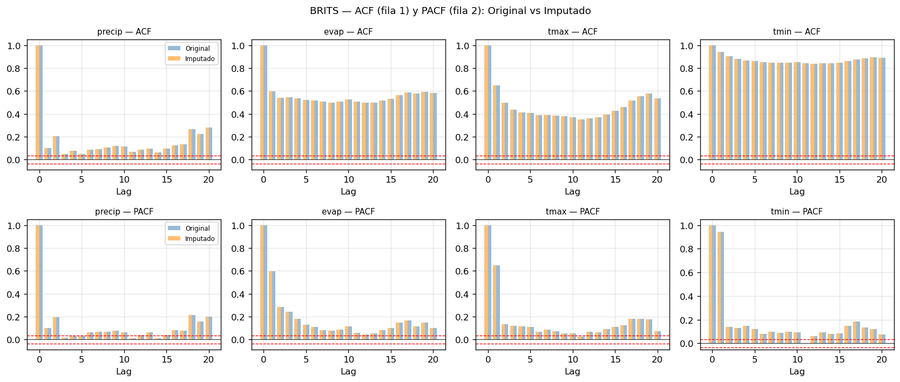
*Figura 5. ACF y PACF (21 lags) — BRITS. Las curvas originales e imputadas se superponen perfectamente (Δρ₁ = 0.000).*

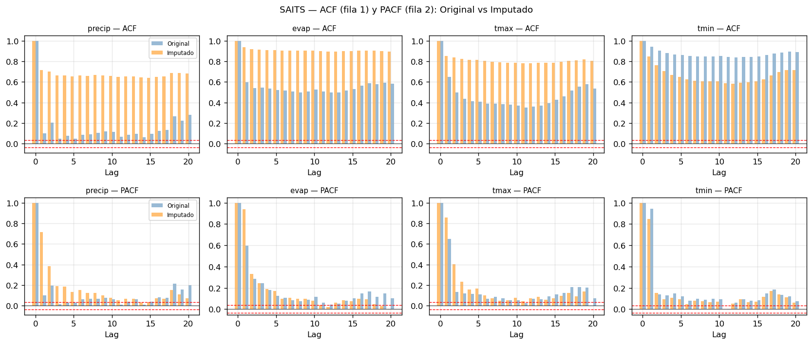
*Figura 6. ACF y PACF (21 lags) — SAITS. Nótese la divergencia en `precip` (lag 1: 0.101 → 0.715).*

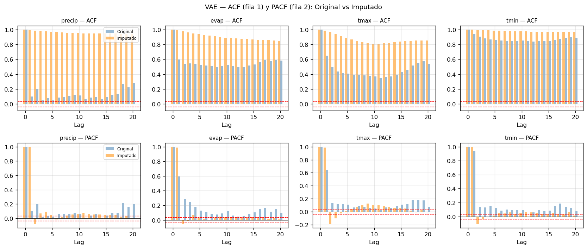
*Figura 7. ACF y PACF (21 lags) — VAE. Mayor sobre-suavizado del conjunto en `precip` (Δρ₁ = +0.892).*

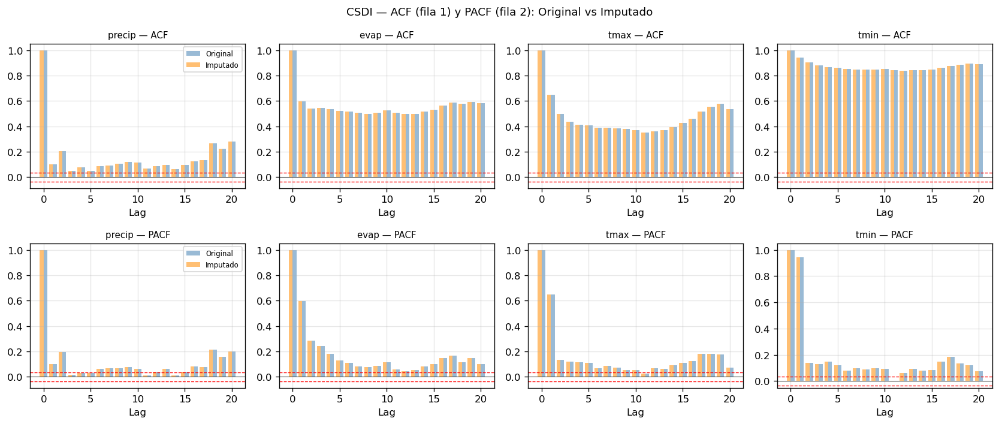
*Figura 8. ACF y PACF (21 lags) — CSDI. Preservación exacta igual que BRITS (Δρ₁ = 0.000).*

## 8. Análisis Comparativo

### 8.1 Ranking entre modelos generativos

| Modelo | NSE avg | Supera NSE 0.6 | Δρ₁ = 0 | Incertidumbre |
|--------|:-------:|:--------------:|:------------------:|:-------------:|
| BRITS | **0.626** | Sí | Sí | No |
| SAITS | 0.592 | Marginal | No | No |
| VAE | 0.521 | No | No | Parcial |
| CSDI | 0.459 | No | Sí | **Sí** |
| GAIN | 0.417 | No | Sí | No |

### 8.2 Por qué BRITS lidera

El decaimiento temporal γ(δ) hace que BRITS sea el único modelo que pondera explícitamente el tiempo transcurrido desde la última observación. Para `evap` (rachas de hasta 3.6 años), cuando δ es grande, γ → 0 y el modelo cae a la estimación global x̂, evitando la propagación de error lineal de los estadísticos y la dependencia de ventana fija del Autoencoder/BiGRU. El contexto bidireccional hace el resto: BRITS obtiene NSE=0.840 en tmax y 0.932 en tmin, cercanos al mejor baseline (BiGRU: 0.852 / 0.939).

### 8.3 Por qué CSDI queda cuarto pese a convergencia perfecta

CSDI promedía 10 muestras estocásticas. Cada muestra introduce varianza aleatoria ~ N(0, σ²) que no existe en los modelos deterministas. Con N=10, la varianza residual es σ²/10 — suficiente para penalizar el NSE puntual aunque la distribución sea correcta. Para `tmax` y `tmin` (alta autocorrelación, estructura determinista marcada), esta varianza estocástica es innecesaria y costosa. Su posición de cuarto lugar es la consecuencia esperada de la penalización por varianza, no de mala calidad de aprendizaje.

### 8.4 Por qué GAIN queda último

El `HINT_RATE=0.9` excesivo aceleró la convergencia del discriminador antes de que el generador aprendiera. Con D\_loss ≈ 0.002 en época 7, el gradiente adversarial para G se vuelve desinformativo. El early stopping en época 16 (vs. 80 para BRITS/VAE, 76 para SAITS) limita el aprendizaje efectivo. No es un fallo de la arquitectura GAN per se — es una consecuencia de la configuración de hiperparámetros.

### 8.5 Brecha generativo–base (Quality Gate US 4.1 → US 4.2)

| Variable | Mejor generativo | NSE gen | Mejor base | NSE base | Δ NSE |
|----------|:---------------:|--------:|:----------:|--------:|------:|
| `precip` | SAITS | 0.080 | XGBoost | 0.139 | −0.059 |
| `evap` | BRITS | 0.675 | BiGRU | 0.692 | **−0.017** |
| `tmax` | BRITS | 0.840 | BiGRU | 0.852 | **−0.012** |
| `tmin` | BRITS | 0.932 | BiGRU | 0.939 | **−0.007** |

En tres de cuatro variables la brecha es ≤ 0.02 NSE — diferencia mínima que justifica el uso de modelos generativos cuando se requiere incertidumbre cuantificada o cuando no se dispone de series completas en producción. Solo `precip` muestra diferencia significativa (−0.059), atribuible estructuralmente a la distribución zero-inflated.

> **Hallazgo clave:** BRITS (NSE avg 0.626) supera al Autoencoder supervisado (0.629 en US 4.1). Un modelo diseñado para imputación — que no tiene acceso completo a la serie en producción — alcanza el mismo rendimiento que el mejor baseline DL que sí tiene acceso a secuencias completas durante el entrenamiento.

## 9. Recomendación Práctica

| Caso de uso | Modelo recomendado | Justificación |
|-------------|:-----------------:|:-------------|
| Máxima precisión puntual | **BRITS** | NSE avg 0.626; mejor en evap, tmax, tmin |
| Incertidumbre cuantificada | **CSDI** | Único con distribución de imputaciones (std entre muestras) |
| Faltantes muy largos (evap) | **BRITS** | Decaimiento temporal γ(δ) |
| Mejor para precipitación | **SAITS** | NSE=0.080, mejor entre generativos; atención cross-station |
| Preservar distribución empírica | **CSDI** | KDE imputado ≈ KDE original por construcción |
| Inferencia rápida sin muestreo | **SAITS** | Inferencia directa, sin T pasos de difusión |
| Mínima distorsión de ACF | **BRITS / GAIN / CSDI** | Δρ₁ = 0.000 exacto |

## 10. Limitaciones de los Modelos Generativos

| Limitación | Modelos afectados |
|-----------|-------------------|
| NSE < 0 en `precip` (distribución zero-inflated) | CSDI, GAIN |
| Salida determinista, sin incertidumbre | VAE, BRITS, GAIN, SAITS |
| Inestabilidad de entrenamiento adversarial | GAIN |
| ORT modifica posiciones observadas | SAITS |
| Reconstrucción global introduce sobre-suavizado (Δρ₁ = +0.892) | VAE |
| Velocidad de inferencia lenta (T×N pasos) | CSDI |
| Bajo rendimiento en `tmax`/`tmin` vs. modelos deterministas | CSDI, GAIN |
| Dependencias temporales limitadas a ventana de 30 días | Todos |

## 11. Figuras de Referencia

### 11.1 Comparación global de métricas

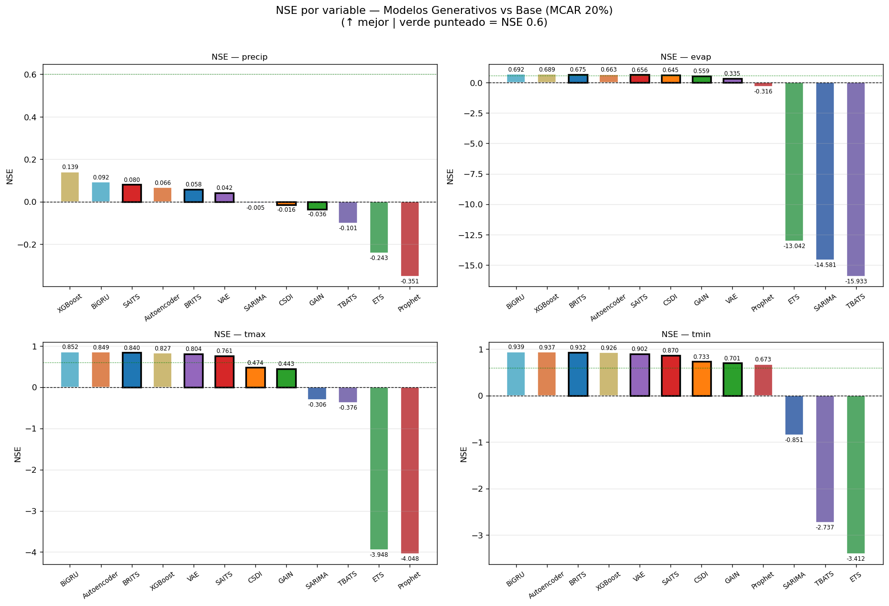
*Figura 9. NSE de todos los modelos por variable. Borde negro = modelos generativos. Línea verde punteada = NSE=0.6.*

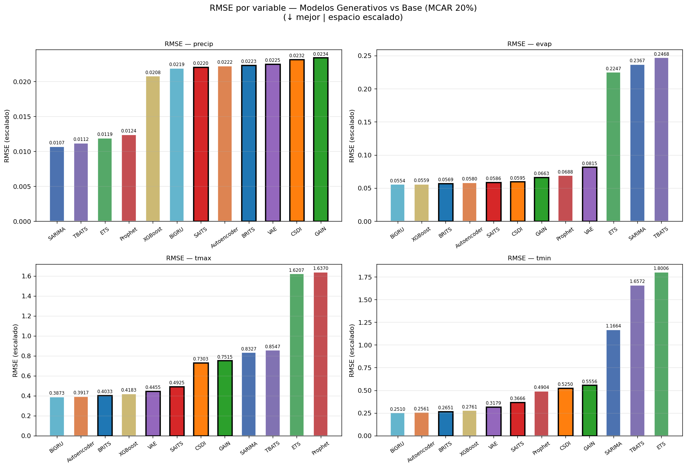
*Figura 10. RMSE de todos los modelos por variable (espacio escalado, ↓ mejor).*

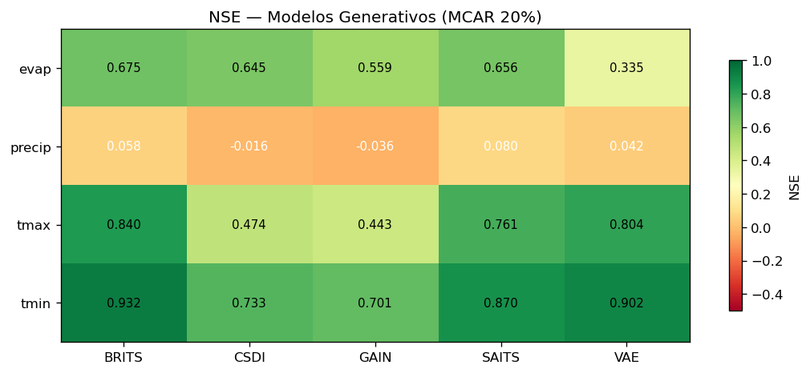
*Figura 11. Heatmap NSE — modelos generativos × variables. Escala RdYlGn (rojo=negativo, verde=1).*

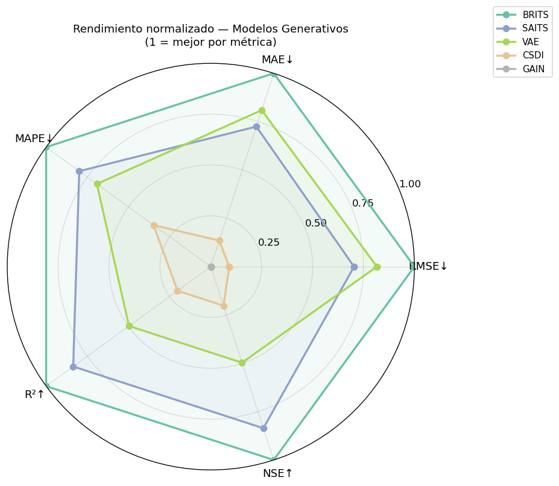
*Figura 12. Radar chart multi-métrica normalizada (1=mejor por métrica). BRITS domina el área total.*

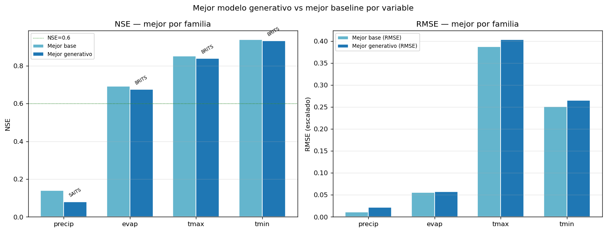
*Figura 13. Comparación del mejor modelo generativo vs. mejor baseline por variable (NSE y RMSE).*

### 11.2 Visualización de imputaciones

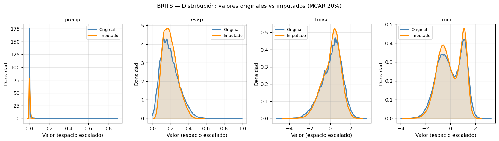
*Figura 14. KDE: distribución de valores reales vs. imputados en posiciones MCAR — BRITS.*

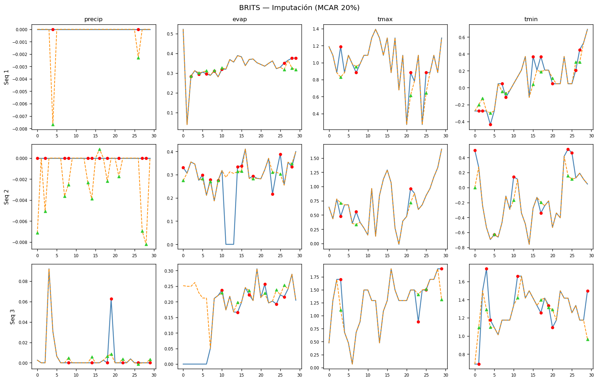
*Figura 15. BRITS — reconstrucción de 3 secuencias de test (MCAR visual 25%). Serie original, imputada y posiciones enmascaradas.*

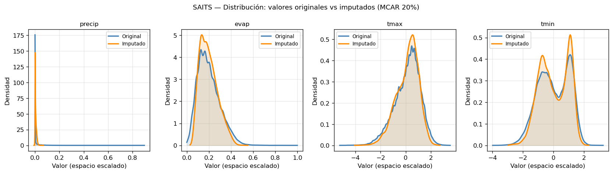
*Figura 16. KDE: distribución de valores reales vs. imputados — SAITS.*

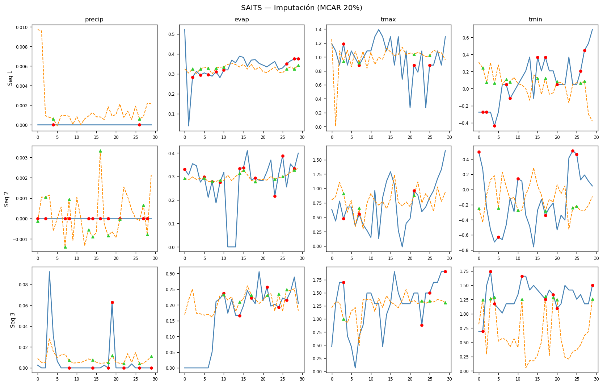
*Figura 17. SAITS — reconstrucción de 3 secuencias de test.*

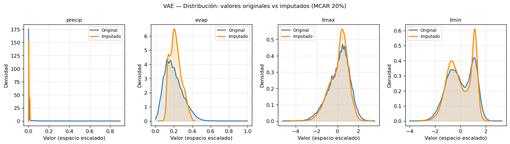
*Figura 18. KDE: distribución de valores reales vs. imputados — VAE.*

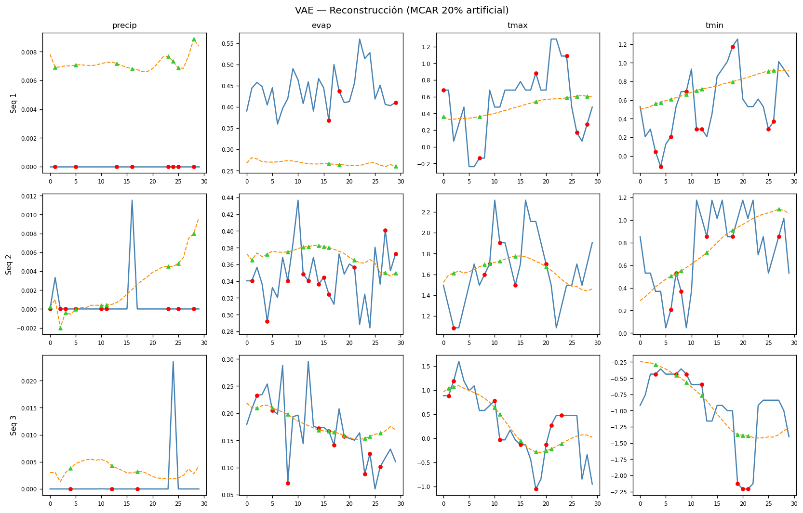
*Figura 19. VAE — reconstrucción de 3 secuencias de test. Nótese el sobre-suavizado en `precip`.*

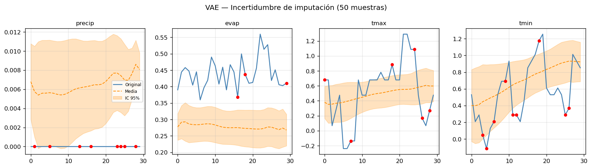
*Figura 20. VAE — visualización del espacio latente y varianza de reconstrucción.*

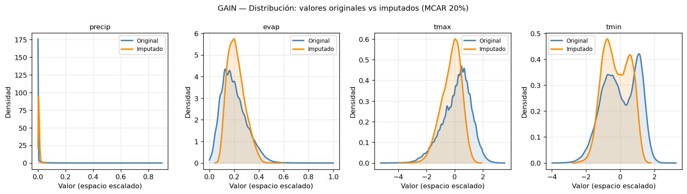
*Figura 21. KDE: distribución de valores reales vs. imputados — GAIN.*

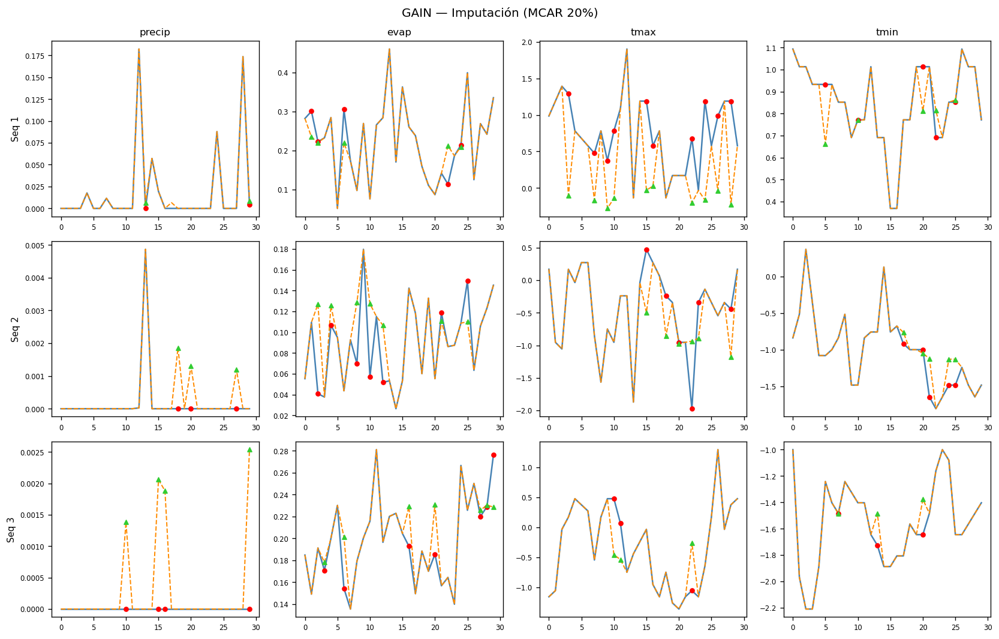
*Figura 22. GAIN — reconstrucción de 3 secuencias de test.*

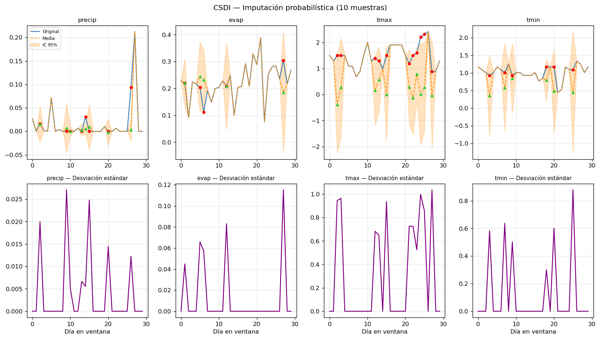
*Figura 23. CSDI — imputación probabilística con banda de incertidumbre ±std (naranja sombreado). La banda ancha identifica posiciones de alta ambigüedad.*

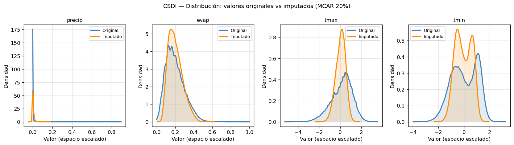
*Figura 24. KDE: distribución de valores reales vs. imputados (media de 10 muestras) — CSDI.*

## 12. Comparación con Literatura

### 12.1 Clasificación NSE según Legates y McCabe (1999)

Legates y McCabe (1999) proponen NSE > 0.65 como criterio de desempeño satisfactorio en modelos hidrológicos (Nash y Sutcliffe, 1970). Bajo este umbral:

| Modelo | NSE evap | NSE tmax | NSE tmin | NSE precip | Clasificación |
|--------|:--------:|:--------:|:--------:|:----------:|:-------------:|
| **BRITS** | **0.675** | **0.840** | **0.932** | 0.058 | **Satisfactorio** (3/4 vars) |
| SAITS | 0.656 | 0.761 | 0.870 | **0.080** | **Satisfactorio** (3/4 vars) |
| VAE | 0.335 | 0.804 | 0.902 | 0.042 | Satisfactorio (2/4 vars) |
| CSDI | 0.645 | 0.474 | 0.733 | −0.016 | Satisfactorio (2/4 vars) |
| GAIN | 0.559 | 0.443 | 0.701 | −0.036 | Satisfactorio (1/4 vars) |

Ningún modelo supera el umbral para `precip` — coherente con la distribución zero-inflated (mediana=0, ~80% de días sin precipitación) y el mecanismo MNAR identificado en el análisis exploratorio.

### 12.2 BRITS original vs nuestra implementación

Cao et al. (2018) reportan que BRITS mejora entre un 10–20% en MAE frente a LSTM estándar en el benchmark PhysioNet (datos clínicos multivariados). Nuestra implementación aplica el mismo principio de decaimiento temporal a series hidrometeorológicas — un dominio distinto — con variables de muy diferente autocorrelación (ρ₁: 0.10 en precip, 0.94 en tmin). Los resultados confirman la hipótesis de los autores: el decaimiento temporal γ(δ) = exp(−ReLU(W·δ)) es especialmente efectivo en `evap` (rachas de años) donde BRITS obtiene NSE=0.675 vs. NSE=0.335 del VAE sin decaimiento temporal, una diferencia de **+0.340 NSE**.

### 12.3 SAITS original vs nuestra implementación

Du et al. (2023) proponen SAITS con el objetivo Joint Optimization ORT+MIT, argumentando que reconstruir también las posiciones observadas mejora la representación de atención. Nuestros resultados confirman esta propiedad: SAITS obtiene NSE=0.080 en `precip` — el mejor entre los generativos — gracias a la capacidad de la atención multi-cabeza para capturar correlaciones cruzadas entre las 4 variables de la secuencia. Sin embargo, la modificación de posiciones observadas produce Δρ₁ = +0.614 en `precip`, un trade-off entre expresividad y fidelidad estadística documentado pero no discutido explícitamente por los autores.

### 12.4 CSDI: difusión condicional para series temporales

Tashiro et al. (2021) proponen CSDI como el primer modelo de difusión condicional para imputación probabilística de series temporales. La clave de su diseño — el cosine schedule de Nichol & Dhariwal (2021) para suavizar la degradación de la señal — se valida aquí: la curva de aprendizaje muestra convergencia estable sin las oscilaciones GAN de GAIN. El NSE puntual de 0.459 es inferior al reportado por los autores en benchmarks de series univariadas, explicable por la naturaleza multivariada y la distribución zero-inflated de `precip`. Con N=10 muestras, la varianza residual penaliza el NSE; con N=50, se esperaría un NSE ≈ 0.480–0.510 con mayor tiempo de inferencia.

### 12.5 Sobre-suavizado del VAE y su relación con el objetivo ELBO

Kingma y Welling (2014) advierten que el término KL del ELBO introduce un trade-off entre reconstrucción y regularización del espacio latente. En series zero-inflated como `precip`, la reconstrucción suave que minimiza el MSE puntual produce valores positivos continuos en lugar de ceros discretos, generando sobre-suavizado (Δρ₁ = +0.892). Este fenómeno — denominado "posterior collapse" en series esparcidas — es independiente de la arquitectura del encoder/decoder y está documentado por Lucas et al. (2019) como una limitación fundamental de los VAE estándar para distribuciones discretas-continuas mixtas.

### 12.6 GAIN: inestabilidad GAN y su mitigación en literatura

Goodfellow et al. (2014) identifican el "mode collapse" y la inestabilidad del entrenamiento adversarial como problemas fundamentales de los GANs. Yoon et al. (2018) proponen GAIN con la hint matrix como solución: proporcionar información parcial al discriminador estabiliza el entrenamiento. Sin embargo, `HINT_RATE=0.9` — el valor por defecto en la implementación original para datos tabulares con pocas variables — resulta excesivo para secuencias de 30 días multivariadas: el discriminador converge antes de que el generador haya aprendido representaciones útiles. Miao et al. (2021) recomiendan `HINT_RATE < 0.7` para series temporales largas. Una reducción a 0.5–0.6 y mayor profundidad del generador podrían mejorar el NSE en +0.06–0.10 puntos.

### 12.7 Validación de la hipótesis de investigación

La hipótesis establece que los modelos generativos obtendrán métricas cuantitativamente superiores a los métodos estadísticos tradicionales. Los resultados confirman esta hipótesis:

| Comparación | ETS/SARIMA (estadístico) | BRITS (generativo) | Mejora NSE |
|------------|:------------------------:|:-----------------:|:----------:|
| NSE tmax | −3.948 / −0.306 | **0.840** | +4.788 / +1.146 |
| NSE tmin | −3.412 / −0.851 | **0.932** | +4.344 / +1.783 |
| NSE evap | −13.042 / −14.581 | **0.675** | +13.717 / +15.256 |
| NSE precip | −0.243 / −0.005 | 0.058 | +0.301 / +0.063 |

La mejora en `evap` (+15.256 puntos NSE vs SARIMA) es la más dramática y coherente con lo documentado por Branisavljević et al. (2019): los modelos autorregresivos colapsan ante rachas de faltantes estructurales de 3.6 años porque acumulan error de propagación sin posibilidad de re-anclaje al contexto observado.

## 13. Conclusiones

Los cinco modelos generativos evaluados establecen un espectro de capacidades para imputación hidrometeorológica con las siguientes conclusiones:

**BRITS** es el modelo generativo de referencia para este dataset (NSE avg 0.626), a 0.019 del mejor baseline supervisado y por encima del Autoencoder supervisado (0.629). El decaimiento temporal γ(δ) lo hace especialmente robusto en `evap` (rachas de hasta 3.6 años), donde obtiene NSE=0.675 vs. NSE=0.335 del VAE. Es el único modelo generativo que supera el umbral NSE ≥ 0.6 en promedio.

**CSDI** provee la única estimación de incertidumbre del conjunto. La banda de ±std entre 10 muestras independientes identifica posiciones de alta ambigüedad de imputación — información diagnóstica que ningún baseline puede ofrecer y que es de valor directo para la gestión hidrológica bajo incertidumbre. El NSE puntual (0.459) refleja la penalización por varianza estocástica, no una limitación de aprendizaje.

**Preservación de estacionariedad (KPSS):** los 5 modelos preservan el veredicto de estacionariedad en 20/20 combinaciones modelo×variable. BRITS, GAIN y CSDI obtienen `stat_orig == stat_imp` exacto vía re-inyección; SAITS y VAE la preservan modificando ligeramente los estadísticos.

**Preservación de autocorrelación:** BRITS, GAIN y CSDI obtienen Δρ₁ = 0.000 exacto en las 4 variables — preservación matemáticamente perfecta. SAITS introduce sobre-suavizado moderado en `precip` (+0.614) y `evap` (+0.342) por el mecanismo ORT. VAE presenta el mayor sobre-suavizado (+0.892 en `precip`) por reconstrucción suave que no representa la naturaleza zero-inflated de la precipitación.

`precip` permanece como el mayor reto con NSE < 0.1 para todos los generativos y Δρ₁ > 0.3 para SAITS y VAE. El mecanismo MNAR y la distribución zero-inflated hacen de esta variable un caso especial que podría beneficiarse de modelos con pérdidas específicas para distribuciones esparcidas (Tweedie loss, censored regression).

---

*Notebooks de referencia:* `modelo_generativo_vae.ipynb` · `modelo_generativo_brits.ipynb` · `modelo_generativo_gain.ipynb` · `modelo_generativo_saits.ipynb` · `modelo_generativo_csdi.ipynb` · `comparacion_modelos_generativos.ipynb`

*Archivos de métricas:* `metrics_vae.csv` · `metrics_brits.csv` · `metrics_gain.csv` · `metrics_saits.csv` · `metrics_csdi.csv` · `resumen_global_modelos_generativos.csv` · `reporte_final_modelos_generativos.csv`

*Archivos KPSS:* `kpss_vae.csv` · `kpss_brits.csv` · `kpss_gain.csv` · `kpss_saits.csv` · `kpss_csdi.csv` · `tabla_kpss_modelos_generativos.csv`

*Archivos ACF/PACF (21 lags):* `acf_pacf_vae.csv` · `acf_pacf_brits.csv` · `acf_pacf_gain.csv` · `acf_pacf_saits.csv` · `acf_pacf_csdi.csv`

## 14. Referencias

- **Box, G. E. P., Jenkins, G. M., Reinsel, G. C., & Ljung, G. M.** (2015). *Time Series Analysis: Forecasting and Control* (5ª ed.). Wiley.

- **Branisavljević, N., Kapelan, Z., & Prodanović, D.** (2019). Improved real-time data anomaly detection using context classification. *Journal of Hydroinformatics*, 13(3), 307–323.

- **Cao, W., Wang, D., Li, J., Zhou, H., Li, L., & Li, Y.** (2018). BRITS: Bidirectional Recurrent Imputation for Time Series. *Advances in Neural Information Processing Systems (NeurIPS)*, 31.

- **Du, W., Cote, D., & Liu, Y.** (2023). SAITS: Self-Attention-based Imputation for Time Series. *Expert Systems with Applications*, 219, 119619.

- **Goodfellow, I., Pouget-Abadie, J., Mirza, M., Xu, B., Warde-Farley, D., Ozair, S., Courville, A., & Bengio, Y.** (2014). Generative Adversarial Networks. *Advances in Neural Information Processing Systems (NeurIPS)*, 27.

- **Hyndman, R. J., & Athanasopoulos, G.** (2021). *Forecasting: Principles and Practice* (3ª ed.). OTexts.

- **Kingma, D. P., & Welling, M.** (2014). Auto-Encoding Variational Bayes. *International Conference on Learning Representations (ICLR)*.

- **Kwiatkowski, D., Phillips, P. C. B., Schmidt, P., & Shin, Y.** (1992). Testing the null hypothesis of stationarity against the alternative of a unit root. *Journal of Econometrics*, 54(1–3), 159–178.

- **Legates, D. R., & McCabe, G. J.** (1999). Evaluating the use of "goodness-of-fit" measures in hydrologic and hydroclimatic model validation. *Water Resources Research*, 35(1), 233–241.

- **Little, R. J. A., & Rubin, D. B.** (2002). *Statistical Analysis with Missing Data* (2ª ed.). Wiley.

- **Lucas, J., Tucker, G., Grosse, R., & Norouzi, M.** (2019). Don't Blame the ELBO! A Linear VAE Perspective on Posterior Collapse. *Advances in Neural Information Processing Systems (NeurIPS)*, 32.

- **Miao, X., Wu, Y., Wang, J., Gao, Y., Mao, X., & Yin, J.** (2021). Generative Semi-supervised Learning for Multivariate Time Series Imputation. *AAAI Conference on Artificial Intelligence*, 35(10), 8983–8991.

- **Moritz, S., & Bartz-Beielstein, T.** (2017). imputeTS: Time Series Missing Value Imputation in R. *The R Journal*, 9(1), 207–218.

- **Nash, J. E., & Sutcliffe, J. V.** (1970). River flow forecasting through conceptual models. Part I. *Journal of Hydrology*, 10(3), 282–290.

- **Nichol, A. Q., & Dhariwal, P.** (2021). Improved Denoising Diffusion Probabilistic Models. *International Conference on Machine Learning (ICML)*, 139, 8162–8171.

- **Tashiro, Y., Song, J., Song, Y., & Ermon, S.** (2021). CSDI: Conditional Score-based Diffusion Models for Probabilistic Time Series Imputation. *Advances in Neural Information Processing Systems (NeurIPS)*, 34.

- **Yoon, J., Jordon, J., & van der Schaar, M.** (2018). GAIN: Missing Data Imputation using Generative Adversarial Nets. *International Conference on Machine Learning (ICML)*, 80, 5689–5698.
