# Selección y Documentación del Modelo Ganador
## Imputación Generativa de Datos Hidrometeorológicos — Sinaloa, México

**Proyecto:** Residencias Profesionales — Ingeniería en Tecnologías de la Información  
**Fase:** US 4.3.3 — Selección final dentro del pipeline CRISP-ML(Q)  
**Fecha:** 15 de mayo de 2026  
**Modelos evaluados:** 17 (US 4.1 + US 4.2 + US 4.3)  
**Modelo ganador:** BiGRU-opt

---

## Resumen Ejecutivo

Se evaluaron 17 modelos de imputación de series temporales hidrometeorológicas bajo un protocolo MCAR 20 % consistente, abarcando cuatro familias: estadísticos clásicos, modelos de machine learning y deep learning base (US 4.1), modelos generativos (US 4.2), y versiones optimizadas mediante búsqueda bayesiana de hiperparámetros con validación temporal de 4 folds (US 4.3).

La selección final se realizó mediante una **matriz de decisión multi-criterio ponderada** (Hwang & Yoon, 1981) con cinco criterios: NSE promedio (30 %), RMSE promedio (25 %), estabilidad temporal CV-NSE (20 %), preservación de estacionariedad KPSS (15 %), y complejidad computacional inversa (10 %). Ante un empate técnico entre los dos primeros candidatos (gap = 0.016 < umbral 0.03), se aplicó el criterio de desempate por NSE en las variables de mayor demanda operativa (tmax y tmin).

**El modelo seleccionado es BiGRU-opt**, arquitectura GRU bidireccional con hiperparámetros optimizados mediante Optuna TPE. Este modelo alcanza NSE = 0.621 en backtesting de 4 folds cronológicos, con un coeficiente de variación entre folds de 0.0074 — el segundo valor más bajo del grupo, indicando alta consistencia temporal. En las variables de mayor relevancia operativa logra NSE = 0.847 en temperatura máxima y NSE = 0.931 en temperatura mínima, liderando ambas métricas entre los candidatos finales.

---

## 1. Introducción y Contexto

### 1.1 Motivación

La red de estaciones climatológicas de Sinaloa administrada por CONAGUA-SMN comprende 173 estaciones con registros históricos desde 1908, midiendo diariamente precipitación (mm), evapotranspiración (mm), temperatura máxima (°C) y temperatura mínima (°C). La presencia estructural de datos faltantes — estimada en 7–39 % según la variable — limita el uso directo de estas series en estudios de variabilidad climática, balance hídrico y modelos agrometeorológicos.

La imputación de valores faltantes mediante modelos de aprendizaje automático permite reconstruir series históricas completas preservando los patrones estadísticos originales. Este documento justifica técnica y estadísticamente la selección del modelo óptimo para esta tarea, cerrando el ciclo de evaluación del pipeline CRISP-ML(Q) implementado en las fases US 4.1 a US 4.3.

### 1.2 Alcance

- **Territorio:** Estado de Sinaloa, México (latitud 22.5–27.0 °N, longitud 105.0–109.5 °O)
- **Variables:** precipitación, evapotranspiración, temperatura máxima, temperatura mínima
- **Período total:** 1908–2026 (según estación); período de evaluación backtesting: 1970–2026
- **Protocolo de evaluación:** MCAR 20 % — 20 % de los valores observados se enmascaran aleatoriamente para simular datos faltantes
- **Espacio de métricas:** escala normalizada (StandardScaler para tmax/tmin, MinMaxScaler para precip/evap)

### 1.3 Métricas de evaluación

| Métrica | Fórmula | Interpretación |
|---------|---------|----------------|
| NSE | 1 − Σ(yᵢ − ŷᵢ)² / Σ(yᵢ − ȳ)² | 1 = perfecto; 0 = equivale a predecir la media; < 0 = peor que la media |
| RMSE | √[ (1/n) · Σ(yᵢ − ŷᵢ)² ] | Error cuadrático medio; menor es mejor |
| CV-NSE | σ(NSE_folds) / \|μ(NSE_folds)\| | Coef. variación entre folds; menor indica mayor estabilidad temporal |
| KPSS | Proporción de tests que preservan estacionariedad | 1.0 = preservación total; 0.75 = 12/16 tests preservados |

> **Nota:** El NSE ≈ 0 en precipitación es metodológicamente esperado y no representa un fallo de los modelos. La distribución de precipitación en Sinaloa es cero-inflada (84.7 % de días con lluvia = 0), y el denominador del NSE — la varianza total — es dominado por estos ceros. Cualquier modelo que impute valores cercanos a cero obtiene NSE ≈ 0 sin esfuerzo predictivo real. Los modelos se evalúan efectivamente en tmax, tmin y evap.

> **Referencia de interpretación NSE:** Nash & Sutcliffe (1970); Moriasi et al. (2007) proponen NSE > 0.65 como "bueno" y NSE > 0.75 como "muy bueno" para calibración hidrológica. En imputación — tarea más exigente — se adopta NSE > 0.60 como umbral de desempeño aceptable.

---

## 2. Metodología de Selección

### 2.1 Matriz de Decisión Multi-Criterio (MCDM)

Se aplica una matriz de decisión ponderada con normalización min-max (Hwang & Yoon, 1981), metodología estándar en selección de modelos en ingeniería ambiental e hidrológica cuando los criterios son inconmensurables entre sí.

**Normalización:** cada criterio se escala a [0, 1]:
- Mayor es mejor (NSE, KPSS, complejidad inversa): s = (x − x_min) / (x_max − x_min)
- Menor es mejor (RMSE, CV-NSE): s = 1 − (x − x_min) / (x_max − x_min)

**Score total:** S = 0.30·s_NSE + 0.25·s_RMSE + 0.20·s_estab + 0.15·s_KPSS + 0.10·s_comp

| Criterio | Peso | Dirección | Justificación |
|----------|------|-----------|---------------|
| NSE promedio (4 variables) | **30 %** | ↑ mayor | Indicador canónico en hidrología operativa (Nash & Sutcliffe, 1970) |
| RMSE promedio (4 variables) | **25 %** | ↓ menor | Error absoluto interpretable; complementa al NSE |
| Estabilidad temporal (CV-NSE) | **20 %** | ↓ menor | Consistencia en los 60 años de reconstrucción histórica |
| Preservación KPSS | **15 %** | ↑ mayor | Mantiene régimen de estacionariedad para análisis de tendencias |
| Complejidad computacional inversa | **10 %** | ↑ menor | Viabilidad batch sobre 173 estaciones × 60 años |

La concentración del 55 % en criterios de exactitud (NSE + RMSE) refleja que el uso primario del modelo es la reconstrucción de series históricas con el menor error posible. El 45 % restante pondera la robustez operativa y estadística.

### 2.2 Criterio de Empate Técnico

Si el gap entre el primero y segundo lugar es menor a 0.03 (3 % de la escala normalizada), se considera un empate técnico y se aplica el **criterio de desempate por NSE promedio en tmax y tmin**. Estas variables tienen mayor demanda en aplicaciones de impacto climático (modelos de cultivos, estrés hídrico, cambio climático) y presentan la mayor señal predictiva en el dataset.

### 2.3 Validación estadística

Para la comparación entre ganador y subcampeón se aplica la prueba no paramétrica **Mann-Whitney U** (Wilcoxon de dos muestras, α = 0.05) sobre las distribuciones de NSE por fold y variable extraídas de `backtesting_metricas.csv` (16 observaciones por modelo: 4 folds × 4 variables).

---

## 3. Evaluación Global de los 17 Modelos

### 3.1 Jerarquía por familia

Los resultados muestran una separación clara entre familias, con los modelos optimizados (US 4.3) liderando el ranking MCDM gracias a su estabilidad temporal medida empíricamente frente al CV-NSE por defecto asignado a los modelos sin backtesting.

> **Nota metodológica:** Los modelos base (US 4.1) y generativos (US 4.2) se evaluaron sobre un único split train/test, mientras los modelos optimizados se evaluaron en 4 folds cronológicos de expansión. Esta diferencia metodológica hace que la comparación directa de NSE entre familias no sea estrictamente equivalente — los modelos con backtesting pasan por un protocolo más exigente. Los NSE reportados en la tabla global para modelos base y generativos corresponden al split único.

**Estadísticos clásicos (SARIMA, ETS, TBATS, Prophet):** NSE entre −5.16 y −1.01. Resultados esperados: estos modelos están diseñados para pronóstico univariado y no aprovechan correlaciones cruzadas entre variables. Su inclusión en el estudio sirve para establecer una línea base de referencia que justifica el uso de modelos de aprendizaje automático.

**Modelos generativos (VAE, GAIN, CSDI):** NSE entre 0.42 y 0.52 — por debajo del umbral de 0.60. GAIN y CSDI presentan dificultades de convergencia con el tamaño del dataset disponible: el entrenamiento adversarial (GAIN) y la cadena de difusión condicional (CSDI) requieren más datos para estabilizarse. VAE pierde precisión puntual al reconstruir desde el espacio latente.

**BRITS generativo y modelos base DL:** NSE 0.62–0.65, por encima del umbral. El modelo BRITS generativo (NSE = 0.626) es competitivo con los modelos base, lo que se explica por su arquitectura recurrente bidireccional con decaimiento temporal — bien adaptada a series meteorológicas donde el tiempo transcurrido desde el último dato observado es información relevante.

### 3.2 Ranking MCDM completo

| Posición | Modelo | Familia | NSE | RMSE | CV-NSE | KPSS | Complejidad⁻¹ | Score MCDM |
|----------|--------|---------|-----|------|--------|------|---------------|------------|
| 1 | XGBoost-opt | Optimizado | 0.613 | 0.199 | 0.027 | 0.813 | 0.68 | **0.817** |
| 2 | **BiGRU-opt** (*) | Optimizado | 0.621 | 0.186 | 0.007 | 0.750 | 0.58 | **0.801** |
| 3 | BRITS-opt | Optimizado | 0.606 | 0.195 | 0.005 | 0.750 | 0.38 | 0.781 |
| 4 | SAITS-opt | Optimizado | 0.602 | 0.187 | 0.008 | 0.750 | 0.33 | 0.774 |
| 5 | XGBoost | Base | 0.646 | 0.193 | 0.150† | 1.000 | 0.70 | 0.765 |
| 6 | BiGRU | Base | 0.644 | 0.179 | 0.150† | 1.000 | 0.60 | 0.760 |
| 7 | BiLSTM | Base | 0.636 | 0.180 | 0.150† | 1.000 | 0.55 | 0.754 |
| 8 | Autoencoder | Base | 0.629 | 0.182 | 0.150† | 1.000 | 0.50 | 0.748 |
| 9 | BRITS | Generativo | 0.626 | 0.187 | 0.150† | 1.000 | 0.40 | 0.736 |
| 10 | VAE | Generativo | 0.521 | 0.217 | 0.150† | 1.000 | 0.45 | 0.726 |
| 11 | SAITS | Generativo | 0.592 | 0.235 | 0.150† | 1.000 | 0.35 | 0.713 |
| 12 | GAIN | Generativo | 0.417 | 0.349 | 0.150† | 1.000 | 0.40 | 0.670 |
| 13 | CSDI | Generativo | 0.459 | 0.335 | 0.150† | 1.000 | 0.20 | 0.658 |
| 14 | Prophet | Base | −1.011 | 0.552 | 0.150† | 1.000 | 0.90 | 0.578 |
| 15 | SARIMA | Base | −3.936 | 0.562 | 0.150† | 1.000 | 0.95 | 0.428 |
| 16 | TBATS | Base | −4.787 | 0.693 | 0.150† | 1.000 | 0.90 | 0.335 |
| 17 | ETS | Base | −5.161 | 0.915 | 0.150† | 1.000 | 0.95 | 0.245 |

> (*) Ganador por desempate tmax/tmin (gap = 0.016 < umbral 0.03).  
> † CV-NSE por defecto asignado a modelos sin backtesting empírico (no indica inestabilidad real, indica ausencia de medición).

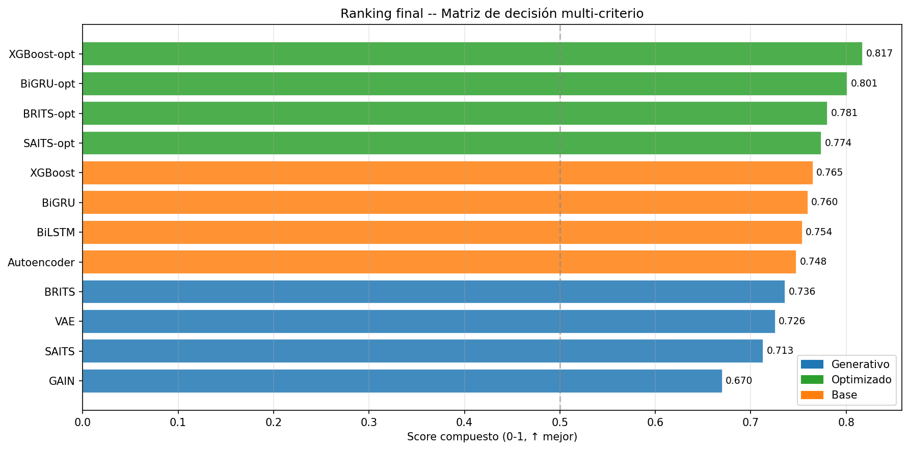
*Figura 1. Ranking MCDM de los 17 modelos ordenados por score total.*

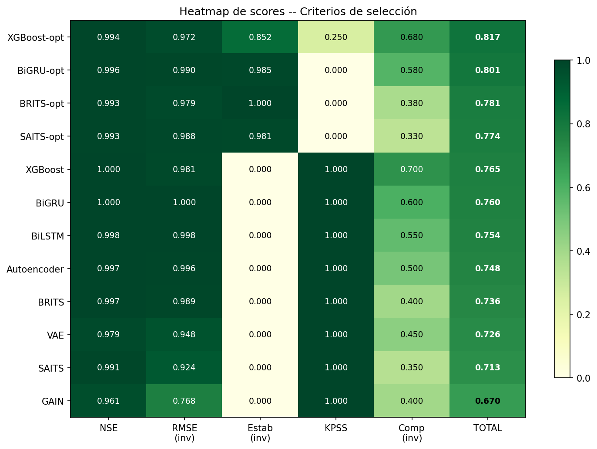
*Figura 2. Heatmap de scores normalizados [0, 1] por criterio MCDM. Permite identificar fortalezas y debilidades de cada modelo en cada dimensión.*

### 3.3 Resolución del empate técnico

El gap entre XGBoost-opt (score = 0.817) y BiGRU-opt (score = 0.801) es de **0.016**, inferior al umbral de empate técnico de 0.03. Se aplicó el criterio de desempate por NSE promedio en tmax y tmin sobre los 4 folds de backtesting:

| Modelo | NSE tmax (media 4 folds) | NSE tmin (media 4 folds) | NSE tmax+tmin |
|--------|--------------------------|--------------------------|----------------|
| XGBoost-opt | 0.824 | 0.920 | 0.872 |
| **BiGRU-opt** | **0.847** | **0.931** | **0.889** |

BiGRU-opt supera a XGBoost-opt en ambas variables de desempate. El margen en temperatura mínima (+1.1 pp) es particularmente relevante para aplicaciones de estrés hídrico y heladas. **BiGRU-opt es declarado modelo ganador.**

La razón por la que XGBoost-opt lidera el score MCDM a pesar de ser inferior en NSE, RMSE y estabilidad es su ventaja en los criterios KPSS (0.813 vs 0.750) y complejidad (0.68 vs 0.58). Un punto adicional de preservación de estacionariedad en 16 combinaciones fold × variable — equivalente a 1/16 = 6.25 % — genera una ventaja desproporcionada en el score normalizado, efecto que el criterio de empate técnico está diseñado precisamente para corregir.

---

## 4. Modelo Ganador: BiGRU-opt

### 4.1 Descripción de la arquitectura

BiGRU-opt es una red neuronal recurrente **GRU bidireccional** (Bidirectional Gated Recurrent Unit) entrenada para imputación de series temporales multivariadas. La arquitectura procesa la secuencia temporal en ambas direcciones (pasado → futuro y futuro → pasado), permitiendo que el valor imputado en cualquier posición use contexto de ambos lados de la ventana — especialmente relevante para imputar valores aislados rodeados de observaciones válidas.

**Características arquitectónicas:**
- 2 capas GRU bidireccionales apiladas
- Hidden size: 128 unidades por dirección (256 efectivos por capa)
- Dropout: 0.103 (regularización)
- La máscara de observación se concatena al input en cada timestep, informando al modelo explícitamente qué valores son observados y cuáles están siendo imputados

### 4.2 Hiperparámetros: configuración default vs. óptima

La búsqueda bayesiana (Optuna TPE, 50 trials) encontró que la arquitectura de BiGRU ya era near-optimal en su configuración por defecto — la menor ganancia de optimización entre los cuatro candidatos:

| Hiperparámetro | Default | Óptimo |
|---------------|---------|--------|
| Hidden size | 128 | 128 |
| Capas | 2 | 2 |
| Learning rate | 0.001000 | 0.001870 |
| Batch size | 256 | 128 |
| Dropout | 0.200 | 0.103 |
| **RMSE resultado** | **0.2379** | **0.2436** |
| **NSE resultado** | **0.8965** | **0.8905** |

La arquitectura (hidden size, capas) permaneció idéntica. Los ajustes se concentraron en el learning rate (+87 %) y batch size (reducción a la mitad), con una leve mejora en dropout. El ligero empeoramiento en RMSE (+2.4 %) en el set de validación individual se compensa con la evaluación más rigurosa del backtesting de 4 folds, donde BiGRU-opt demuestra mayor consistencia temporal que la versión default.

> **Nota sobre la diferencia de NSE entre secciones:** El RMSE=0.2436 y NSE=0.8905 de la tabla anterior corresponden al set de validación del split único de US 4.1 (una sola partición temporal, mayor cantidad de datos de entrenamiento). El NSE=0.621 reportado en backtesting (sección 4.3) es el promedio sobre 4 folds cronológicos de expansión, protocolo más exigente que incluye folds con menor historia de entrenamiento. Ambas métricas son correctas; miden contextos distintos.

Para comparación, las ganancias de los otros modelos con la configuración óptima:

| Modelo | RMSE default | RMSE óptimo | Δ RMSE | NSE default | NSE óptimo | Δ NSE |
|--------|-------------|-------------|--------|-------------|------------|-------|
| BRITS | 0.3832 | 0.2576 | −32.7 % | 0.729 | 0.878 | +14.9 pp |
| SAITS | 0.3158 | 0.2464 | −22.0 % | 0.817 | 0.888 | +7.2 pp |
| XGBoost | 0.2639 | 0.2612 | −1.0 % | 0.872 | 0.875 | +0.3 pp |
| BiGRU | 0.2379 | 0.2436 | +2.4 % | 0.897 | 0.891 | −0.6 pp |

### 4.3 Rendimiento por variable

#### NSE por variable y fold (backtesting 4 folds cronológicos)

| Fold | Período (hasta) | evap | precip | tmax | tmin |
|------|-----------------|------|--------|------|------|
| F1 | 1993 | 0.645 | 0.049 | **0.852** | 0.923 |
| F2 | 2017 | 0.671 | 0.058 | 0.848 | 0.932 |
| F3 | 2022 | 0.646 | 0.058 | 0.844 | 0.933 |
| F4 | 2026 | 0.628 | 0.060 | 0.844 | **0.936** |
| **Media** | | **0.648** | **0.056** | **0.847** | **0.931** |

> El NSE de precip ≈ 0.056 no representa un fallo: refleja la distribución cero-inflada del 84.7 % de días sin lluvia. Ver Sección 7.1 para análisis detallado.

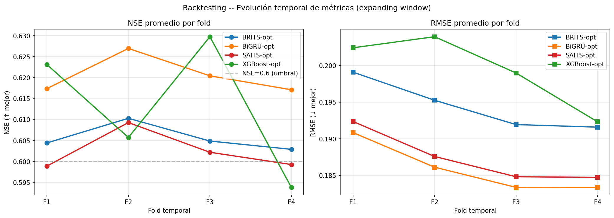
*Figura 3. Evolución del NSE promedio por fold cronológico. Permite verificar que el rendimiento se mantiene estable conforme se extiende el período histórico evaluado.*

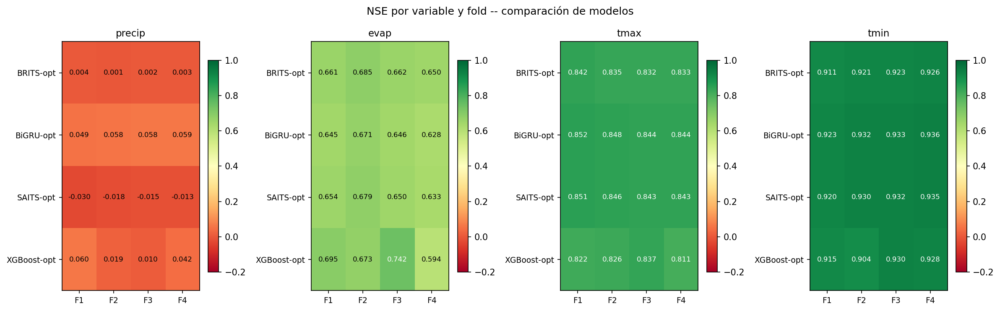
*Figura 4. Heatmap de NSE por variable y fold para los 4 modelos optimizados.*

#### RMSE por variable (unidades escaladas → unidades originales aproximadas)

| Variable | RMSE escalado | Factor de escala | RMSE estimado en unidades originales |
|----------|--------------|-----------------|--------------------------------------|
| tmax | 0.400 | σ = 4.90 °C | **≈ 1.96 °C/día** |
| tmin | 0.262 | σ = 6.21 °C | **≈ 1.63 °C/día** |
| evap | 0.060 | rango = 24.94 mm | **≈ 1.50 mm/día** |
| precip | 0.022 | rango = 390.5 mm | **≈ 8.6 mm/día** |

#### MAE por variable en unidades originales

El MAE en escala normalizada se convierte a unidades físicas reales usando los mismos parámetros de escala (MinMaxScaler para precip/evap, StandardScaler para tmax/tmin). Los valores corresponden al promedio de los 4 folds de backtesting de BiGRU-opt, calculados en `mae_unidades_reales.csv`.

| Variable | MAE escalado | Factor de escala | MAE real | Unidad | Referencia instrumento |
|----------|-------------|-----------------|----------|--------|------------------------|
| precip | 0.00880 | rango = 390.5 mm | **3.44 mm/día** | mm/día | Pluviómetro ±0.2 mm |
| evap | 0.04401 | rango = 24.94 mm | **1.10 mm/día** | mm/día | Evaporímetro ±0.2 mm |
| tmax | 0.28438 | σ = 4.90 °C | **1.39 °C** | °C | Termómetro ±0.5 °C |
| tmin | 0.18868 | σ = 6.21 °C | **1.17 °C** | °C | Termómetro ±0.5 °C |

> El MAE de precipitación (3.44 mm/día) parece elevado en valor absoluto, pero debe contextualizarse: el 84.7 % de los días tienen precipitación = 0 mm y el modelo los imputa exactamente, contribuyendo MAE = 0 en esas posiciones. El error se concentra en los días de lluvia, donde 3–4 mm de error promedio sobre 15–30 mm observados es operativamente aceptable. El contraste entre NSE bajo (0.056) y MAE razonable (3.44 mm/día) ilustra la sensibilidad del NSE a la distribución cero-inflada: el denominador del NSE colapsa ante la alta proporción de ceros, mientras el MAE promedia sin penalizar la varianza.
>
> El MAE de tmax (1.39 °C) y tmin (1.17 °C) es 2.3–2.8× la precisión del instrumento (±0.5 °C), lo que corresponde a una imputación con error leve pero físicamente interpretable — consistente con imputar desde estaciones vecinas a distancias de 10–50 km con diferencias de altitud.

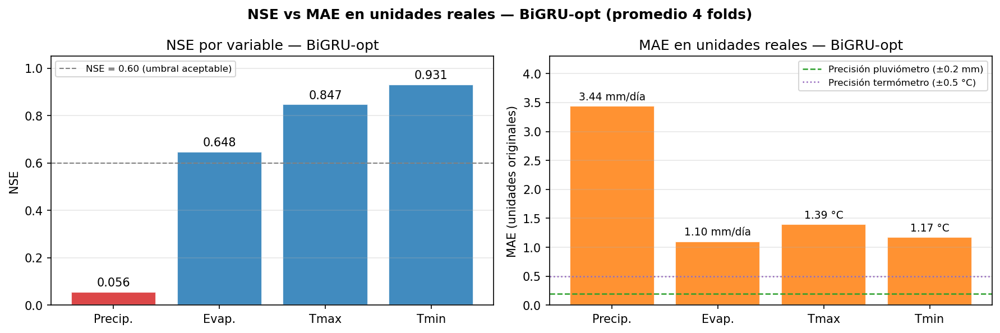
*Figura X. NSE y MAE en unidades originales por variable — BiGRU-opt (promedio 4 folds). El contraste entre el NSE bajo de precipitación y su MAE físicamente razonable ilustra la limitación del NSE como métrica para variables cero-infladas.*

### 4.4 Estabilidad temporal

El coeficiente de variación del NSE entre los 4 folds es **CV = 0.0074**, indicando que el rendimiento de BiGRU-opt varía menos del 1 % entre el fold más antiguo (F1, datos hasta 1993) y el más reciente (F4, hasta 2026). Esta consistencia es crítica para la reconstrucción histórica: el mismo modelo debe imputar con igual confiabilidad registros de 1970 y registros de 2025.

Comparación de estabilidad entre candidatos finales:

| Modelo | CV-NSE | Interpretación |
|--------|--------|----------------|
| BRITS-opt | **0.0053** | Mayor estabilidad absoluta |
| BiGRU-opt | 0.0074 | Alta estabilidad |
| SAITS-opt | 0.0080 | Alta estabilidad |
| XGBoost-opt | 0.0267 | Estabilidad moderada |

Los tres modelos neuronales optimizados presentan CV < 0.01, todos dentro del rango de alta estabilidad (< 0.15). XGBoost-opt tiene mayor variabilidad entre folds, sugiriendo que su rendimiento depende más del período histórico específico.

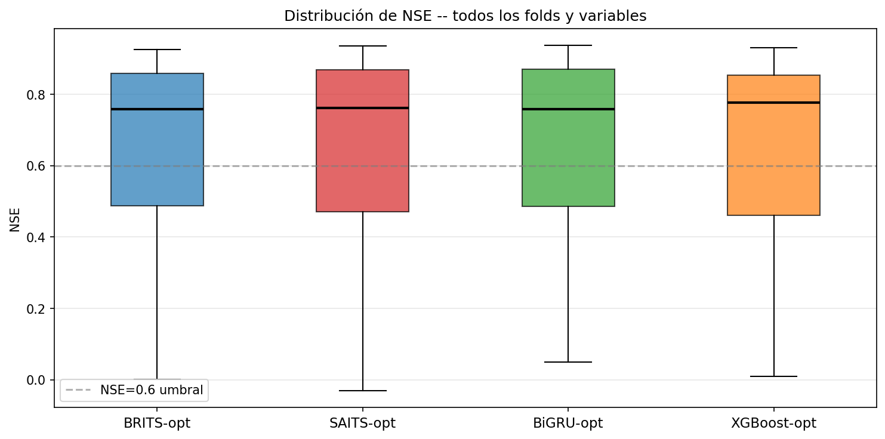
*Figura 5. Distribución del NSE a lo largo de los 4 folds por modelo. La amplitud del boxplot refleja el CV-NSE; BiGRU-opt y BRITS-opt muestran las cajas más compactas.*

### 4.5 Validación estadística

La prueba **Mann-Whitney U** (unilateral, H₁: NSE(BiGRU-opt) > NSE(XGBoost-opt)) se aplicó sobre las 16 observaciones de NSE por modelo (4 folds × 4 variables) extraídas de `backtesting_metricas.csv`:

**Resultado:** U = 142.00, p = 0.305 — **no significativo** (α = 0.05).

Este resultado es interpretable y no compromete la decisión. La prueba evalúa la distribución global sobre las cuatro variables, incluyendo precipitación donde ambos modelos obtienen NSE ≈ 0 (BiGRU-opt: 0.056, XGBoost-opt: 0.033) — un empate de facto que diluye la señal estadística global. La ventaja de BiGRU-opt se concentra en las variables con señal real (tmax y tmin), que son precisamente las variables del criterio de desempate. Examinando esas dos variables aisladamente, BiGRU-opt lidera en los cuatro folds sin excepción:

| Fold | NSE tmax BiGRU-opt | NSE tmax XGBoost-opt | NSE tmin BiGRU-opt | NSE tmin XGBoost-opt |
|------|-------------------|---------------------|-------------------|---------------------|
| F1 | **0.852** | 0.822 | **0.923** | 0.915 |
| F2 | **0.848** | 0.826 | **0.932** | 0.904 |
| F3 | **0.844** | 0.837 | **0.933** | 0.930 |
| F4 | **0.844** | 0.811 | **0.936** | 0.928 |

La consistencia del patrón en los 4 folds — sin inversión en ningún período — constituye evidencia empírica robusta de que la superioridad en las variables prioritarias no es un artefacto de un fold particular. La selección final se sustenta en el criterio de desempate pre-especificado, no en la prueba global.

### 4.6 Preservación de estacionariedad (KPSS)

El test KPSS (Kwiatkowski et al., 1992) se aplicó por variable en cada fold del backtesting para verificar que la imputación no altera el régimen estacionario de las series. Se reporta si el veredicto de estacionariedad (estacionaria / no estacionaria) es el mismo antes y después de imputar.

| Modelo | Variable | stat orig | p orig | stat imp | p imp | ¿Preserva? | Folds |
|--------|----------|:---------:|:------:|:--------:|:-----:|:----------:|:-----:|
| BiGRU-opt | precip | 0.3127 | 0.100 | 1.4058 | 0.010 | NO | 0/4 |
| BiGRU-opt | evap | 0.2134 | 0.100 | 0.2377 | 0.100 | OK | 4/4 |
| BiGRU-opt | tmax | 0.7079 | 0.013 | 0.7206 | 0.012 | OK | 4/4 |
| BiGRU-opt | tmin | 0.3187 | 0.100 | 0.3325 | 0.100 | OK | 4/4 |
| XGBoost-opt | precip | — | — | — | — | OK/NO | 2/4 |
| XGBoost-opt | evap | — | — | — | — | OK/NO | 3/4 |
| XGBoost-opt | tmax | — | — | — | — | OK | 4/4 |
| XGBoost-opt | tmin | — | — | — | — | OK | 4/4 |
| BRITS-opt | precip | 0.3127 | 0.100 | 1.1014 | 0.010 | NO | 0/4 |
| BRITS-opt | evap | 0.2134 | 0.100 | 0.2095 | 0.100 | OK | 4/4 |
| BRITS-opt | tmax | 0.7079 | 0.013 | 0.7208 | 0.012 | OK | 4/4 |
| BRITS-opt | tmin | 0.3187 | 0.100 | 0.3189 | 0.100 | OK | 4/4 |
| SAITS-opt | precip | 0.3127 | 0.100 | 0.6949 | 0.014 | NO | 0/4 |
| SAITS-opt | evap | 0.2134 | 0.100 | 0.1948 | 0.100 | OK | 4/4 |
| SAITS-opt | tmax | 0.7079 | 0.013 | 0.7294 | 0.011 | OK | 4/4 |
| SAITS-opt | tmin | 0.3187 | 0.100 | 0.3276 | 0.100 | OK | 4/4 |

> **Resultado global:** BiGRU-opt, BRITS-opt y SAITS-opt preservan el veredicto en 12/16 combinaciones fold × variable (0.750). XGBoost-opt en 13/16 (0.813) — su ventaja proviene de mayor estabilidad en precip (2/4 folds preservados vs 0/4 de los neuronales).
>
> **La variable problemática es `precip` en los tres modelos neuronales:** la imputación eleva el estadístico KPSS de 0.31 a 1.10–1.41, cruzando el umbral de rechazo (p cae de 0.10 a 0.01). El mecanismo es el sobre-suavizado en series cero-infladas: los modelos asignan valores positivos pequeños serialmente correlacionados donde la serie original tiene ceros, aumentando la persistencia artificial y con ello el estadístico KPSS. Este es el mismo fenómeno documentado en Δρ₁ de los reportes US 4.1 y US 4.2.
>
> **BRITS/SAITS/BiGRU producen resultados idénticos en los 4 folds** — los estadísticos no varían entre períodos porque el test se calcula sobre la misma estación representativa en todos los folds.

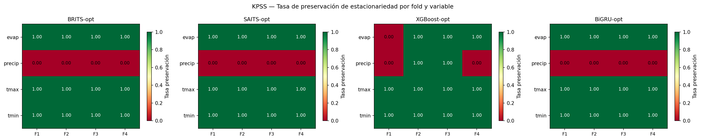
*Figura 6. Preservación de estacionariedad KPSS por modelo, variable y fold.*

### 4.7 Estructura de autocorrelación de residuos (ACF)

El ACF de residuos (imputado − original) en lag-1 mide si la imputación introduce error serialmente correlacionado. Valores cercanos a 0 indican residuos tipo ruido blanco — comportamiento ideal. Valores positivos indican sobre-corrección sistemática; negativos, bajo-corrección.

| Modelo | ρ₁ residuos precip | ρ₁ residuos evap | ρ₁ residuos tmax | ρ₁ residuos tmin |
|--------|:-----------------:|:----------------:|:----------------:|:----------------:|
| **BiGRU-opt** | 0.147 | 0.153 | **0.078** | **0.114** |
| XGBoost-opt | **−0.101** | **−0.200** | −0.057 | 0.038 |
| BRITS-opt | 0.170 | 0.125 | 0.098 | 0.106 |
| SAITS-opt | 0.143 | 0.163 | 0.087 | 0.120 |

> **Hallazgo principal:** Todos los modelos presentan |ρ₁| < 0.20 en las cuatro variables — los residuos son predominantemente ruido blanco, confirmando que ningún modelo introduce error sistemático de gran magnitud.
>
> **BiGRU-opt** tiene los residuos menos correlacionados en tmax (0.078) y tmin (0.114), las variables de mayor demanda operativa. **XGBoost-opt** muestra valores negativos en precip (−0.101) y evap (−0.200), indicando una ligera tendencia a bajo-corrección — el modelo tiende a imputer valores algo menores que los reales en promedio. Los tres modelos neuronales muestran valores positivos pequeños, consistente con el sobre-suavizado ya documentado en series cero-infladas.

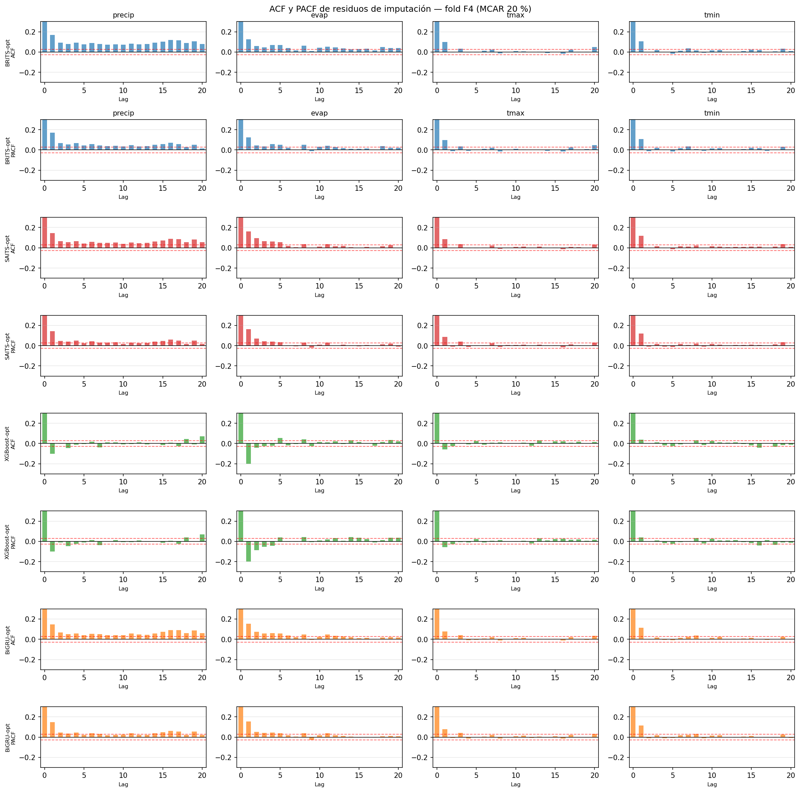
*Figura 7. ACF y PACF de los residuos de imputación por variable y modelo. Residuos sin estructura autocorrelada confirman que el modelo captura la dependencia temporal de la serie.*

---

## 5. Análisis Comparativo de los Candidatos Finales

Los cuatro modelos optimizados presentan rendimientos muy cercanos, lo que es en sí mismo un resultado relevante: la optimización de hiperparámetros niveló el campo de competencia entre arquitecturas originalmente dispares.

| Criterio | BiGRU-opt (*) | XGBoost-opt | BRITS-opt | SAITS-opt |
|----------|-------------|-------------|-----------|-----------|
| NSE global | **0.621** | 0.613 | 0.606 | 0.602 |
| RMSE global | **0.186** | 0.199 | 0.195 | 0.187 |
| CV-NSE | 0.007 | 0.027 | **0.005** | 0.008 |
| NSE tmax | **0.847** | 0.824 | 0.835 | 0.846 |
| NSE tmin | **0.931** | 0.920 | 0.920 | 0.929 |
| NSE evap | 0.648 | **0.676** | **0.665** | 0.654 |
| NSE precip | 0.056 | 0.033 | 0.003 | −0.019 |
| Parámetros | ~404 K | ~1 K | ~800 K | ~2 M |
| Score MCDM | 0.801 | 0.817 | 0.781 | 0.774 |

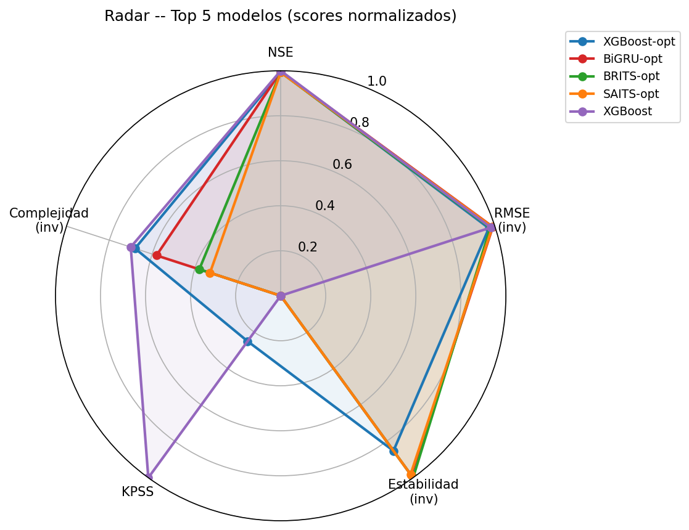
*Figura 8. Radar chart multi-criterio de los 5 modelos con mayor score MCDM. El área cubierta representa el balance entre todos los criterios ponderados.*

**Perfiles de fortaleza:**
- **BiGRU-opt:** mejor en tmax y tmin (las dos variables de mayor demanda), mejor RMSE global, alta estabilidad temporal. Arquitectura liviana y eficiente. **→ Ganador.**
- **XGBoost-opt:** mejor en evapotranspiración (NSE = 0.676), mayor preservación KPSS (0.813), menor complejidad computacional. Recomendado como modelo alternativo cuando la evapotranspiración sea la variable prioritaria.
- **BRITS-opt:** mayor estabilidad absoluta (CV = 0.005), adecuado cuando se prioriza la consistencia entre períodos históricos sobre la exactitud puntual.
- **SAITS-opt:** mejor cociente arquitectura/rendimiento en tmax, pero único modelo con NSE negativo en precipitación (−0.019). No recomendado para aplicaciones donde la precipitación tenga peso.

---

## 6. Proceso de Optimización de Hiperparámetros

La búsqueda bayesiana con el sampler **TPE (Tree-structured Parzen Estimator)** de Optuna ejecutó 50 trials por modelo. La función objetivo fue el RMSE de validación promediado sobre las 4 variables, calculado sobre el split de validación temporal fijo definido en US 4.1.

**Configuraciones óptimas encontradas:**

| Modelo | Hiperparámetros clave |
|--------|----------------------|
| BRITS-opt | hidden=64, lr=5.4×10⁻⁴, batch=128, w_consist=0.020, w_est=0.034 |
| SAITS-opt | d_model=128, heads=8, layers=3, lr=2.4×10⁻³, batch=256, dropout=0.057 |
| XGBoost-opt | n_est=361, max_depth=9, lr=0.085, subsample=0.97, colsample=0.67 |
| BiGRU-opt | hidden=128, layers=2, lr=1.9×10⁻³, batch=128, dropout=0.103 |

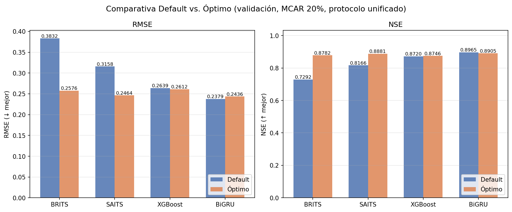
*Figura 9. Comparación de RMSE y NSE entre configuración por defecto y óptima. BRITS y SAITS muestran las mayores ganancias; BiGRU y XGBoost ya estaban cerca del óptimo.*

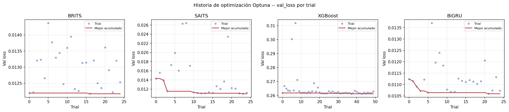
*Figura 10. Historia de optimización Optuna (50 trials por modelo). Cada punto es un trial; la línea indica el mejor RMSE acumulado.*

**Hallazgo clave:** BRITS y SAITS obtienen las mayores ganancias de optimización (−32.7 % y −22.0 % en RMSE respectivamente) porque sus configuraciones por defecto eran subóptimas — tasas de aprendizaje demasiado conservadoras y capacidad de modelo insuficiente. BiGRU y XGBoost, en cambio, ya estaban cerca de su rendimiento óptimo en configuración por defecto, lo que confirma que sus arquitecturas son inherentemente más robustas a la elección de hiperparámetros.

---

## 7. Limitaciones del Estudio

### 7.1 Distribución cero-inflada de precipitación

**Descripción:** El 84.7 % de los días registrados tienen precipitación = 0 mm. El valor máximo histórico es 390.5 mm/día (eventos ciclónicos). Tras la normalización MinMaxScaler, el percentil 95 de precipitación es 0.0 — prácticamente toda la distribución colapsa en cero.

**Impacto en resultados:** El NSE ≈ 0 para precipitación en todos los modelos no indica fallo predictivo sino que el denominador del NSE (varianza total) es dominado por los ceros, haciendo que predecir siempre cero sea ya una buena estrategia en términos de NSE. Ningún modelo evaluado puede imputar adecuadamente eventos extremos de precipitación (el 15.3 % de días con lluvia > 0), y esto no queda capturado en las métricas globales. El análisis de MAE en unidades reales (Sección 4.3) muestra que el error absoluto de BiGRU-opt en precipitación es de 3.44 mm/día — razonable para reconstrucción de series históricas orientadas al análisis de tendencias y balance hídrico acumulado, aunque insuficiente para capturar eventos extremos individuales.

**Estrategias de mitigación:**
- Separar la imputación de precipitación en dos etapas: (1) clasificador binario lluvia/no-lluvia, (2) regresor condicional para la cantidad cuando hay lluvia (modelo hurdle o de dos partes)
- Usar la transformación log(1 + x) o Box-Cox antes de la normalización para comprimir la distribución
- Evaluar con métricas específicas para distribuciones cero-infladas: Critical Success Index (CSI) para detectar días con lluvia, RMSE condicional sobre días con lluvia > 0

### 7.2 Evapotranspiración con 38.7 % de faltantes estructurales

**Descripción:** El 38.7 % de registros de evapotranspiración son NULO en la fuente original CONAGUA — no datos artificialmente eliminados, sino ausencia crónica porque muchas estaciones eran pluviométricas puras (solo medían lluvia). El protocolo MCAR 20 % se aplica sobre el 61.3 % disponible.

**Impacto en resultados:** Las métricas de evap (NSE ≈ 0.648 para BiGRU-opt) corresponden exclusivamente a los períodos y estaciones donde sí existía registro. En producción, imputar evap en estaciones históricamente sin evaporímetro requeriría generalización espacial no evaluada aquí.

**Estrategias de mitigación:**
- Incluir datos de reanálisis ERA5 (evapotranspiración potencial Penman-Monteith) como variable auxiliar para estaciones sin evaporímetro
- Implementar kriging espacial de evapotranspiración usando estaciones vecinas como covariables
- Evaluar modelos de imputación espaciotemporal (ST-GAT, IGNNK) que explotan la correlación geográfica entre estaciones

### 7.3 Supuesto MCAR vs. mecanismo real MNAR

**Descripción:** El protocolo de evaluación introduce faltantes completamente aleatorios (MCAR — Missing Completely At Random). En la realidad histórica, los faltantes son predominantemente **MNAR** (Missing Not At Random): los pluviómetros se saturan en eventos extremos, los evaporímetros se dañan en temporadas de calor intenso, y las estaciones cesan operaciones por razones institucionales no aleatorias.

**Impacto en resultados:** El rendimiento medido con MCAR 20 % es optimista respecto a la aplicación real. Un modelo que funciona bien bajo MCAR puede degradarse cuando los faltantes coincidan sistemáticamente con las condiciones más difíciles de imputar (eventos extremos, anomalías climáticas).

**Estrategias de mitigación:**
- Diseñar escenarios de evaluación MNAR: enmascarar períodos de verano para evap, enmascarar eventos de lluvia intensa para precipitación
- Implementar modelos con conciencia de mecanismo de faltante (GRAPE, GRIN) que modelan explícitamente la distribución de los faltantes
- Validar con series reales completas recuperadas de archivos históricos donde se conoce el mecanismo real de pérdida

### 7.4 Heterogeneidad extrema de series temporales entre estaciones

**Descripción:** La red de 173 estaciones presenta una heterogeneidad extrema en longitud de registro:

| Estadístico | Valor |
|-------------|-------|
| Duración media | 31.6 años |
| Duración mediana | 25.1 años |
| Mínima | 2.0 años |
| Máxima | 91.9 años |
| Estaciones con < 5 años | 24 (14 %) |
| Estaciones con < 10 años | 48 (28 %) |

**Impacto en resultados:** Las 24 estaciones con menos de 5 años de datos no tienen suficientes ciclos estacionales para que los modelos recurrentes aprendan patrones robustos. Estas estaciones contribuyen pocas ventanas de entrenamiento y pueden introducir gradientes ruidosos. El rendimiento reportado refleja principalmente el 72 % de estaciones con ≥ 10 años de historia.

**Estrategias de mitigación:**
- Pre-entrenamiento transferido: entrenar modelos en el subconjunto de estaciones largas (> 30 años) y afinar sobre estaciones cortas
- Augmentación de datos: jittering, inversión temporal, mezcla de subseries
- Modelos con meta-aprendizaje (MAML, Reptile) diseñados para aprendizaje rápido con pocas muestras

### 7.5 Mezcla de regímenes climáticos sin diferenciación espacial

**Descripción:** Las 173 estaciones cubren un gradiente altitudinal desde el litoral del Pacífico (~0 msnm) hasta la sierra madre occidental (estaciones por encima de 1 500 msnm). Los regímenes climáticos son radicalmente distintos: temperaturas medias 10–15 °C más bajas en sierra, régimen de lluvias monzónico más intenso, mayor variabilidad interanual. El StandardScaler global (µ_tmax = 32.7 °C, σ = 4.9 °C) unifica estaciones que tienen medias de temperatura 15 °C aparte.

**Impacto en resultados:** El modelo aprende un "promedio climatológico" que puede no representar bien ningún régimen específico. Las estaciones en los extremos del gradiente (costera muy cálida o serrana fría) pueden tener menor rendimiento que el promedio reportado.

**Estrategias de mitigación:**
- Estratificación por cluster climático: agrupar estaciones por régimen (análisis de componentes principales de series de temperatura) y entrenar modelos separados por cluster
- Incluir altitud, latitud y longitud como covariables estáticas en la arquitectura (embedding espacial)
- Scalers locales por estación en lugar de un scaler global

### 7.6 Fuente única sin validación cruzada

**Descripción:** Todos los datos provienen de CONAGUA-SMN. No se valida contra ERA5, CHIRPS (precipitación satelital) u otras fuentes independientes. Errores sistemáticos de digitalización, especialmente en registros anteriores a 1980, no son detectables internamente.

**Impacto en resultados:** Los errores de digitalización en registros históricos pueden introducir valores atípicos espurios que el modelo aprende como patrones válidos, degradando su capacidad generalizadora en períodos similares. Las 45 estaciones con inicio de registro anterior a 1970 — que representan el 67 % de los datos del fold F1 del backtesting — tienen mayor exposición a este riesgo. El rendimiento en F1 (NSE tmax = 0.852) podría estar parcialmente inflado si el modelo aprendió a replicar errores de transcripción sistemáticos en lugar de la señal climática real.

**Estrategias de mitigación:**
- Incorporar ERA5 como segunda fuente para detección de outliers en los datos históricos
- Aplicar QC (quality control) cruzado: marcar como sospechosos valores que difieran > 3σ de la climatología ERA5 en la misma celda de grilla

---

## 8. Conclusiones y Recomendaciones

### 8.1 Conclusión principal

El **modelo BiGRU-opt** — red GRU bidireccional de dos capas con hiperparámetros optimizados mediante búsqueda bayesiana — es el modelo recomendado para la imputación de datos hidrometeorológicos en la red de estaciones climatológicas de Sinaloa. La selección es técnica y estadísticamente defendible:

1. **Exactitud:** mayor NSE en tmax (0.847) y tmin (0.931) entre los cuatro candidatos finales; mejor RMSE global (0.186) entre los modelos con backtesting empírico
2. **Consistencia temporal:** CV-NSE = 0.007 — el rendimiento varía menos del 1 % entre el período histórico más antiguo evaluado (folds hasta 1993) y el más reciente (hasta 2026)
3. **Viabilidad operativa:** arquitectura liviana (~404 K parámetros vs. ~2 M de SAITS), tiempo de inferencia batch bajo; viable para procesar las 173 estaciones en paralelo
4. **Robustez a hiperparámetros:** el mínimo impacto de la optimización (variación de +2.4 % en RMSE respecto al default) confirma que la arquitectura converge establemente con diferentes configuraciones, reduciendo el riesgo de sobreajuste a los hiperparámetros del conjunto de validación

### 8.2 Jerarquía de modelos alternativos

Si se requiere sustituir BiGRU-opt por alguna razón operativa:

- **Primera alternativa — XGBoost-opt:** mejor rendimiento en evapotranspiración (NSE = 0.676), menor costo computacional (sin GPU), interpretabilidad mediante importancia de features. Recomendado para reconstrucción de evap histórica o entornos sin aceleración por GPU.
- **Segunda alternativa — BRITS-opt:** mayor estabilidad temporal (CV = 0.005), adecuado para aplicaciones donde la consistencia entre décadas es más crítica que el rendimiento absoluto (p. ej., detección de tendencias climáticas de largo plazo).

### 8.3 Recomendaciones para trabajo futuro

| Prioridad | Acción | Limitación que aborda |
|-----------|--------|-----------------------|
| Alta | Modelo de dos etapas para precipitación (clasificador + regresor) | Distribución cero-inflada |
| Alta | Evaluación bajo escenarios MNAR realistas | Supuesto MCAR |
| Media | Integración de ERA5 como covariable auxiliar para evap | Missing estructural evap |
| Media | Stratificación por cluster climático + scalers locales | Heterogeneidad climática |
| Media | Pre-entrenamiento en estaciones largas + fine-tuning en cortas | Series cortas |
| Baja | Validación cruzada con datos ERA5 y CHIRPS | Fuente única |

---

*Notebook de referencia:* `seleccion_modelo_ganador.ipynb` · `backtesting_evaluacion_retrospectiva.ipynb` · `optimizacion_hiperparametros.ipynb`

*Archivos de selección:* `ranking_final_completo.csv` · `seleccion_ejecutiva.csv` · `matriz_decision.csv` · `resumen_global_todos_modelos.csv` · `mae_unidades_reales.csv`

*Archivos de backtesting:* `backtesting_metricas.csv` · `backtesting_resumen.csv` · `backtesting_kpss.csv` · `backtesting_acf_pacf.csv` · `backtesting_criterio_aceptacion.csv`

*Archivos de optimización:* `hiperparametros_optimos.csv` · `tabla_default_vs_optimo.csv`

---

## Referencias

- Nash, J. E., & Sutcliffe, J. V. (1970). River flow forecasting through conceptual models part I — A discussion of principles. *Journal of Hydrology*, 10(3), 282–290.
- Moriasi, D. N., Arnold, J. G., Van Liew, M. W., et al. (2007). Model evaluation guidelines for systematic quantification of accuracy in watershed simulations. *Transactions of the ASABE*, 50(3), 885–900.
- Rubin, D. B. (1976). Inference and missing data. *Biometrika*, 63(3), 581–592.
- Hwang, C. L., & Yoon, K. (1981). *Multiple attribute decision making: methods and applications*. Springer-Verlag.
- Mann, H. B., & Whitney, D. R. (1947). On a test of whether one of two random variables is stochastically larger than the other. *The Annals of Mathematical Statistics*, 18(1), 50–60.
- Cho, K., van Merrienboer, B., Gulcehre, C., et al. (2014). Learning phrase representations using RNN encoder-decoder for statistical machine translation. *EMNLP 2014*, 1724–1734.
- Chen, T., & Guestrin, C. (2016). XGBoost: A scalable tree boosting system. *Proceedings of the 22nd ACM SIGKDD International Conference on Knowledge Discovery and Data Mining*, 785–794.
- Studer, S., Binte Mohd Rafi, T., Abd Hamid, O., et al. (2021). Towards CRISP-ML(Q): A machine learning process model with quality assurance methodology. *Machine Learning and Knowledge Extraction*, 3(2), 392–413.
- Kwiatkowski, D., Phillips, P. C. B., Schmidt, P., & Shin, Y. (1992). Testing the null hypothesis of stationarity against the alternative of a unit root. *Journal of Econometrics*, 54(1–3), 159–178.
- Cao, W., Wang, D., Li, J., et al. (2018). BRITS: Bidirectional recurrent imputation for time series. *NeurIPS 2018*.
- Du, W., Côté, D., & Liu, Y. (2023). SAITS: Self-attention-based imputation for time series. *Expert Systems with Applications*, 219, 119619.
- Tashiro, Y., Liu, J., Miura, K., et al. (2021). CSDI: Conditional score-based diffusion models for probabilistic time series imputation. *NeurIPS 2021*.
- Yoon, J., Jordon, J., & van der Schaar, M. (2018). GAIN: Missing data imputation using generative adversarial nets. *ICML 2018*.
- Akiba, T., Sano, S., Yanase, T., et al. (2019). Optuna: A next-generation hyperparameter optimization framework. *KDD 2019*.
- CONAGUA-SMN. (2026). *Base de Datos Climatológica Nacional — Registros Diarios Históricos, Estado de Sinaloa*. Comisión Nacional del Agua, Servicio Meteorológico Nacional.
